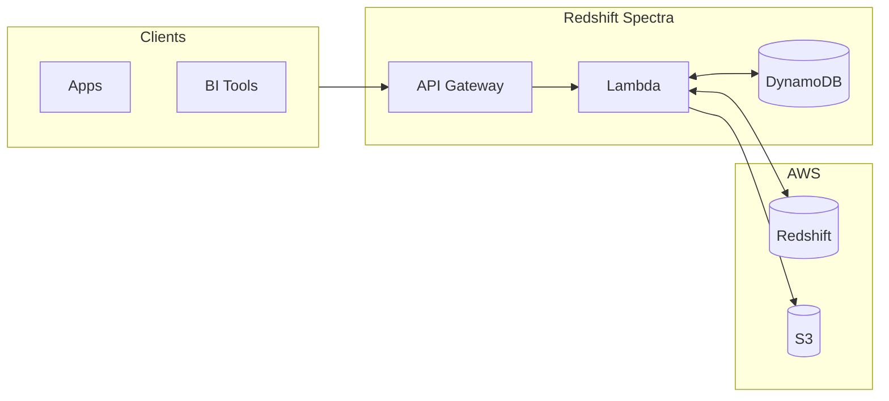

# Redshift Spectra 🚀

[](https://opensource.org/licenses/MIT)
[](https://www.python.org/downloads/)
[](https://www.terraform.io/)
[](https://aws.amazon.com/)

> **Transform your Amazon Redshift into a secure, scalable Data-as-a-Service platform.**

Redshift Spectra is an enterprise-grade serverless middleware that sits between your data consumers and your Redshift cluster. It transforms raw SQL power into a managed RESTful API with **built-in multi-tenancy**, **session reuse optimization**, and **hybrid data delivery**.

## ✨ Why Redshift Spectra?

Building a multi-tenant data platform is hard. Redshift Spectra solves the challenges:

| Challenge | Solution |
|-----------|----------|
| 🔒 **Tenant Isolation** | Database-level security with RLS/CLS. Zero tenant logic in app code. |
| ⚡ **Query Performance** | Session reuse for 80% latency reduction. CSV format for fast parsing. |
| ⏱️ **Long-Running Queries** | Async job pattern. No timeout constraints. |
| 📊 **Large Result Sets** | Auto-switch to S3 presigned URLs for big data. |
| 🏗️ **Infrastructure** | Terragrunt-based IaC. Deploy in minutes. |

## 🏗️ Architecture



## 🚀 Quick Start

```bash
# Clone and install
git clone https://github.com/zhiweio/redshift-spectra.git
cd redshift-spectra
make install-dev

# Configure
cp .env.template .env
# Edit .env with your Redshift settings

# Build and deploy
make package-all
make tg-apply-dev
```

### Make Your First Query

```bash
curl -X POST "https://your-api.execute-api.us-east-1.amazonaws.com/v1/queries" \
  -H "Authorization: Bearer $API_KEY" \
  -H "X-Tenant-ID: my-tenant" \
  -d '{"sql": "SELECT * FROM sales LIMIT 10"}'
```

Response:
```json
{
  "job_id": "job-abc123",
  "status": "QUEUED"
}
```

## 🎯 Key Features

### 🔐 True Multi-Tenancy
- Every tenant maps to a Redshift database user
- Row-Level Security (RLS) enforced at database layer
- Column-Level Security (CLS) for sensitive data
- Zero trust architecture

### ⚡ Performance Optimized
- **Session Reuse**: Redshift `SessionKeepAliveSeconds` for connection pooling
- **CSV Format**: `get_statement_result_v2` with 70%+ faster parsing
- **Lambda Layers**: Shared dependencies for faster cold starts

### 📦 Hybrid Data Delivery
- Small results → Inline JSON response
- Large results → S3 presigned URL (Parquet/CSV)
- Automatic threshold-based switching

### 📊 Bulk Operations
- Salesforce Bulk API v2 compatible workflow
- Support for query, insert, update, upsert, delete
- CSV/JSON formats with GZIP compression

### 🔧 Production Ready
- Structured logging with AWS Lambda Powertools
- X-Ray distributed tracing
- CloudWatch dashboards and alarms
- Terragrunt for DRY multi-environment deployments

## 📊 Performance Benchmarks

| Metric | Without Optimization | With Optimization | Improvement |
|--------|---------------------|-------------------|-------------|
| First Query | 500ms | 500ms | - |
| Subsequent Queries | 500ms | 100ms | **80%** |
| Result Parsing (10k rows) | 120ms | 35ms | **71%** |
| Cold Start | 3s | 1.5s | **50%** |

## 📚 Documentation

| Section | Description |
|---------|-------------|
| [Getting Started](docs/getting-started/installation.md) | Installation, configuration, quickstart |
| [User Guide](docs/user-guide/query-api.md) | Query API, Bulk API, async jobs |
| [Security](docs/security/overview.md) | Authentication, authorization, RLS/CLS |
| [Performance](docs/performance/overview.md) | Session reuse, CSV format optimization |
| [Deployment](docs/deployment/infrastructure.md) | Terragrunt, Lambda layers, monitoring |
| [API Reference](docs/api-reference.md) | Complete REST API documentation |

## 🛠️ Development

```bash
# Install dev dependencies
make install-dev

# Run tests
make test

# Lint and format
make lint
make format

# Build packages
make package-all
```

## 🤝 Contributing

Contributions are welcome! See [Contributing Guide](docs/development/contributing.md).

## 📄 License

MIT License - see [LICENSE](LICENSE) for details.

---

<p align="center">
  <strong>Built with ❤️ for the data engineering community</strong>
</p>
