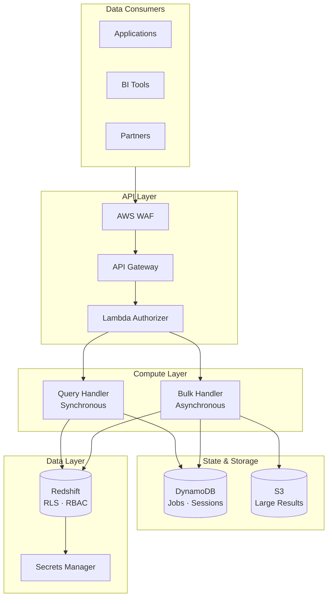

# Redshift Spectra 🚀

[](https://opensource.org/licenses/MIT)
[](https://www.python.org/downloads/)
[](https://www.terraform.io/)
[](https://aws.amazon.com/)
[](https://zhiweio.github.io/redshift-spectra/)

> **Turn your Amazon Redshift into a secure, multi-tenant Data-as-a-Service platform.**

Redshift Spectra is an enterprise-grade serverless middleware that transforms your Redshift data warehouse into a managed RESTful API. With **zero-trust security**, **database-level tenant isolation**, and **dual execution modes** (synchronous Query API + asynchronous Bulk API), you can safely expose analytical data to internal teams, partners, and customers—without exposing your database directly.

## ✨ Why Redshift Spectra?

Building a multi-tenant data platform is hard. Redshift Spectra solves the key challenges:

| Challenge | Traditional Solution | Redshift Spectra |
|-----------|---------------------|------------------|
| 🔒 **Tenant Isolation** | Application-level filtering (error-prone) | Database-level RLS/RBAC enforcement |
| 🛡️ **Security** | Shared credentials, custom logic | Zero-trust with JWT/API Key/IAM auth |
| ⚡ **Interactive Queries** | Complex async polling | Synchronous API with immediate results |
| 📊 **Large Exports** | Timeout constraints | Async Bulk API with S3 delivery |
| ⏱️ **Latency** | Cold connections every request | Session reuse for 80% latency reduction |
| 🔍 **Compliance** | Custom audit logging | Built-in audit trail with X-Ray tracing |

## 🏗️ Architecture



## 🚀 Quick Start

### Local Development (Recommended)

```bash
# Clone and install
git clone https://github.com/zhiweio/redshift-spectra.git
cd redshift-spectra
make install-dev

# Configure (defaults work for LocalStack)
cp .env.example .env

# Start LocalStack and deploy
make deploy-local

# Verify deployment
make localstack-status
```

### AWS Deployment

```bash
# Configure for AWS
cp .env.example .env
# Edit .env with your AWS Redshift settings

# Build and deploy to dev
make package-all
make tg-apply-dev
```

### Query API — Synchronous Execution

For interactive queries with immediate results (≤10,000 rows):

```bash
curl -X POST "https://your-api.execute-api.region.amazonaws.com/v1/queries" \
  -H "Authorization: Bearer $API_KEY" \
  -H "X-Tenant-ID: tenant-a" \
  -H "Content-Type: application/json" \
  -d '{"sql": "SELECT * FROM sales WHERE region = '\''APAC'\'' LIMIT 100"}'
```

Response (immediate):
```json
{
  "data": [
    {"id": 1, "product": "Widget", "amount": 99.99, "region": "APAC"},
    {"id": 2, "product": "Gadget", "amount": 149.99, "region": "APAC"}
  ],
  "metadata": {
    "row_count": 2,
    "column_info": [...],
    "execution_time_ms": 245
  }
}
```

### Bulk API — Asynchronous Execution

For large exports and long-running operations:

```bash
# Create a bulk job
curl -X POST "https://your-api.execute-api.region.amazonaws.com/v1/bulk/jobs" \
  -H "Authorization: Bearer $API_KEY" \
  -H "X-Tenant-ID: tenant-a" \
  -H "Content-Type: application/json" \
  -d '{"operation": "query", "sql": "SELECT * FROM large_table"}'

# Response: {"job_id": "job-abc123", "state": "QUEUED"}

# Poll for completion
curl "https://your-api.execute-api.region.amazonaws.com/v1/bulk/jobs/job-abc123" \
  -H "Authorization: Bearer $API_KEY" \
  -H "X-Tenant-ID: tenant-a"

# When complete, get results via presigned S3 URL
curl "https://your-api.execute-api.region.amazonaws.com/v1/bulk/jobs/job-abc123/result"
```

## 🎯 Key Features

### 🔐 Zero-Trust Security
- **Database-level isolation** — Tenant security enforced by Redshift RLS/RBAC, not application code
- **Multiple auth methods** — JWT tokens, API keys, AWS IAM (SigV4)
- **SQL injection prevention** — Built-in validator blocks dangerous operations
- **Complete audit trail** — Every query logged with tenant context and X-Ray tracing

### ⚡ Dual Execution Modes
- **Query API (Sync)** — Immediate results for interactive workloads, ≤10,000 rows
- **Bulk API (Async)** — Background processing for large exports, unlimited rows
- **Automatic LIMIT injection** — Query API enforces safe result sizes

### 🚀 Performance Optimized
- **Session Reuse** — Redshift Data API `SessionKeepAliveSeconds` for connection pooling
- **CSV Format Parsing** — `get_statement_result_v2` with 70%+ faster deserialization
- **Lambda Layers** — Shared dependencies for faster cold starts

### 📦 Intelligent Data Delivery
- **Inline JSON** — Small results returned directly in API response
- **S3 Presigned URLs** — Large results exported to S3 (Parquet/CSV)
- **Automatic switching** — Threshold-based format selection

### 🔧 Enterprise Ready
- **Multi-tenancy** — One database user per tenant with isolated permissions
- **Terragrunt IaC** — DRY multi-environment deployments (dev/staging/prod)
- **Observability** — CloudWatch dashboards, X-Ray tracing, structured logging
- **Idempotency** — Request deduplication with configurable TTL

## 📊 Performance Benchmarks

| Metric | Without Optimization | With Optimization | Improvement |
|--------|---------------------|-------------------|-------------|
| First Query Latency | 500ms | 500ms | — |
| Subsequent Queries | 500ms | 100ms | **80% ⬇️** |
| Result Parsing (10K rows) | 120ms | 35ms | **71% ⬇️** |
| Cold Start | 3s | 1.5s | **50% ⬇️** |

> Optimizations include session reuse and CSV format parsing via `get_statement_result_v2`.

## 📚 Documentation

Full documentation is available at **[zhiweio.github.io/redshift-spectra](https://zhiweio.github.io/redshift-spectra/)**

| Section | Description |
|---------|-------------|
| [Getting Started](docs/getting-started/installation.md) | Installation, configuration, quickstart |
| [User Guide](docs/user-guide/query-api.md) | Query API (sync), Bulk API (async) |
| [Concepts](docs/concepts/architecture.md) | Architecture, multi-tenancy, data delivery |
| [Security](docs/security/overview.md) | Zero-trust model, authentication, SQL validation |
| [Performance](docs/performance/overview.md) | Session reuse, CSV format optimization |
| [Deployment](docs/deployment/infrastructure.md) | Terragrunt, Lambda layers, monitoring |
| [API Reference](docs/api-reference.md) | Complete REST API specification |

## 🛠️ Development

### Local Development with LocalStack

For local development and testing without AWS costs:

```bash
# Start LocalStack
make localstack-start

# Deploy infrastructure to LocalStack
make deploy-local

# Check status
make localstack-status

# Clean up
make localstack-stop
```

See the [LocalStack documentation](docs/development/localstack.md) for more details.

### Running Tests

```bash
# Install dev dependencies
make install-dev

# Run all tests (450+ test cases)
make test

# Lint and format
make lint
make format

# Build Lambda packages
make package-all

# Serve documentation locally
make docs-serve
```

## 📁 Project Structure

```
redshift-spectra/
├── src/spectra/          # Lambda function source code
│   ├── handlers/         # API endpoint handlers
│   ├── services/         # Business logic (Redshift, S3, DynamoDB)
│   ├── middleware/       # Tenant context, authentication
│   ├── models/           # Request/response schemas
│   └── utils/            # SQL validator, config, helpers
├── terraform/            # Terraform modules
│   └── modules/          # API Gateway, Lambda, DynamoDB, IAM, S3
├── terragrunt/           # Terragrunt configurations
│   └── environments/     # dev, staging, prod configs
├── tests/                # Unit and integration tests
│   ├── unit/             # Handler, service, utility tests
│   └── integration/      # End-to-end workflow tests
└── docs/                 # MkDocs documentation source
```

## 🤝 Contributing

Contributions are welcome! Please see our [Contributing Guide](docs/development/contributing.md) for details.

## 📄 License

MIT License — see [LICENSE](LICENSE) for details.

---

<p align="center">
  <strong>Built with ❤️ for the data engineering community</strong>
</p>
<p align="center">
  <a href="https://zhiweio.github.io/redshift-spectra/">Documentation</a> •
  <a href="https://github.com/zhiweio/redshift-spectra/issues">Report Bug</a> •
  <a href="https://github.com/zhiweio/redshift-spectra/issues">Request Feature</a>
</p>
