# API Reference

Complete reference for all Redshift Spectra REST API endpoints.

## Overview

Redshift Spectra provides two primary APIs for data access:

```mermaid
flowchart LR
    subgraph QueryAPI["Query API"]
        Q1[Synchronous]
        Q2[Inline Results]
        Q3["≤ 10,000 rows"]
    end

    subgraph BulkAPI["Bulk API"]
        B1[Asynchronous]
        B2[S3 Export]
        B3[Unlimited rows]
    end

    Client --> QueryAPI
    Client --> BulkAPI
```



| Aspect | Query API | Bulk API |
|--------|-----------|----------|
| Execution | Synchronous | Asynchronous |
| Results | Inline JSON | S3 Export |
| Row Limit | 10,000 | Unlimited |
| Timeout | 5 minutes | 24 hours |
| Use Case | Interactive queries | Data export / ETL |

---

## Base URL

```
https://{api-id}.execute-api.{region}.amazonaws.com/v1
```

---

## Authentication

All requests require authentication. The system supports three authentication methods:

### Bearer Token (Recommended)

```bash
Authorization: Bearer {api_key}
```

### JWT Authentication

```bash
Authorization: Bearer {jwt_token}
```

### AWS IAM (SigV4)

For internal AWS service-to-service calls, IAM authentication via AWS Signature Version 4 is supported.

### Tenant Identification

All requests in multi-tenant deployments require tenant identification:

```bash
X-Tenant-ID: {tenant_id}
```

---

## Common Headers

| Header | Required | Description |
|--------|----------|-------------|
| `Authorization` | Yes | Authentication token |
| `X-Tenant-ID` | Yes* | Tenant identifier (*multi-tenant deployments) |
| `Content-Type` | POST/PATCH | `application/json` |
| `X-Request-ID` | No | Client request ID for distributed tracing |
| `X-Idempotency-Key` | No | Prevents duplicate operations (24h TTL) |

---

## Query API

The Query API provides **synchronous** query execution with results returned directly in the HTTP response. Designed for interactive queries and real-time data access.

### Execute Query

Execute a SQL query and receive results immediately.

```
POST /queries
```

**Request Headers:**

| Header | Required | Description |
|--------|----------|-------------|
| `Authorization` | Yes | Bearer token or API key |
| `X-Tenant-ID` | Yes | Tenant identifier |
| `Content-Type` | Yes | `application/json` |
| `X-Idempotency-Key` | No | Unique key to prevent duplicate execution |

**Request Body:**

```json
{
  "sql": "SELECT region, SUM(amount) as total FROM sales GROUP BY region",
  "parameters": {
    "limit": 1000,
    "timeout_seconds": 60
  }
}
```

| Field | Type | Required | Default | Description |
|-------|------|----------|---------|-------------|
| `sql` | string | Yes | - | SQL query to execute |
| `parameters.limit` | integer | No | 10000 | Maximum rows to return (max: 10000) |
| `parameters.timeout_seconds` | integer | No | 60 | Query timeout in seconds (max: 300) |

!!! note "Automatic LIMIT Enforcement"
    The system automatically enforces row limits to ensure predictable response sizes:

    - If your query has no LIMIT clause, one is injected automatically
    - If your query has a LIMIT greater than the configured maximum, it's reduced
    - The `truncated` field in metadata indicates if more rows exist

**Response: `200 OK`**

```json
{
  "data": [
    {"region": "APAC", "total": 1500000},
    {"region": "EMEA", "total": 2300000},
    {"region": "AMER", "total": 3100000}
  ],
  "metadata": {
    "columns": ["region", "total"],
    "column_types": ["VARCHAR", "DECIMAL"],
    "row_count": 3,
    "total_rows": 3,
    "truncated": false,
    "execution_time_ms": 850,
    "query_id": "abc123-def456-789"
  }
}
```

**Response Fields:**

| Field | Type | Description |
|-------|------|-------------|
| `data` | array | Query results as JSON objects |
| `metadata.columns` | array | Column names in order |
| `metadata.column_types` | array | Redshift data types |
| `metadata.row_count` | integer | Rows returned in this response |
| `metadata.total_rows` | integer | Total matching rows (before truncation) |
| `metadata.truncated` | boolean | Whether results were truncated |
| `metadata.execution_time_ms` | integer | Query execution time |
| `metadata.query_id` | string | Redshift query ID for debugging |

**Truncation Example:**

When results exceed the limit:

```json
{
  "data": [...],
  "metadata": {
    "row_count": 10000,
    "total_rows": 150000,
    "truncated": true
  }
}
```

!!! tip "Large Result Sets"
    If you receive `truncated: true`, consider using the [Bulk API](#bulk-api) for complete data export.

---

### Idempotent Requests

Prevent duplicate query execution using idempotency keys:

```bash
curl -X POST "$API_URL/queries" \
  -H "Authorization: Bearer $API_KEY" \
  -H "X-Tenant-ID: tenant-123" \
  -H "X-Idempotency-Key: report-2024-01-29-sales" \
  -H "Content-Type: application/json" \
  -d '{"sql": "SELECT COUNT(*) FROM orders WHERE date = CURRENT_DATE"}'
```

Behavior:

- First request: Executes query and caches result
- Subsequent requests (same key): Returns cached result immediately
- Cache TTL: 24 hours

---

## Job API

The Job API provides status tracking for query execution. Useful for debugging and monitoring.

### Get Job Status

Retrieve execution details for a query.

```
GET /jobs/{job_id}
```

**Path Parameters:**

| Parameter | Type | Description |
|-----------|------|-------------|
| `job_id` | string | Job identifier (from query metadata or Bulk API) |

**Response: `200 OK`**

```json
{
  "job_id": "job-550e8400-e29b-41d4-a716-446655440000",
  "tenant_id": "tenant-123",
  "status": "COMPLETED",
  "submitted_at": "2026-01-29T10:00:00Z",
  "started_at": "2026-01-29T10:00:01Z",
  "completed_at": "2026-01-29T10:00:02Z",
  "row_count": 1500,
  "execution_time_ms": 1250,
  "error": null
}
```

**Job Status Values:**

| Status | Description |
|--------|-------------|
| `QUEUED` | Job submitted, awaiting execution |
| `RUNNING` | Query executing on Redshift |
| `COMPLETED` | Execution successful, results available |
| `FAILED` | Execution failed (see `error` field) |
| `CANCELLED` | Job cancelled by user |

---

### Get Job Results

Retrieve results for a completed job (primarily used with Bulk API).

```
GET /jobs/{job_id}/results
```

**Response: `200 OK` (Inline)**

```json
{
  "data": [
    {"column1": "value1", "column2": 123}
  ],
  "metadata": {
    "columns": ["column1", "column2"],
    "row_count": 1
  }
}
```

**Response: `200 OK` (S3 Export - Bulk API)**

```json
{
  "download_url": "https://bucket.s3.amazonaws.com/exports/...",
  "expires_at": "2026-01-29T11:00:00Z",
  "format": "parquet",
  "size_bytes": 52428800
}
```

---

### Cancel Job

Cancel a running job.

```
DELETE /jobs/{job_id}
```

**Response: `200 OK`**

```json
{
  "job_id": "job-abc123def456",
  "status": "CANCELLED",
  "message": "Job cancelled by user"
}
```

---

## Bulk API

The Bulk API provides **asynchronous** job processing for large-scale data operations. Results are exported to S3 for download.


### Create Bulk Job

Create a new bulk operation job.

```
POST /bulk/jobs
```

**Request Body:**

```json
{
  "operation": "query",
  "object": "sales",
  "query": "SELECT * FROM sales WHERE year = 2024",
  "content_type": "CSV",
  "compression": "GZIP"
}
```

| Field | Type | Required | Description |
|-------|------|----------|-------------|
| `operation` | string | Yes | Operation type: `query`, `insert`, `update`, `upsert`, `delete` |
| `object` | string | Yes | Target table name |
| `query` | string | For query | SQL query (required for query operations) |
| `content_type` | string | No | Data format: `CSV` (default), `JSON`, `PARQUET` |
| `compression` | string | No | Compression: `NONE` (default), `GZIP` |

**Response: `201 Created`**

```json
{
  "job_id": "bulk-job-abc123",
  "state": "Open",
  "operation": "query",
  "object": "sales",
  "created_at": "2026-01-29T10:00:00Z"
}
```

---

### Get Bulk Job

Retrieve bulk job details and status.

```
GET /bulk/jobs/{job_id}
```

**Response: `200 OK`**

```json
{
  "job_id": "bulk-job-abc123",
  "state": "JobComplete",
  "operation": "query",
  "object": "sales",
  "number_records_processed": 150000,
  "number_records_failed": 0,
  "created_at": "2026-01-29T10:00:00Z",
  "updated_at": "2026-01-29T10:15:00Z"
}
```

**Bulk Job States:**

| State | Description |
|-------|-------------|
| `Open` | Job created, awaiting data upload (for insert/update) |
| `UploadComplete` | Data uploaded, ready for processing |
| `InProgress` | Operation executing |
| `JobComplete` | Operation successful, results available |
| `Failed` | Operation failed |
| `Aborted` | Job cancelled by user |

---

### Update Bulk Job State

Update job state to trigger processing or abort.

```
PATCH /bulk/jobs/{job_id}
```

**Request Body:**

```json
{
  "state": "UploadComplete"
}
```

| State | Description |
|-------|-------------|
| `UploadComplete` | Signal that data upload is complete, begin processing |
| `Aborted` | Cancel the job |

**Response: `200 OK`**

```json
{
  "job_id": "bulk-job-abc123",
  "state": "UploadComplete"
}
```

---

### Get Upload URL

Get a presigned S3 URL for data upload (insert/update/upsert operations).

```
GET /bulk/jobs/{job_id}/upload-url
```

**Response: `200 OK`**

```json
{
  "upload_url": "https://bucket.s3.amazonaws.com/uploads/...",
  "expires_at": "2026-01-29T11:00:00Z"
}
```

---

### Get Bulk Job Results

Get download URL for job results.

```
GET /bulk/jobs/{job_id}/results
```

**Response: `200 OK`**

```json
{
  "download_url": "https://bucket.s3.amazonaws.com/exports/...",
  "expires_at": "2026-01-29T11:00:00Z",
  "format": "csv",
  "compression": "gzip",
  "size_bytes": 52428800
}
```

---

### List Bulk Jobs

List bulk jobs for the current tenant.

```
GET /bulk/jobs
```

**Query Parameters:**

| Parameter | Type | Default | Description |
|-----------|------|---------|-------------|
| `state` | string | - | Filter by state |
| `operation` | string | - | Filter by operation type |
| `limit` | integer | 25 | Maximum results (max: 100) |
| `offset` | string | - | Pagination token |

**Response: `200 OK`**

```json
{
  "jobs": [
    {
      "job_id": "bulk-job-abc123",
      "state": "JobComplete",
      "operation": "query",
      "object": "sales",
      "created_at": "2026-01-29T10:00:00Z"
    }
  ],
  "next_offset": "eyJsYXN0X2tleSI6..."
}
```

---

## Error Responses

All errors follow a consistent format:

```json
{
  "error": {
    "code": "ERROR_CODE",
    "message": "Human-readable error description",
    "details": {
      "field": "Additional context"
    }
  }
}
```

### Error Codes

| Code | HTTP Status | Description |
|------|-------------|-------------|
| `INVALID_REQUEST` | 400 | Malformed request body |
| `INVALID_SQL` | 400 | SQL syntax error or forbidden pattern |
| `SQL_BLOCKED` | 400 | SQL contains blocked patterns (DDL, DML) |
| `UNAUTHORIZED` | 401 | Authentication failed |
| `FORBIDDEN` | 403 | Permission denied for resource |
| `NOT_FOUND` | 404 | Resource not found |
| `CONFLICT` | 409 | State conflict (e.g., job already complete) |
| `PAYLOAD_TOO_LARGE` | 413 | Request body exceeds limit |
| `RATE_LIMITED` | 429 | Too many requests |
| `QUERY_TIMEOUT` | 504 | Query execution timeout |
| `INTERNAL_ERROR` | 500 | Internal server error |

### Error Examples

**Invalid SQL:**

```json
{
  "error": {
    "code": "INVALID_SQL",
    "message": "SQL syntax error",
    "details": {
      "position": 45,
      "hint": "Check for missing keyword near 'FORM'"
    }
  }
}
```

**SQL Blocked:**

```json
{
  "error": {
    "code": "SQL_BLOCKED",
    "message": "Query contains forbidden patterns",
    "details": {
      "pattern": "DROP TABLE",
      "reason": "DDL statements are not allowed"
    }
  }
}
```

---

## Rate Limits

Rate limits are applied per tenant to ensure fair usage:

| Endpoint | Limit |
|----------|-------|
| `POST /queries` | 100 requests/minute |
| `GET /jobs/*` | 300 requests/minute |
| `POST /bulk/jobs` | 10 requests/minute |
| `GET /bulk/jobs/*` | 100 requests/minute |

**Rate Limit Headers:**

```
X-RateLimit-Limit: 100
X-RateLimit-Remaining: 95
X-RateLimit-Reset: 1738234800
```

When rate limited, the API returns:

```json
{
  "error": {
    "code": "RATE_LIMITED",
    "message": "Too many requests",
    "details": {
      "retry_after": 30
    }
  }
}
```

---

## SDK Examples

### Python

```python
import requests
from typing import Optional

class SpectraClient:
    """Redshift Spectra API client."""

    def __init__(self, base_url: str, api_key: str, tenant_id: str):
        self.base_url = base_url.rstrip('/')
        self.session = requests.Session()
        self.session.headers.update({
            'Authorization': f'Bearer {api_key}',
            'X-Tenant-ID': tenant_id,
            'Content-Type': 'application/json'
        })

    def query(self, sql: str, limit: int = 10000,
              timeout_seconds: int = 60) -> dict:
        """Execute a synchronous query."""
        response = self.session.post(
            f'{self.base_url}/queries',
            json={
                'sql': sql,
                'parameters': {
                    'limit': limit,
                    'timeout_seconds': timeout_seconds
                }
            }
        )
        response.raise_for_status()
        return response.json()

    def create_bulk_job(self, operation: str, object_name: str,
                        query: Optional[str] = None) -> dict:
        """Create an asynchronous bulk job."""
        payload = {
            'operation': operation,
            'object': object_name
        }
        if query:
            payload['query'] = query

        response = self.session.post(
            f'{self.base_url}/bulk/jobs',
            json=payload
        )
        response.raise_for_status()
        return response.json()

    def get_bulk_job(self, job_id: str) -> dict:
        """Get bulk job status."""
        response = self.session.get(
            f'{self.base_url}/bulk/jobs/{job_id}'
        )
        response.raise_for_status()
        return response.json()


# Usage
client = SpectraClient(
    base_url='https://api.example.com/v1',
    api_key='your-api-key',
    tenant_id='tenant-123'
)

# Synchronous query
result = client.query('SELECT COUNT(*) FROM sales')
print(f"Count: {result['data'][0]}")

# Async bulk export
job = client.create_bulk_job(
    operation='query',
    object_name='sales',
    query='SELECT * FROM sales WHERE year = 2024'
)
print(f"Bulk job created: {job['job_id']}")
```

### JavaScript / TypeScript

```typescript
interface QueryResult {
  data: Record<string, unknown>[];
  metadata: {
    columns: string[];
    row_count: number;
    truncated: boolean;
  };
}

interface BulkJob {
  job_id: string;
  state: string;
  operation: string;
}

class SpectraClient {
  private baseUrl: string;
  private headers: Record<string, string>;

  constructor(baseUrl: string, apiKey: string, tenantId: string) {
    this.baseUrl = baseUrl.replace(/\/$/, '');
    this.headers = {
      'Authorization': `Bearer ${apiKey}`,
      'X-Tenant-ID': tenantId,
      'Content-Type': 'application/json'
    };
  }

  async query(sql: string, limit = 10000): Promise<QueryResult> {
    const response = await fetch(`${this.baseUrl}/queries`, {
      method: 'POST',
      headers: this.headers,
      body: JSON.stringify({
        sql,
        parameters: { limit }
      })
    });

    if (!response.ok) {
      throw new Error(`Query failed: ${response.status}`);
    }

    return response.json();
  }

  async createBulkJob(
    operation: string,
    objectName: string,
    query?: string
  ): Promise<BulkJob> {
    const response = await fetch(`${this.baseUrl}/bulk/jobs`, {
      method: 'POST',
      headers: this.headers,
      body: JSON.stringify({
        operation,
        object: objectName,
        ...(query && { query })
      })
    });

    if (!response.ok) {
      throw new Error(`Bulk job creation failed: ${response.status}`);
    }

    return response.json();
  }

  async getBulkJob(jobId: string): Promise<BulkJob> {
    const response = await fetch(
      `${this.baseUrl}/bulk/jobs/${jobId}`,
      { headers: this.headers }
    );

    if (!response.ok) {
      throw new Error(`Get job failed: ${response.status}`);
    }

    return response.json();
  }
}

// Usage
const client = new SpectraClient(
  'https://api.example.com/v1',
  'your-api-key',
  'tenant-123'
);

// Synchronous query
const result = await client.query('SELECT COUNT(*) FROM sales');
console.log(`Row count: ${result.metadata.row_count}`);
```

---

## OpenAPI Specification

The complete OpenAPI 3.0 specification is available at:

```
GET /openapi.json
```

This can be imported into tools like Postman, Insomnia, or used for client code generation.
