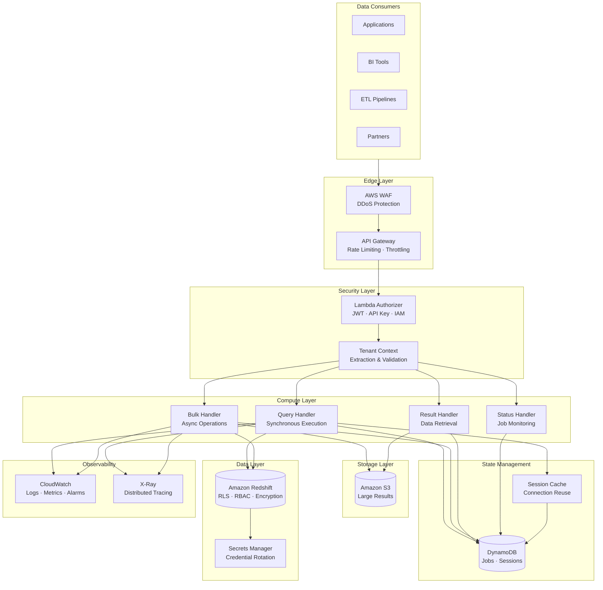
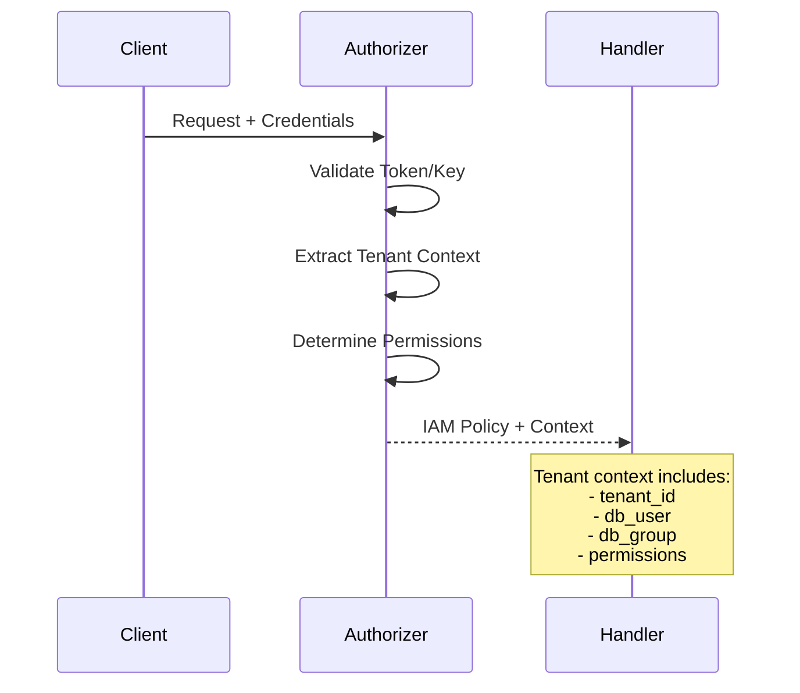
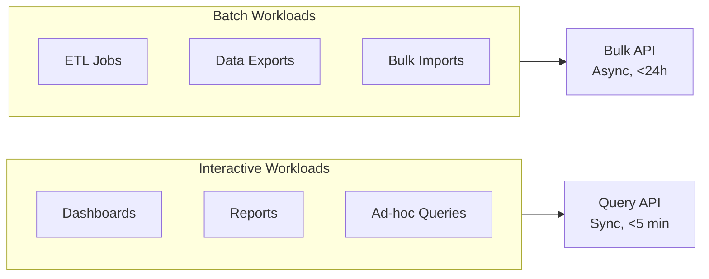
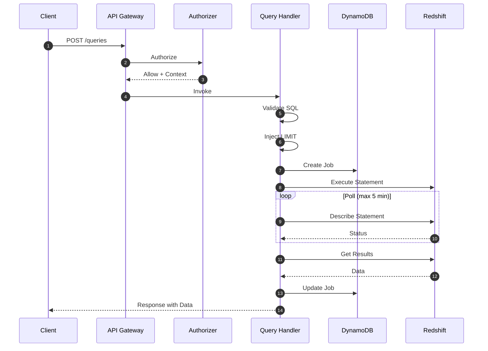
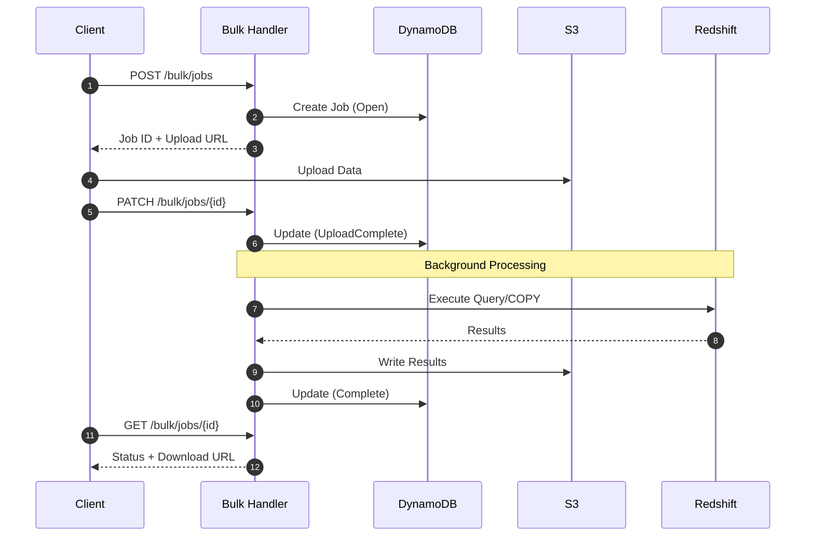
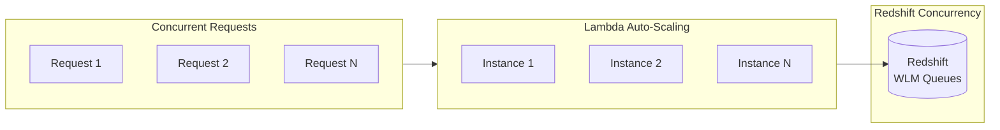
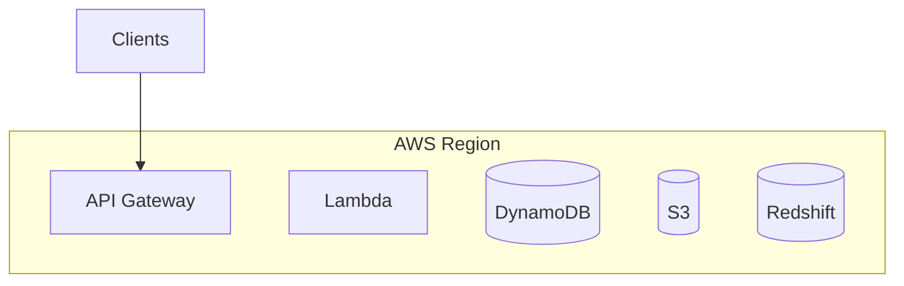
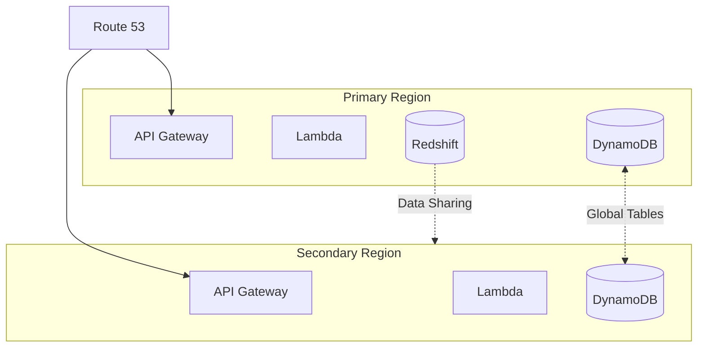

# Architecture

This document provides a comprehensive overview of Redshift Spectra's architecture, explaining the design decisions that make it suitable for enterprise data platforms.

## Design Philosophy

Redshift Spectra is built on three fundamental principles:

1. **Security by Design** — Tenant isolation is enforced at the database layer, not in application code
2. **Serverless First** — No servers to manage, automatic scaling, pay-per-use pricing
3. **Enterprise Ready** — Built for compliance, auditability, and operational excellence

## System Overview

The architecture follows a layered approach where each layer has a specific responsibility:

## Layer-by-Layer Explanation

### Edge Layer

The edge layer is your first line of defense and traffic management.

**AWS WAF** provides protection against common web exploits:

- SQL injection attempts (additional layer on top of our SQL validator)
- Cross-site scripting (XSS) protection
- Rate-based rules for DDoS mitigation
- Geographic restrictions for compliance

**API Gateway** handles traffic management:

- Request/response transformation
- Per-tenant throttling limits
- Request validation before Lambda invocation
- API versioning support

!!! info "Why API Gateway?"
    We chose API Gateway over Application Load Balancer for its native integration with Lambda authorizers, built-in request validation, and usage plan features essential for multi-tenant platforms.

### Security Layer

The security layer authenticates requests and establishes tenant context.

The **Lambda Authorizer** performs several critical functions:

1. **Authentication** — Validates JWT tokens, API keys, or IAM signatures
2. **Context Extraction** — Extracts tenant identifier from the credential
3. **User Mapping** — Maps tenant to appropriate database user
4. **Permission Assignment** — Determines what operations the tenant can perform

!!! warning "Why Tenant Context Matters"
    The tenant context flows through the entire request lifecycle. It determines which Redshift database user executes the query, which in turn controls what data the tenant can access through Row-Level Security.

### Compute Layer

The compute layer contains the business logic, organized into specialized handlers:

| Handler | Purpose | Execution Model |
|---------|---------|-----------------|
| **Query Handler** | Interactive queries | Synchronous (max 5 min) |
| **Bulk Handler** | Large data operations | Asynchronous (up to 24h) |
| **Result Handler** | Data retrieval | Synchronous |
| **Status Handler** | Job monitoring | Synchronous |

**Why Two Execution Models?**

Different use cases have different requirements:

The **Query API** is optimized for:

- Low latency responses
- Interactive user experiences
- Dashboard-style queries
- Small to medium result sets

The **Bulk API** is optimized for:

- Large data volumes
- Long-running operations
- ETL workloads
- Data import/export

### State Management

DynamoDB provides persistent state management with two primary tables:

**Jobs Table** — Tracks all query executions:

- Job metadata (ID, tenant, status, timestamps)
- Execution details (statement ID, duration)
- Result references (S3 location, row counts)
- Audit information (original SQL, parameters)

**Sessions Table** — Manages Redshift Data API sessions:

- Active session tracking per tenant/user combination
- TTL for automatic cleanup
- Last-used timestamps for session reuse

!!! tip "Why DynamoDB?"
    DynamoDB's single-digit millisecond latency and automatic scaling make it ideal for job state management. The built-in TTL feature handles automatic cleanup of old job records.

### Storage Layer

Amazon S3 stores large query results that exceed inline response limits:

- Results are partitioned by tenant for isolation
- Lifecycle rules automatically clean up old results
- Server-side encryption protects data at rest
- Presigned URLs provide time-limited, secure access

### Data Layer

**Amazon Redshift** is the analytical engine:

- Row-Level Security (RLS) enforces tenant data isolation
- Role-Based Access Control (RBAC) manages permissions
- Encryption at rest with KMS
- Audit logging for compliance

**Secrets Manager** handles credentials:

- Automatic rotation of database credentials
- No hardcoded passwords in code or configuration
- IAM-based access control

## Data Flow Patterns

### Synchronous Query Flow

The Query API executes queries synchronously, returning results directly in the response:

Key design decisions:

1. **LIMIT Injection** — Automatically adds LIMIT clause to prevent memory issues
2. **Polling with Backoff** — Exponential backoff prevents API throttling
3. **Truncation Detection** — Returns partial data with warning if results exceed threshold
4. **Job Audit Trail** — Every query is recorded even for sync execution

### Asynchronous Bulk Flow

The Bulk API uses a job-based pattern for long-running operations:

Key design decisions:

1. **State Machine** — Clear job states (Open → UploadComplete → InProgress → Complete)
2. **Decoupled Upload** — Presigned URLs allow direct S3 upload without Lambda
3. **Background Processing** — Jobs continue processing after client disconnects
4. **Result Delivery** — Large results stored in S3 with secure presigned URLs

## Scalability Considerations

### Horizontal Scaling

- **Lambda** — Automatically scales to thousands of concurrent executions
- **DynamoDB** — On-demand capacity scales with traffic
- **S3** — Virtually unlimited storage capacity
- **Redshift** — WLM queues manage concurrent queries

### Performance Optimizations

1. **Session Reuse** — Redshift Data API sessions are cached and reused
2. **Connection Pooling** — Sessions are shared across requests for the same tenant
3. **Lambda Warm Start** — Provisioned concurrency for latency-sensitive workloads
4. **Smart Caching** — Session metadata cached in DynamoDB with TTL

## Deployment Architecture

Redshift Spectra supports multiple deployment topologies:

### Single-Region Deployment

Suitable for most use cases:

### Multi-Region Deployment

For global enterprises requiring low-latency access:

## Next Steps

Now that you understand the architecture:

- [Learn about multi-tenancy](multi-tenancy.md) — Deep dive into tenant isolation
- [Explore data delivery](data-delivery.md) — Understand result handling strategies
- [Review security model](../security/overview.md) — Comprehensive security overview
