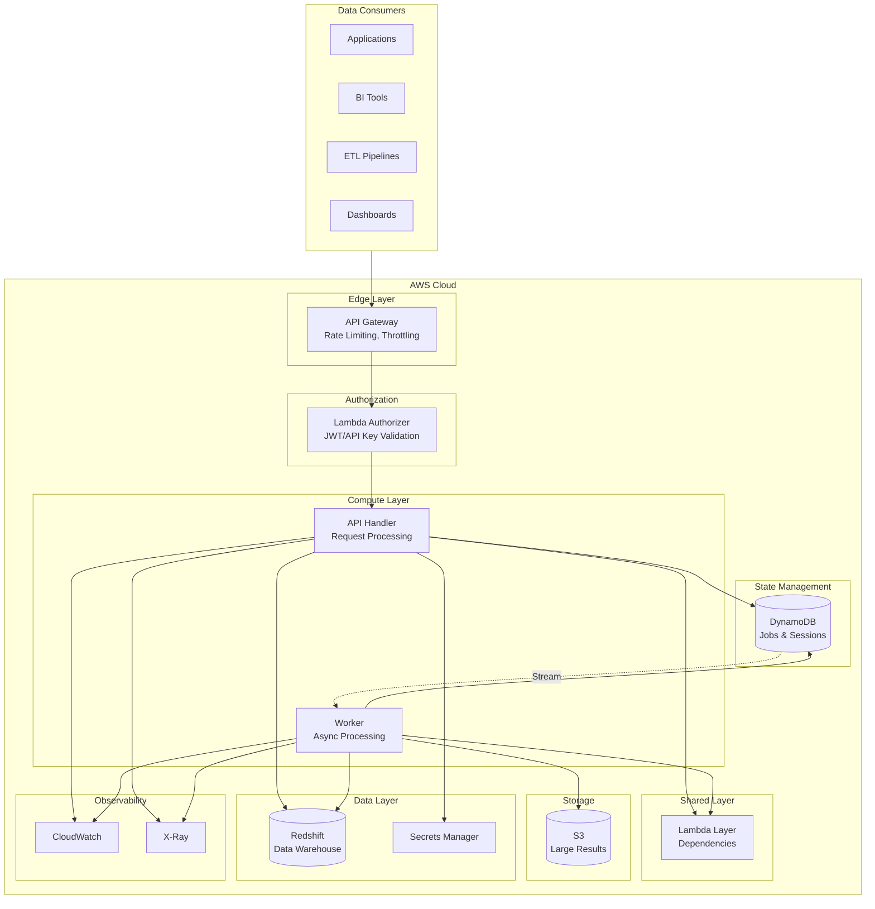
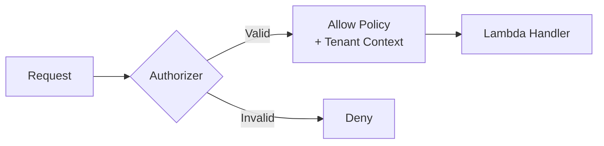
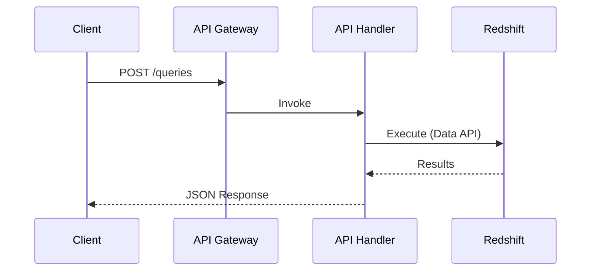
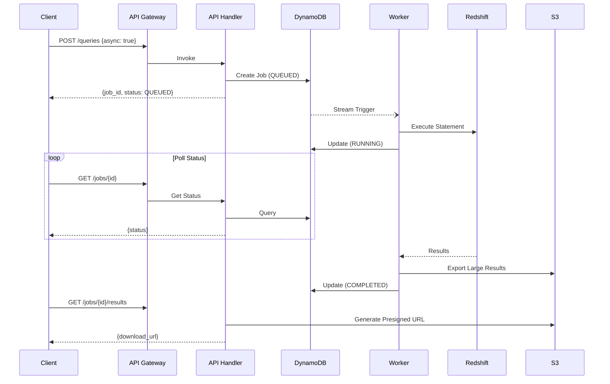
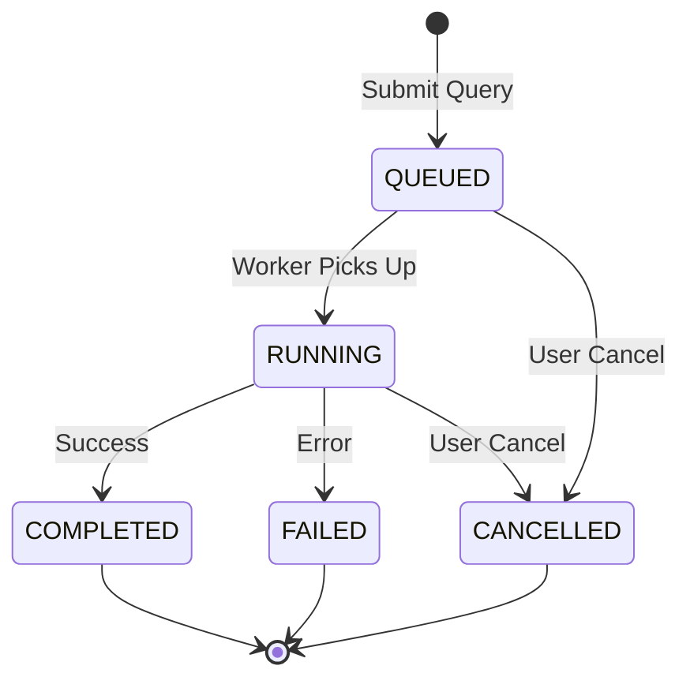
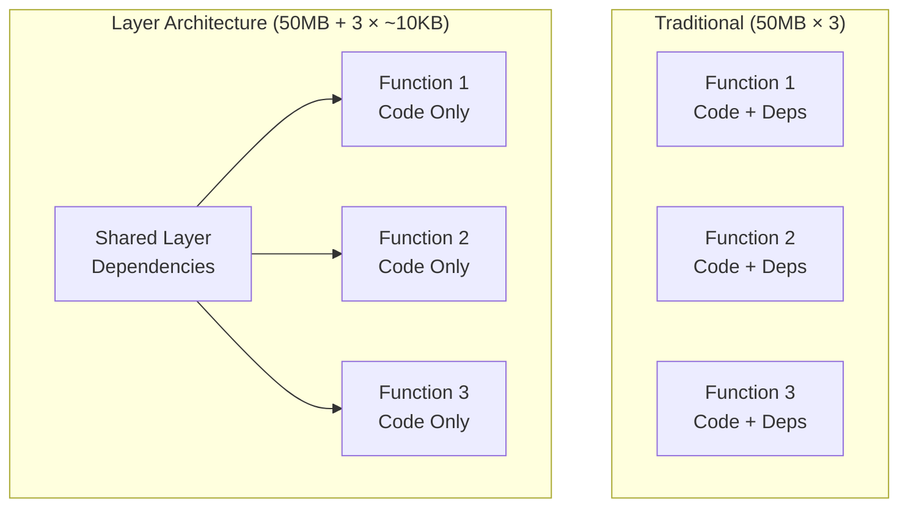
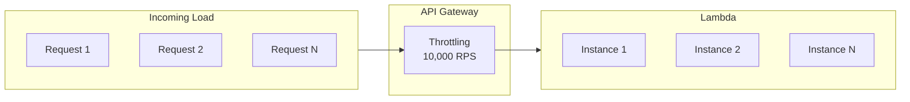

# Architecture

Deep dive into the Redshift Spectra system architecture and design decisions.

## System Overview

Redshift Spectra is a serverless middleware that provides secure, multi-tenant access to Amazon Redshift through a RESTful API.

## Core Components

### API Gateway

The entry point for all requests. Provides:

- **Rate Limiting**: Per-tenant request throttling
- **Request Validation**: Schema validation before Lambda invocation
- **CORS**: Cross-origin resource sharing configuration
- **SSL/TLS**: Encrypted communication

### Lambda Authorizer

Validates authentication and extracts tenant context:

### API Handler Lambda

Processes incoming requests synchronously:

- Query submission
- Job status checks
- Result retrieval
- Bulk job management

### Worker Lambda

Handles asynchronous operations triggered by DynamoDB Streams:

- Long-running query execution
- Large result export to S3
- Bulk data processing

### Lambda Layer

Shared dependencies for all functions:

| Package | Purpose |
|---------|---------|
| `aws-lambda-powertools` | Logging, tracing, metrics |
| `pydantic` | Data validation |
| `boto3` | AWS SDK |

## Data Flow

### Synchronous Query Flow

For small, fast queries:

### Asynchronous Query Flow

For long-running analytical queries:

## State Management

### Job Lifecycle

### DynamoDB Tables

**Jobs Table:**

| Attribute | Type | Description |
|-----------|------|-------------|
| `job_id` (PK) | String | Unique job identifier |
| `tenant_id` (GSI) | String | Tenant identifier |
| `status` | String | Job status |
| `sql` | String | Query SQL |
| `created_at` | String | Creation timestamp |
| `ttl` | Number | Expiration time |

**Sessions Table:**

| Attribute | Type | Description |
|-----------|------|-------------|
| `session_id` (PK) | String | Redshift session ID |
| `tenant_id` (GSI) | String | Tenant identifier |
| `created_at` | String | Session creation time |
| `last_used` | String | Last activity time |
| `ttl` | Number | Expiration time |

## Design Decisions

### Why Redshift Data API?

| Feature | Data API | JDBC/ODBC |
|---------|----------|-----------|
| Connection Management | AWS-managed | Self-managed |
| Scaling | Automatic | Connection pools |
| Cold Start | None | Connection overhead |
| Lambda Compatible | Native | VPC required |

### Why DynamoDB for State?

- **Serverless**: No connection limits
- **Low Latency**: Single-digit millisecond reads
- **Streams**: Trigger async processing
- **TTL**: Automatic data cleanup

### Why Lambda Layer Architecture?

Benefits:

- **Reduced Deployment Size**: Functions are KB instead of MB
- **Faster Updates**: Deploy code without rebuilding dependencies
- **Consistent Versions**: All functions use the same dependency versions

## Scalability

### Request Scaling

### Concurrency Limits

| Component | Limit | Configurable |
|-----------|-------|--------------|
| API Gateway | 10,000 RPS | Yes (quota) |
| Lambda Concurrent | 1,000 | Yes (reserved) |
| DynamoDB | On-demand | Automatic |
| Redshift Data API | 200 statements | Account quota |

## Next Steps

- [Multi-Tenancy](multi-tenancy.md) - Tenant isolation design
- [Data Delivery](data-delivery.md) - Result delivery patterns
- [Performance](../performance/overview.md) - Optimization techniques
