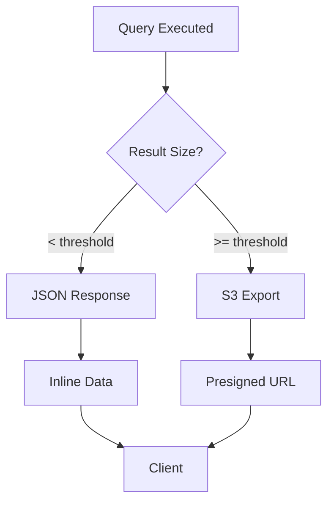
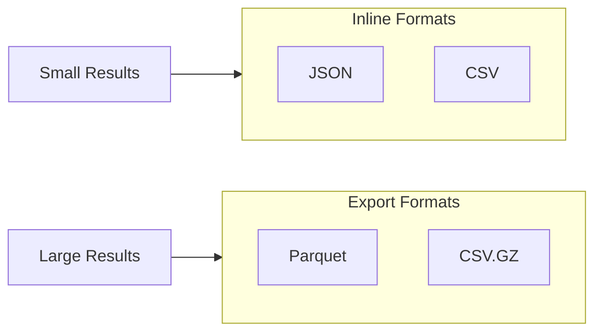

# Data Delivery

Redshift Spectra provides a **hybrid data delivery** strategy that automatically chooses the optimal format based on result size.

## Overview



## Delivery Modes

### Inline JSON

For small result sets (default: < 10,000 rows), data is returned directly in the API response:

```json
{
  "data": [
    {"id": 1, "name": "Product A", "revenue": 1000.00},
    {"id": 2, "name": "Product B", "revenue": 2500.00}
  ],
  "metadata": {
    "columns": ["id", "name", "revenue"],
    "row_count": 2,
    "format": "json"
  }
}
```

**Benefits:**

- Immediate data access
- No additional API calls
- Simple client implementation

### S3 Export

For large result sets, data is exported to S3 and a presigned URL is returned:

```json
{
  "download_url": "https://s3.amazonaws.com/...",
  "expires_at": "2026-01-29T11:00:00Z",
  "format": "parquet",
  "size_bytes": 52428800,
  "row_count": 1500000
}
```

**Benefits:**

- No timeout concerns for large datasets
- Efficient binary formats (Parquet)
- Direct S3 download capability

## Format Selection



### Supported Formats

| Format | Use Case | Compression | Best For |
|--------|----------|-------------|----------|
| **JSON** | Small results | None | Web applications |
| **CSV** | Tabular data | Optional GZIP | Spreadsheets |
| **Parquet** | Large exports | Built-in | Analytics tools |

## Configuration

Control the threshold in your environment:

```bash
# Number of rows before switching to S3 export
SPECTRA_RESULT_SIZE_THRESHOLD=10000

# Presigned URL expiration (seconds)
SPECTRA_PRESIGNED_URL_EXPIRY=3600
```

## Request-Level Override

Clients can request specific delivery modes:

```bash
# Force S3 export regardless of size
curl -X POST "$API_URL/queries" \
  -H "Authorization: Bearer $TOKEN" \
  -d '{
    "sql": "SELECT * FROM sales",
    "output_format": "parquet",
    "force_export": true
  }'
```

## Best Practices

!!! tip "Choosing the Right Format"
    
    - Use **JSON** for interactive applications with small result sets
    - Use **Parquet** for analytical workloads and BI tool integration
    - Use **CSV** for data exchange with legacy systems

!!! warning "Presigned URL Security"
    
    Presigned URLs are time-limited but accessible to anyone with the URL. 
    Configure `SPECTRA_PRESIGNED_URL_EXPIRY` based on your security requirements.
