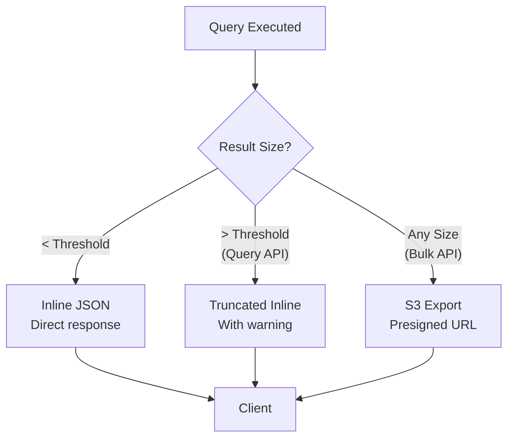
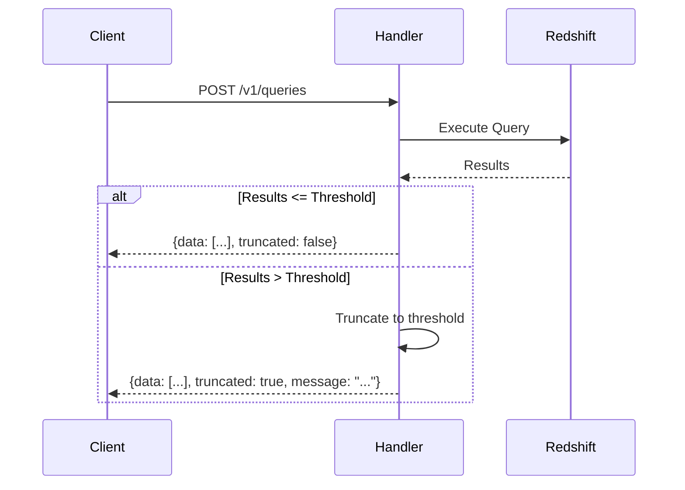
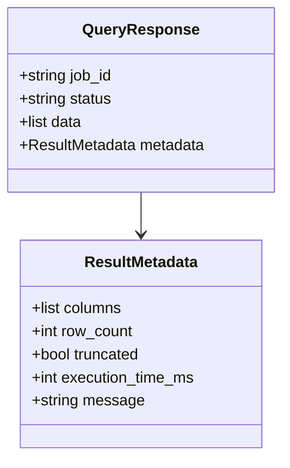
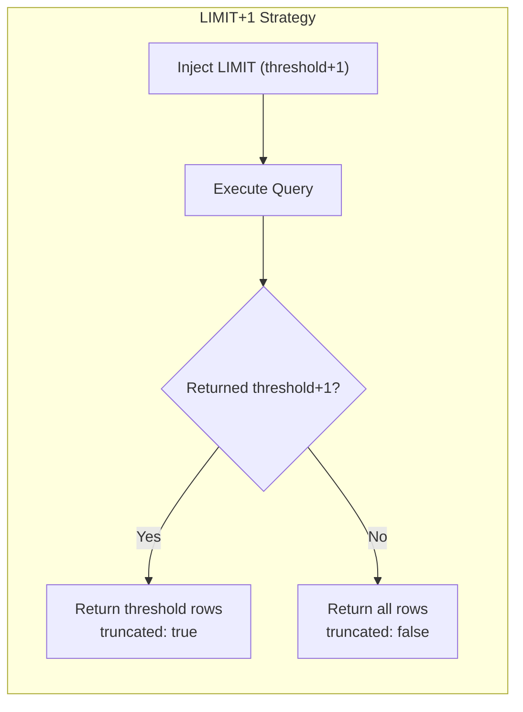
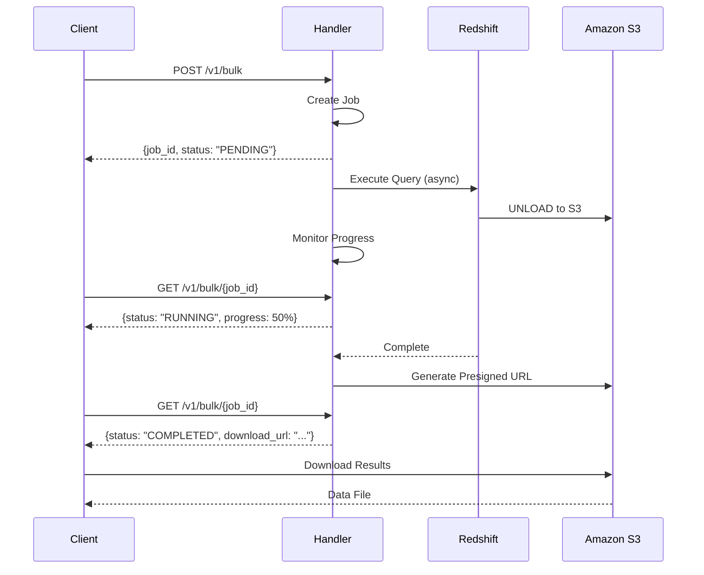
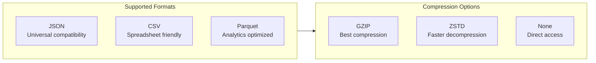
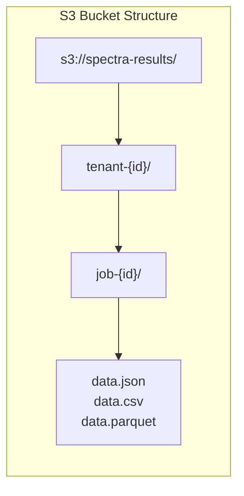
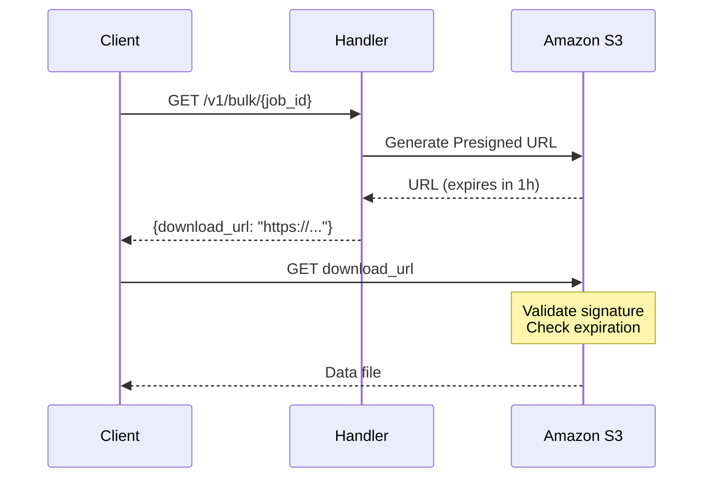
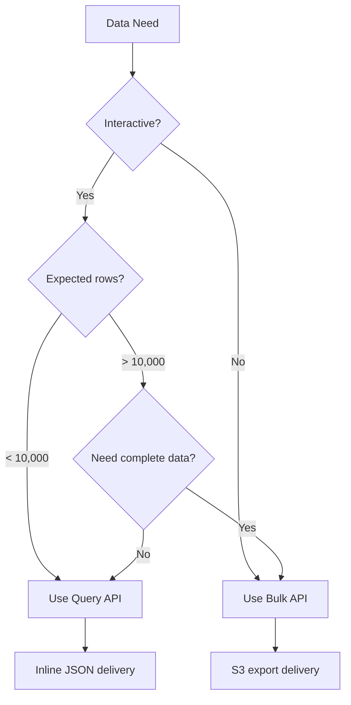
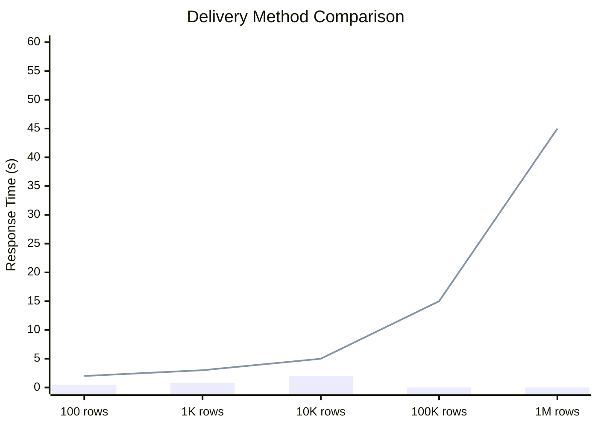

# Data Delivery

Redshift Spectra provides intelligent data delivery that automatically adapts to result size, ensuring optimal performance for both small interactive queries and large data exports.

## Delivery Strategy Overview



The delivery method depends on the API used and result size:

| API | Small Results | Large Results |
|-----|--------------|---------------|
| **Query API** | Inline JSON | Truncated + warning |
| **Bulk API** | S3 export | S3 export |

## Query API: Inline Delivery

The Query API returns results directly in the response body for fast, interactive access.

### Synchronous Flow



### Inline Response Structure

Inline responses include both data and metadata:



### Truncation Behavior

When results exceed the threshold, the Query API:

1. Fetches `threshold + 1` rows
2. Detects if there are more rows
3. Returns only `threshold` rows
4. Sets `truncated: true` with guidance message



This strategy detects truncation without executing the query twice.

## Bulk API: S3 Delivery

The Bulk API exports results directly to Amazon S3, supporting unlimited result sizes.

### Asynchronous Flow



### Export Formats

The Bulk API supports multiple export formats:



| Format | Best For | Compression Support |
|--------|----------|-------------------|
| **JSON** | APIs, web applications | GZIP, ZSTD |
| **CSV** | Spreadsheets, simple ETL | GZIP, ZSTD |
| **Parquet** | Data lakes, analytics | Native compression |

### S3 Organization

Results are organized in S3 by tenant and job:



This structure ensures:

- **Tenant isolation** — Each tenant has separate prefix
- **IAM policies** — Can restrict access by prefix
- **Lifecycle rules** — Automatic cleanup after retention period

### Presigned URLs

Results are delivered via time-limited presigned URLs:



Presigned URL characteristics:

- **Time-limited** — Default 1 hour expiration
- **Single-use** — Can optionally restrict to one download
- **Tenant-scoped** — URL only works for original tenant's data
- **No credentials needed** — Client doesn't need AWS credentials

## Choosing the Right API



### Decision Matrix

| Scenario | API | Delivery | Reason |
|----------|-----|----------|--------|
| Dashboard widget | Query | Inline | Fast, interactive |
| Ad-hoc exploration | Query | Inline | Quick feedback |
| Large report export | Bulk | S3 | Unlimited size |
| ETL pipeline | Bulk | S3 | Reliable, resumable |
| API integration | Query | Inline | Simple consumption |
| Data lake feed | Bulk | S3/Parquet | Optimal format |

## Performance Characteristics

### Inline Delivery

- **Latency**: Low (included in response)
- **Memory**: Limited by Lambda memory
- **Throughput**: Limited by API Gateway payload size
- **Max size**: Configurable threshold (default 10,000 rows)

### S3 Delivery

- **Latency**: Higher (async processing)
- **Memory**: Unlimited (streams to S3)
- **Throughput**: High (parallel UNLOAD)
- **Max size**: Unlimited



*Bar = Query API (Inline), Line = Bulk API (S3)*

## Data Format Details

### JSON Format

```json
{
  "metadata": {
    "columns": [...],
    "row_count": 1000,
    "generated_at": "2026-01-30T10:00:00Z"
  },
  "data": [
    {"id": 1, "name": "Product A", "price": 29.99},
    {"id": 2, "name": "Product B", "price": 49.99}
  ]
}
```

### CSV Format

```csv
id,name,price
1,Product A,29.99
2,Product B,49.99
```

CSV options:
- Delimiter: `,` (default), `|`, `\t`
- Quote character: `"` (default)
- Line ending: `\n` (default), `\r\n`
- Header row: Included by default

### Parquet Format

Parquet provides columnar storage with:
- **Schema preservation** — Types preserved from Redshift
- **Compression** — Native compression (Snappy, ZSTD)
- **Partitioning** — Can be partitioned by columns
- **Analytics optimized** — Efficient for BI tools

## Best Practices

!!! tip "Right-Size Your Queries"
    For Query API:

    - Add LIMIT when exploring data
    - Use aggregations to reduce row count
    - Switch to Bulk API for large exports

!!! tip "Choose Format by Consumer"
    - **JSON** for applications and APIs
    - **CSV** for spreadsheets and simple tools
    - **Parquet** for data lakes and analytics

!!! tip "Handle Truncation Gracefully"
    When `truncated: true`:

    - Display partial data with clear indicator
    - Offer option to export full dataset via Bulk API
    - Log for analytics on query patterns

!!! warning "Presigned URL Security"
    Treat presigned URLs like temporary credentials:

    - Don't log URLs with full signatures
    - Use short expiration times
    - Consider single-use restrictions
