# Multi-Tenancy

Multi-tenancy is at the heart of Redshift Spectra's design. This document explains why we implement tenant isolation at the database layer and how this approach delivers superior security compared to application-level filtering.

## The Multi-Tenancy Challenge

When building a data platform that serves multiple tenants, you face a fundamental question: **where do you enforce tenant isolation?**

```mermaid
flowchart TB
    subgraph AppLevel["❌ Application-Level Isolation"]
        direction TB
        APP1[Application Code] --> FILTER[WHERE tenant_id = ?]
        FILTER --> DATA1[(Shared Data)]
        
        RISK1[🔴 Bug = Data Leak]
        RISK2[🔴 Every Query Needs Filter]
        RISK3[🔴 Hard to Audit]
    end
    
    subgraph DBLevel["✅ Database-Level Isolation"]
        direction TB
        APP2[Application Code] --> USER[Execute as tenant_user]
        USER --> RLS[Row-Level Security]
        RLS --> DATA2[(Shared Data)]
        
        SAFE1[🟢 Guaranteed Isolation]
        SAFE2[🟢 No Code Changes]
        SAFE3[🟢 Built-in Audit]
    end
```

### Why Application-Level Filtering Fails

Traditional multi-tenant applications add `WHERE tenant_id = ?` to every query. This approach has critical weaknesses:

| Risk | Description | Impact |
|------|-------------|--------|
| **Developer Error** | Forgetting to add tenant filter | Complete data breach |
| **SQL Injection** | Malicious query bypassing filter | Cross-tenant access |
| **Query Complexity** | Complex queries miss filters | Partial data leak |
| **Audit Difficulty** | No central enforcement point | Compliance failure |
| **Performance** | Repeated filter logic | Query overhead |

!!! danger "Real-World Impact"
    A single missing `WHERE tenant_id = ?` clause in a query can expose one tenant's sensitive data to another. This is not a theoretical risk—it's one of the most common causes of data breaches in multi-tenant systems.

### Why Database-Level Isolation Works

Redshift Spectra implements tenant isolation at the database layer using Redshift's native security features:

1. **Each tenant maps to a database user** — When Tenant A makes a request, queries execute as `db_user_tenant_a`
2. **Row-Level Security filters automatically** — Redshift applies `WHERE tenant_id = 'tenant_a'` to every query
3. **No application code changes needed** — The same SQL works for all tenants with automatic filtering

This means: **Even if application code has bugs, tenant isolation cannot be violated.**

## How It Works

### The Tenant Context Flow

Every request flows through a series of transformations that establish and enforce tenant context:

### Step 1: Tenant Identification

The authorizer extracts tenant identity from the request:

Multiple authentication methods are supported, each carrying tenant identification:

| Method | Tenant Source | Use Case |
|--------|---------------|----------|
| **JWT Token** | Custom claim `tenant_id` | User authentication via IdP |
| **API Key** | Key prefix or lookup | Machine-to-machine |
| **Request Header** | `X-Tenant-ID` header | Internal services |

### Step 2: Database User Mapping

Each tenant is mapped to a dedicated Redshift database user:

This mapping is configured in your tenant registry and can be:

- **Static** — Predefined mapping in configuration
- **Dynamic** — Computed from tenant ID (e.g., `db_user_{tenant_id}`)
- **Lookup-based** — Retrieved from a tenant database

### Step 3: Row-Level Security Enforcement

Redshift RLS policies automatically filter data based on the executing user:

!!! info "How RLS Works"
    When you execute a query as `db_user_acme`, Redshift automatically applies the RLS policy. The function `current_user_name()` returns `acme` (or however you've configured the mapping), and all queries are filtered to only return that tenant's data.

### Step 4: Column-Level Security (Optional)

For additional data protection, you can restrict which columns tenants can access:

```mermaid
flowchart TB
    subgraph Columns["Table Columns"]
        C1[id ✅]
        C2[name ✅]
        C3[email ✅]
        C4[internal_cost ❌]
        C5[margin ❌]
    end
    
    subgraph Access["Column Access"]
        ALLOW[Tenant Can See]
        DENY[Tenant Cannot See]
    end
    
    C1 --> ALLOW
    C2 --> ALLOW
    C3 --> ALLOW
    C4 --> DENY
    C5 --> DENY
```

This is useful when:

- Some columns contain internal business data
- Different tenant tiers have different access levels
- Compliance requires restricting sensitive fields

## Security Guarantees

### Defense in Depth

Redshift Spectra implements security at multiple layers:

| Layer | Protection | What It Prevents |
|-------|------------|------------------|
| **API Gateway** | WAF, Rate Limiting | DDoS, Common attacks |
| **Authentication** | Token Validation | Unauthorized access |
| **Authorization** | Permission Check | Unpermitted operations |
| **SQL Validation** | Query Analysis | Injection attacks |
| **Database** | RLS/CLS | Cross-tenant data access |

### Why This Matters for Compliance

Enterprise data platforms must meet strict compliance requirements:

| Requirement | How Spectra Addresses It |
|-------------|-------------------------|
| **Data Isolation** (SOC 2) | Database-level RLS guarantees tenant separation |
| **Access Control** (GDPR) | Per-tenant database users with explicit grants |
| **Audit Trail** (HIPAA) | Every query logged with tenant context |
| **Least Privilege** (ISO 27001) | Column-level restrictions for sensitive data |

## Implementation Patterns

### Pattern 1: Simple Tenant-per-User

Each tenant gets a dedicated database user:

**Best for:** Simple setups, clear tenant boundaries

### Pattern 2: Tenant Groups with Roles

Tenants grouped by access level:

**Best for:** Tiered service offerings, different access levels

### Pattern 3: Dynamic Tenant Context

Tenant identifier passed at query time:

**Best for:** Complex multi-tenant scenarios, dynamic provisioning

## Operational Considerations

### Tenant Provisioning

When onboarding a new tenant:

1. **Create database user** — Dedicated user for the tenant
2. **Grant permissions** — Add to appropriate database groups
3. **Register mapping** — Add tenant-to-user mapping
4. **Verify isolation** — Test that RLS is working

### Tenant Deprovisioning

When offboarding a tenant:

1. **Revoke permissions** — Remove from all groups
2. **Archive data** — Export tenant data if required
3. **Remove user** — Drop or disable database user
4. **Clean up mapping** — Remove from tenant registry

### Monitoring Isolation

Regular verification of tenant isolation:

- Query audit logs for cross-tenant access attempts
- Automated tests that verify RLS is active
- Alerts for unusual query patterns

## Next Steps

- [Security Overview](../security/overview.md) — Complete security architecture
- [Authentication](../security/authentication.md) — Auth methods and configuration
- [SQL Security](../security/sql-security.md) — Query validation and protection
