# Multi-Tenancy

Redshift Spectra implements a zero-trust multi-tenancy model using Redshift's native security features.

## Overview

True multi-tenancy means:

- **Data Isolation**: Tenant A can never access Tenant B's data
- **Zero Logic Pollution**: No tenant checks in application code
- **Database-Level Security**: Enforcement at the data layer

```mermaid
flowchart TB
    subgraph API["API Layer"]
        REQ1[Tenant A Request]
        REQ2[Tenant B Request]
    end
    
    subgraph Mapping["Tenant Mapping"]
        MAP[Tenant → db_user]
    end
    
    subgraph Redshift["Redshift Security"]
        USER_A[db_user: tenant_a]
        USER_B[db_user: tenant_b]
        RLS[Row-Level Security]
        DATA[(Data)]
    end
    
    REQ1 --> MAP
    REQ2 --> MAP
    MAP --> USER_A
    MAP --> USER_B
    USER_A --> RLS
    USER_B --> RLS
    RLS --> DATA
```



## Security Layers

### Layer 1: Tenant Context Extraction

Every request includes tenant identification:

```http
POST /v1/queries
Authorization: Bearer <token>
X-Tenant-ID: tenant-123
```

The Lambda Authorizer extracts and validates:


### Layer 2: Database User Mapping

Each tenant maps to a Redshift database user:

| Tenant ID | Database User | Database Group |
|-----------|---------------|----------------|
| `acme-corp` | `tenant_acme_corp` | `tenant_group` |
| `globex` | `tenant_globex` | `tenant_group` |
| `initech` | `tenant_initech` | `tenant_group` |

### Layer 3: Row-Level Security (RLS)

Redshift RLS policies automatically filter data:

```sql
-- Create RLS policy
CREATE RLS POLICY tenant_isolation
ON sales
USING (tenant_id = current_user_name());

-- Attach to table
ALTER TABLE sales ROW LEVEL SECURITY ON;
```

When `tenant_acme_corp` queries:

```sql
SELECT * FROM sales;
-- Redshift automatically applies: WHERE tenant_id = 'acme_corp'
```

### Layer 4: Column-Level Security (Optional)

Restrict which columns tenants can access:

```sql
-- Grant specific columns only
GRANT SELECT (id, name, amount) 
ON sales 
TO tenant_group;

-- Revoke sensitive columns
REVOKE SELECT (internal_cost, margin)
ON sales
FROM tenant_group;
```

## Implementation

### Tenant Context

```python
@dataclass
class TenantContext:
    tenant_id: str          # Unique tenant identifier
    db_user: str            # Redshift database user
    db_group: str | None    # Redshift database group
    permissions: list[str]  # Allowed operations
    metadata: dict          # Additional context
```

### Query Execution


### Redshift Data API Integration

```python
# Execute query with tenant's database user
response = client.execute_statement(
    ClusterIdentifier=cluster_id,
    Database=database,
    DbUser=tenant_context.db_user,  # Tenant-specific user
    Sql=query.sql,
)
```

## Setting Up Multi-Tenancy

### Step 1: Create Database Users

```sql
-- Create a user for each tenant
CREATE USER tenant_acme_corp PASSWORD 'secure_password';
CREATE USER tenant_globex PASSWORD 'secure_password';

-- Create a shared group
CREATE GROUP tenant_group;

-- Add users to group
ALTER GROUP tenant_group ADD USER tenant_acme_corp;
ALTER GROUP tenant_group ADD USER tenant_globex;
```

### Step 2: Configure Table Access

```sql
-- Grant schema access
GRANT USAGE ON SCHEMA public TO GROUP tenant_group;

-- Grant table access
GRANT SELECT ON ALL TABLES IN SCHEMA public TO GROUP tenant_group;
```

### Step 3: Enable Row-Level Security

```sql
-- Add tenant_id column to tables
ALTER TABLE sales ADD COLUMN tenant_id VARCHAR(100);

-- Create RLS policy
CREATE RLS POLICY tenant_policy
ON sales
USING (tenant_id = current_user_name());

-- Enable RLS
ALTER TABLE sales ROW LEVEL SECURITY ON;
```

### Step 4: Configure Secrets

Store credentials in Secrets Manager:

```json
{
  "username": "admin",
  "password": "admin_password",
  "tenant_users": {
    "acme-corp": "tenant_acme_corp",
    "globex": "tenant_globex"
  }
}
```

## Security Best Practices

!!! warning "Critical Security Considerations"

    1. **Never trust client-provided tenant IDs directly** - Always validate against authenticated context
    2. **Use separate database users per tenant** - Never share database credentials
    3. **Enable RLS on all tenant tables** - Don't rely on application-level filtering
    4. **Audit access regularly** - Monitor query logs for anomalies

### Audit Logging

Enable Redshift audit logging:

```sql
-- Enable user activity logging
ALTER USER tenant_acme_corp ENABLE SYSLOG;

-- Query audit logs
SELECT 
    userid,
    query,
    starttime
FROM stl_query
WHERE userid = (SELECT usesysid FROM pg_user WHERE usename = 'tenant_acme_corp')
ORDER BY starttime DESC;
```

## Tenant Isolation Testing

Verify isolation with these tests:

```python
def test_tenant_isolation():
    """Verify Tenant A cannot see Tenant B's data."""
    
    # Insert data for Tenant A
    insert_data(tenant="acme", data={"secret": "acme_secret"})
    
    # Query as Tenant B
    result = query_as_tenant(tenant="globex", sql="SELECT * FROM sales")
    
    # Verify no Tenant A data returned
    assert "acme_secret" not in str(result)
```

## Next Steps

- [Authorization](../security/authorization.md) - Permission model details
- [Authentication](../security/authentication.md) - Auth methods
- [Data Delivery](data-delivery.md) - Result delivery patterns
