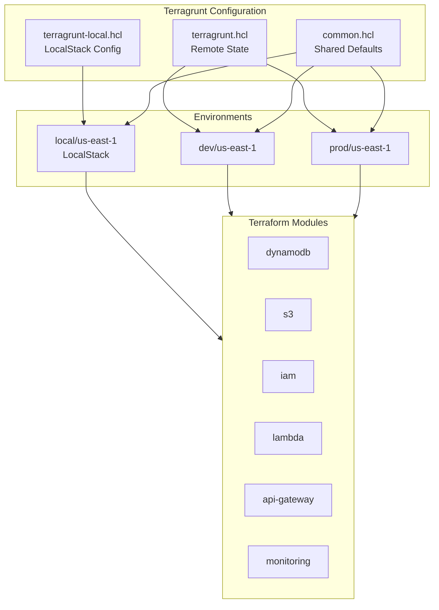
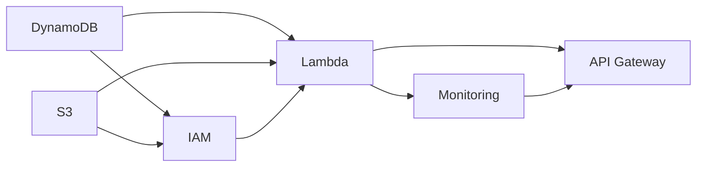

# Infrastructure Deployment

Redshift Spectra uses **Terragrunt** for DRY, modular infrastructure deployment across multiple environments.

## Architecture



## Directory Structure

```
terragrunt/
├── terragrunt.hcl          # Root config for AWS (remote state, providers)
├── terragrunt-local.hcl    # Root config for LocalStack (local state)
├── common.hcl              # Shared default values
└── environments/
    ├── local/              # LocalStack environment
    │   ├── account.hcl     # LocalStack account settings
    │   └── us-east-1/
    │       ├── region.hcl  # LocalStack endpoint settings
    │       ├── env.hcl     # Environment settings
    │       ├── dynamodb/
    │       ├── s3/
    │       ├── iam/
    │       ├── lambda/
    │       ├── api-gateway/
    │       └── monitoring/
    ├── dev/
    │   ├── account.hcl     # AWS account settings
    │   └── us-east-1/
    │       ├── region.hcl  # Region settings
    │       ├── env.hcl     # Environment settings
    │       ├── dynamodb/
    │       ├── s3/
    │       ├── iam/
    │       ├── lambda/
    │       ├── api-gateway/
    │       └── monitoring/
    └── prod/
        └── us-east-1/
            └── ...         # Same structure as dev
```

## Module Dependencies



## Quick Start

### Prerequisites

- AWS CLI configured with appropriate credentials
- Terraform >= 1.14
- Terragrunt >= 0.99
- Lambda packages built (`make package-all`)

### Deploy to LocalStack (Local Development)

```bash
# Start LocalStack and deploy all modules
make deploy-local

# Or step by step:
make localstack-start
make tg-init-local
make tg-plan-local
make tg-apply-local

# View dependency graph
make tg-graph-local

# View outputs
make tg-output-local
```

See [LocalStack documentation](../development/localstack.md) for detailed local development instructions.

### Deploy to Development

```bash
# Initialize all modules
make tg-init-dev

# Preview changes
make tg-plan-dev

# Apply changes
make tg-apply-dev

# View dependency graph
make tg-graph-dev

# View outputs
make tg-output-dev
```

### Deploy to Production

```bash
# Initialize
make tg-init-prod

# Plan (always review production changes!)
make tg-plan-prod

# Apply (requires confirmation)
make tg-apply-prod
```

## Module-by-Module Deployment

Deploy specific modules when needed:

```bash
# Plan individual modules
make tg-plan-dynamodb-dev
make tg-plan-lambda-dev
make tg-plan-api-gateway-dev

# Apply to specific module
cd terragrunt/environments/dev/us-east-1/lambda
terragrunt apply
```

## Configuration

### Remote State

Configured in `terragrunt.hcl`:

```hcl
remote_state {
  backend = "s3"
  config = {
    bucket         = "spectra-terraform-state"
    key            = "${path_relative_to_include()}/terraform.tfstate"
    region         = "us-east-1"
    encrypt        = true
    dynamodb_table = "spectra-terraform-locks"
  }
}
```

### Environment Variables

Each environment has specific configurations:

```hcl
# environments/dev/us-east-1/env.hcl
locals {
  environment = "dev"

  # Lambda settings
  lambda_memory_size = 512
  lambda_timeout     = 30

  # DynamoDB settings
  dynamodb_billing_mode = "PAY_PER_REQUEST"
}
```

## Terraform Modules

### DynamoDB Module

Creates tables for job tracking, session management, and bulk operations:

| Table | Purpose | Indexes |
|-------|---------|---------|
| `spectra-jobs` | Sync query job state tracking | GSI: tenant_id-status |
| `spectra-sessions` | Redshift session cache | GSI: tenant_id |
| `spectra-bulk-jobs` | Async bulk job state tracking | GSI: tenant_id-status |

### Lambda Module

Deploys Lambda functions with shared layer:

| Function | Purpose | Trigger |
|----------|---------|---------|
| `api-handler` | API request processing | API Gateway |
| `worker` | Async job execution | DynamoDB Stream |
| `authorizer` | Request authorization | API Gateway |

### API Gateway Module

Creates REST API with:

- Custom domain (optional)
- API key authentication
- Request validation
- CORS configuration
- Usage plans and throttling

## Outputs

After deployment, retrieve important values:

```bash
make tg-output-dev
```

```
api_endpoint       = "https://abc123.execute-api.us-east-1.amazonaws.com/v1"
api_key_id         = "abcdef123456"
lambda_function_arn = "arn:aws:lambda:us-east-1:123456789012:function:spectra-api"
dynamodb_table_arn = "arn:aws:dynamodb:us-east-1:123456789012:table/spectra-jobs"
```

## Cleanup

!!! danger "Destructive Operation"

    This will permanently delete all infrastructure and data!

```bash
# Destroy development environment
make tg-destroy-dev

# Destroy production (use with extreme caution!)
make tg-destroy-prod
```

## Best Practices

!!! tip "Always Plan First"

    Run `make tg-plan-*` before applying changes, especially in production.

!!! tip "Use Dependency Graph"

    View module dependencies with `make tg-graph-dev` to understand deployment order.

!!! warning "State Lock"

    Terragrunt uses DynamoDB for state locking. Never force-unlock unless absolutely necessary.
