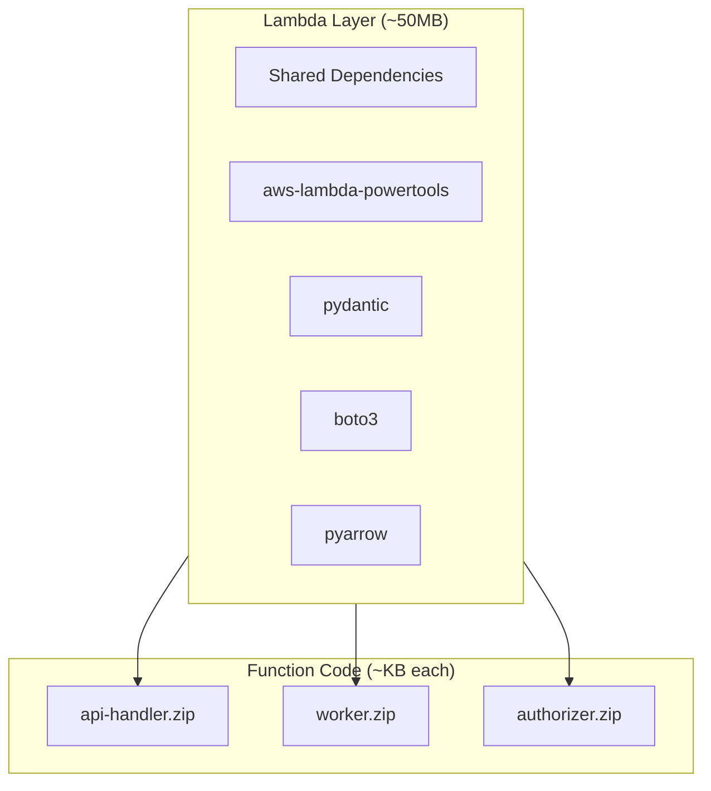
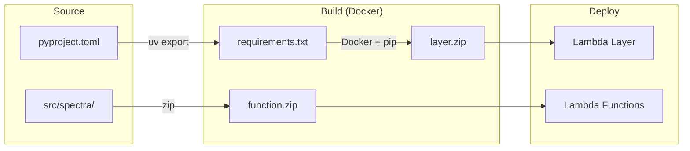
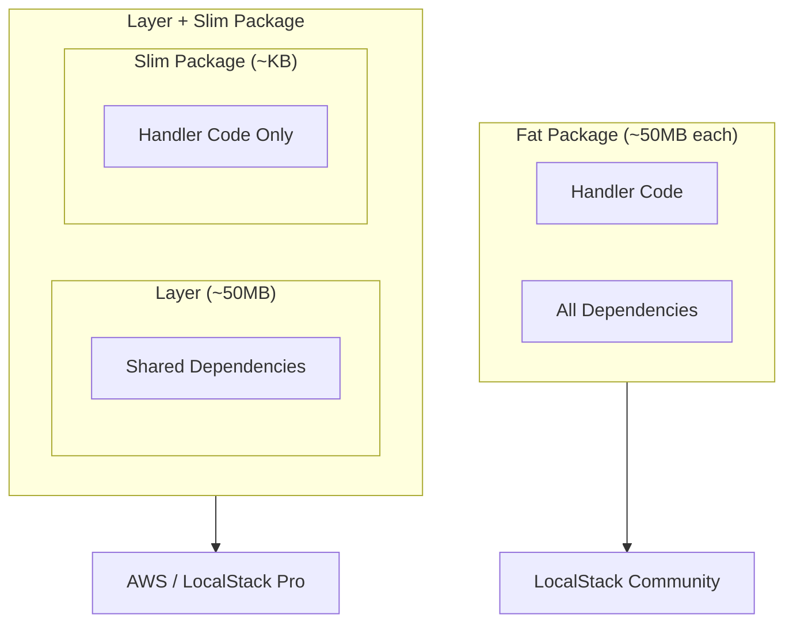
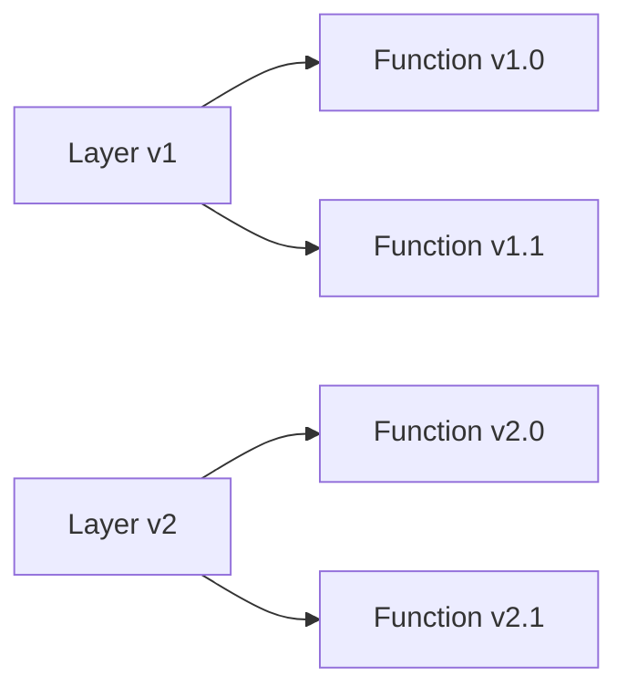

# Lambda Layer Architecture

Redshift Spectra uses a **Lambda Layer** pattern to optimize deployment size, cold start times, and dependency management.

## Overview



## Why Use Layers?

| Aspect | Without Layer | With Layer |
|--------|---------------|------------|
| **Package Size** | 50MB × 3 = 150MB | 50MB + 3×KB |
| **Deploy Time** | Slow (upload 150MB) | Fast (upload layer once) |
| **Cold Start** | Consistent | Optimized caching |
| **Updates** | Redeploy everything | Update only what changed |

## Build Process



## Building the Layer

The layer is built using Docker with Amazon Linux 2 to ensure Lambda runtime compatibility.

### Quick Build

```bash
# Generate requirements and build layer using Docker
make package-layer
```

### Using the Build Script

```bash
# Build layer (uses Docker by default)
python scripts/build_layer.py --output dist/lambda/layer.zip

# Skip size validation
python scripts/build_layer.py --skip-validation
```

### Manual Docker Build

```bash
# 1. Generate requirements.txt
uv export --no-hashes --no-dev --no-emit-project > requirements.txt

# 2. Build using Docker with Amazon Linux 2
docker run --rm -v $(pwd):/build public.ecr.aws/lambda/python:3.11 \
    pip install -r /build/requirements.txt -t /build/dist/lambda/layer/python --quiet

# 3. Create zip
cd dist/lambda/layer && zip -r ../layer.zip .
```

!!! note "Why Docker?"

    Docker builds ensure 100% compatibility with the Lambda runtime environment
    (Amazon Linux 2). Local builds may have platform-specific binary incompatibilities,
    especially for packages like `pyarrow` that include native extensions.

## Building Function Packages

Function packages contain only your application code:

```bash
make package-lambda
```

This creates:

```
dist/lambda/
├── layer.zip          # Shared dependencies
├── api-handler.zip    # API handler code only
├── worker.zip         # Worker code only
└── authorizer.zip     # Authorizer code only
```

## Fat Lambda Packages (LocalStack Community)

!!! info "For LocalStack Community Edition"

    **Lambda Layers are a LocalStack Pro feature.** If you're using LocalStack Community (free version),
    you need to use "fat" Lambda packages with all dependencies bundled inside.

### What are Fat Packages?

Fat packages bundle all dependencies directly into the Lambda deployment package, eliminating the need for Lambda Layers:



### Building Fat Packages

```bash
# Build fat packages for LocalStack Community
make package-lambda-fat

# Or using the script directly
./scripts/package_lambda.sh --fat --clean
```

This creates:

```
dist/lambda/
├── api-handler-fat.zip    # API handler + all dependencies
├── worker-fat.zip         # Worker + all dependencies
└── authorizer-fat.zip     # Authorizer + all dependencies
```

### When to Use Each Mode

| Mode | Command | Use Case | Package Size |
|------|---------|----------|--------------|
| **Layer + Slim** | `make package-layer` | AWS Production, LocalStack Pro | Layer: ~50MB, Functions: ~KB |
| **Fat** | `make package-lambda-fat` | LocalStack Community (free) | Each: ~50MB |

### Size Comparison

| Package Type | api-handler | worker | authorizer | Total |
|--------------|-------------|--------|------------|-------|
| Fat (bundled) | ~50MB | ~50MB | ~50MB | ~150MB |
| Slim (with layer) | ~10KB | ~10KB | ~10KB | ~30KB + 50MB layer |

!!! warning "Fat Package Limitations"

    - Larger deployment size (dependencies duplicated in each package)
    - Slower deployments due to larger upload size
    - Not recommended for production AWS deployments
    - Use only for LocalStack Community local testing

### Packaging Script Options

The `scripts/package_lambda.sh` script supports the following options:

```bash
./scripts/package_lambda.sh [OPTIONS]

Options:
  --fat     Create fat packages with bundled dependencies (for LocalStack Community)
  --layer   Create layer + slim packages (default, for AWS/LocalStack Pro)
  --clean   Clean previous builds before packaging

Environment Variables:
  PYTHON_VERSION  Python version to use (default: 3.11)
  OUTPUT_DIR      Output directory for packages (default: dist/lambda)
```

### How It Works

The packaging script uses Docker to ensure Linux x86_64 compatibility:

1. **Generate requirements.txt** from `pyproject.toml` using `uv export`
2. **Start Docker container** with Python slim image (linux/amd64)
3. **Install dependencies** into temporary directory
4. **Optimize size** by removing `__pycache__`, `*.dist-info`, tests, etc.
5. **Create zip packages** with proper structure

For fat packages, boto3/botocore are excluded since they're already in the Lambda runtime.

## Layer Contents

The layer includes these dependencies:

```
python/
├── aws_lambda_powertools/   # Logging, tracing, metrics
├── pydantic/                # Data validation
├── pydantic_settings/       # Configuration management
├── boto3/                   # AWS SDK
├── botocore/                # AWS SDK core
├── pyarrow/                 # Parquet support
└── ...                      # Transitive dependencies
```

## Size Optimization

AWS Lambda layers have a 50MB zipped / 250MB unzipped limit.

### Optimization Techniques

The build script automatically removes unnecessary files:

- `__pycache__` directories
- `*.dist-info` and `*.egg-info` metadata
- `tests` directories
- Compiled Python files (`*.pyc`, `*.pyo`)

### Validate Size

```bash
make validate-layer
```

Expected output:

```
Layer size OK: 48234567 bytes (limit: 52428800)
```

## Deployment

### Via Terragrunt

The Lambda module automatically manages layer deployment:

```hcl
# terraform/modules/lambda/main.tf
resource "aws_lambda_layer_version" "dependencies" {
  filename            = var.layer_zip_path
  layer_name          = "${var.project_name}-dependencies"
  compatible_runtimes = ["python3.11"]
}

resource "aws_lambda_function" "api_handler" {
  layers = [aws_lambda_layer_version.dependencies.arn]
  # ...
}
```

### Manual Upload

```bash
# Upload layer
aws lambda publish-layer-version \
    --layer-name spectra-dependencies \
    --zip-file fileb://dist/lambda/layer.zip \
    --compatible-runtimes python3.11

# Update function to use new layer
aws lambda update-function-configuration \
    --function-name spectra-api-handler \
    --layers arn:aws:lambda:us-east-1:123456789012:layer:spectra-dependencies:2
```

## Version Management



- Layer versions are immutable
- Functions reference specific layer versions
- Rolling updates: update layer first, then functions

## Troubleshooting

### Import Errors

If you see `ModuleNotFoundError`, check:

1. Layer is attached to the function
2. Dependencies are in `python/` directory within layer
3. Compatible runtime versions match

### Size Exceeded

If layer exceeds 50MB:

```bash
# Check what's taking space
du -sh dist/lambda/layer/python/* | sort -h

# Consider excluding large optional dependencies
pip install --no-deps package-name
```

### Docker Not Available

If Docker is not installed or running:

```bash
# Check Docker status
docker info

# Install Docker (macOS)
brew install --cask docker

# Start Docker Desktop
open -a Docker
```

## Best Practices

!!! tip "Separate Code and Dependencies"

    Always use layers for dependencies. This enables fast code-only deployments.

!!! tip "Pin Dependency Versions"

    Use `uv.lock` to ensure reproducible builds across environments.

!!! tip "Always Use Docker Builds"

    Docker builds with Amazon Linux 2 ensure binary compatibility with the Lambda runtime.
    Never use local builds for production deployments.

!!! warning "Test Layer Locally"

    Use SAM CLI to test with layers before deploying:
    ```bash
    sam local invoke --layer-cache /tmp/layers
    ```
