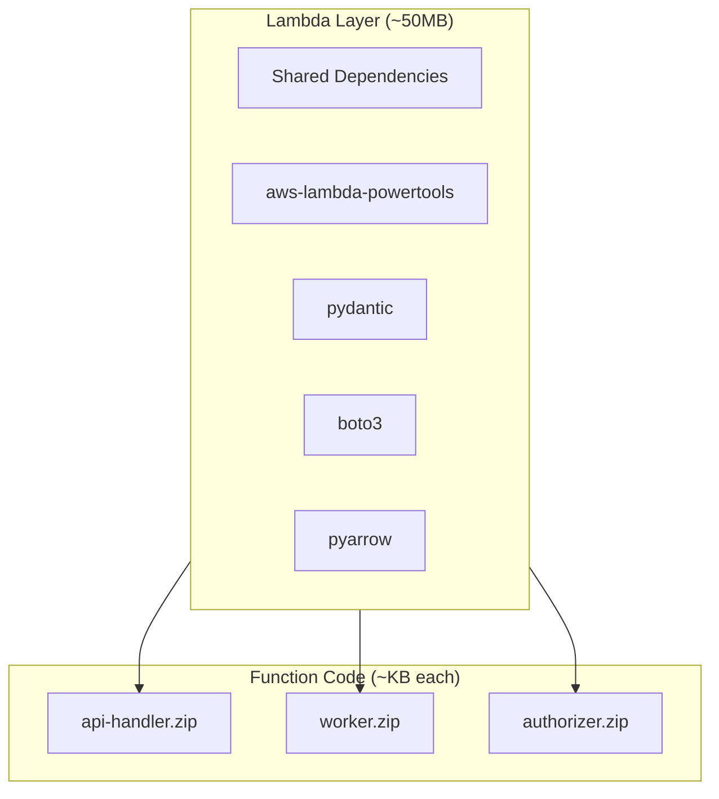
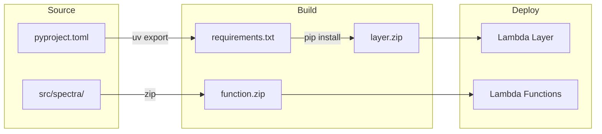
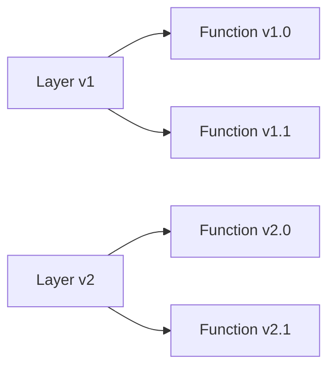

# Lambda Layer Architecture

Redshift Spectra uses a **Lambda Layer** pattern to optimize deployment size, cold start times, and dependency management.

## Overview



## Why Use Layers?

| Aspect | Without Layer | With Layer |
|--------|---------------|------------|
| **Package Size** | 50MB × 3 = 150MB | 50MB + 3×KB |
| **Deploy Time** | Slow (upload 150MB) | Fast (upload layer once) |
| **Cold Start** | Consistent | Optimized caching |
| **Updates** | Redeploy everything | Update only what changed |

## Build Process



## Building the Layer

### Quick Build

```bash
# Generate requirements and build layer
make package-layer
```

### Manual Build

```bash
# 1. Generate requirements.txt
uv export --no-hashes --no-dev --no-emit-project > requirements.txt

# 2. Install for Lambda runtime (Amazon Linux 2)
pip install \
    --platform manylinux2014_x86_64 \
    --implementation cp \
    --python-version 3.11 \
    --only-binary=:all: \
    --target dist/lambda/layer/python \
    -r requirements.txt

# 3. Create zip
cd dist/lambda/layer && zip -r ../layer.zip .
```

### Docker Build (Recommended for Production)

Build in an Amazon Linux 2 container for maximum compatibility:

```bash
make package-layer-docker
```

This uses the `scripts/build_layer.py` script with Docker:

```bash
python scripts/build_layer.py --docker --output dist/lambda/layer.zip
```

## Building Function Packages

Function packages contain only your application code:

```bash
make package-lambda
```

This creates:

```
dist/lambda/
├── layer.zip          # Shared dependencies
├── api-handler.zip    # API handler code only
├── worker.zip         # Worker code only
└── authorizer.zip     # Authorizer code only
```

## Layer Contents

The layer includes these dependencies:

```
python/
├── aws_lambda_powertools/   # Logging, tracing, metrics
├── pydantic/                # Data validation
├── pydantic_settings/       # Configuration management
├── boto3/                   # AWS SDK
├── botocore/                # AWS SDK core
├── pyarrow/                 # Parquet support
└── ...                      # Transitive dependencies
```

## Size Optimization

AWS Lambda layers have a 50MB zipped / 250MB unzipped limit.

### Optimization Techniques

```bash
# Remove unnecessary files
find dist/lambda/layer -type d -name "__pycache__" -exec rm -rf {} +
find dist/lambda/layer -type d -name "*.dist-info" -exec rm -rf {} +
find dist/lambda/layer -type d -name "tests" -exec rm -rf {} +
find dist/lambda/layer -type f -name "*.pyc" -delete
```

### Validate Size

```bash
make validate-layer
```

Expected output:

```
Layer size OK: 48234567 bytes (limit: 52428800)
```

## Deployment

### Via Terragrunt

The Lambda module automatically manages layer deployment:

```hcl
# terraform/modules/lambda/main.tf
resource "aws_lambda_layer_version" "dependencies" {
  filename            = var.layer_zip_path
  layer_name          = "${var.project_name}-dependencies"
  compatible_runtimes = ["python3.11"]
}

resource "aws_lambda_function" "api_handler" {
  layers = [aws_lambda_layer_version.dependencies.arn]
  # ...
}
```

### Manual Upload

```bash
# Upload layer
aws lambda publish-layer-version \
    --layer-name spectra-dependencies \
    --zip-file fileb://dist/lambda/layer.zip \
    --compatible-runtimes python3.11

# Update function to use new layer
aws lambda update-function-configuration \
    --function-name spectra-api-handler \
    --layers arn:aws:lambda:us-east-1:123456789012:layer:spectra-dependencies:2
```

## Version Management



- Layer versions are immutable
- Functions reference specific layer versions
- Rolling updates: update layer first, then functions

## Troubleshooting

### Import Errors

If you see `ModuleNotFoundError`, check:

1. Layer is attached to the function
2. Dependencies are in `python/` directory within layer
3. Compatible runtime versions match

### Size Exceeded

If layer exceeds 50MB:

```bash
# Check what's taking space
du -sh dist/lambda/layer/python/* | sort -h

# Consider excluding large optional dependencies
pip install --no-deps package-name
```

## Best Practices

!!! tip "Separate Code and Dependencies"
    
    Always use layers for dependencies. This enables fast code-only deployments.

!!! tip "Pin Dependency Versions"
    
    Use `uv.lock` to ensure reproducible builds across environments.

!!! warning "Test Layer Locally"
    
    Use SAM CLI to test with layers before deploying:
    ```bash
    sam local invoke --layer-cache /tmp/layers
    ```
