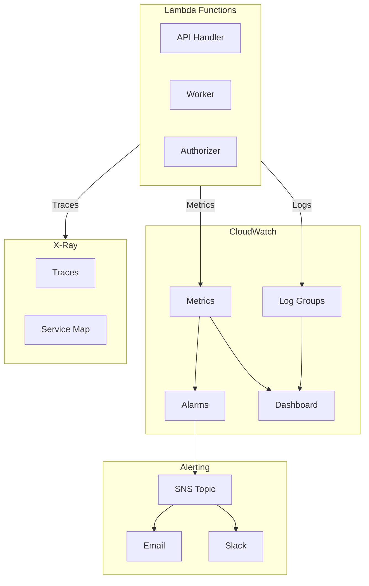
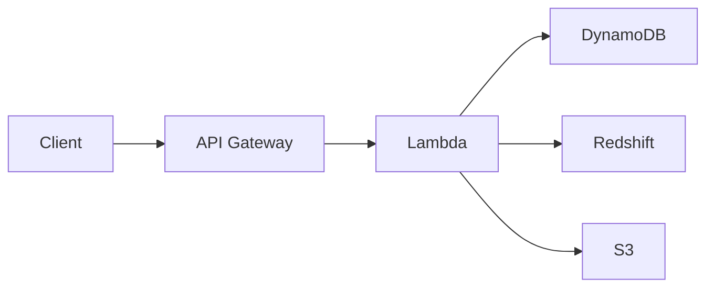
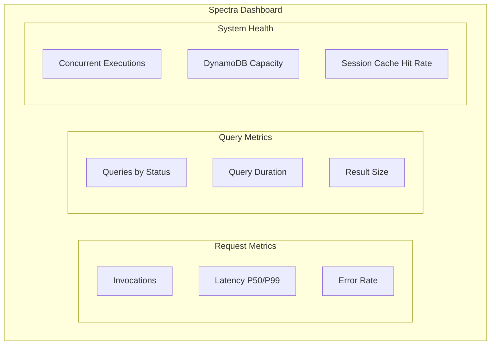

# Monitoring

Redshift Spectra provides comprehensive monitoring through AWS CloudWatch, X-Ray, and custom metrics.

## Architecture



## CloudWatch Logs

### Log Groups

Each Lambda function has its own log group:

| Log Group | Description |
|-----------|-------------|
| `/aws/lambda/spectra-api-handler` | API request processing |
| `/aws/lambda/spectra-worker` | Async job execution |
| `/aws/lambda/spectra-authorizer` | Authorization requests |

### Structured Logging

Spectra uses AWS Lambda Powertools for structured JSON logging:

```json
{
  "level": "INFO",
  "message": "Query submitted",
  "timestamp": "2026-01-29T10:00:00.000Z",
  "service": "spectra",
  "cold_start": false,
  "function_name": "spectra-api-handler",
  "function_memory_size": 512,
  "function_request_id": "abc-123",
  "correlation_id": "req-xyz",
  "tenant_id": "tenant-123",
  "job_id": "job-abc",
  "query_type": "SELECT"
}
```

### Log Insights Queries

Find slow queries:

```sql
fields @timestamp, @message, tenant_id, duration_ms
| filter @message like /Query completed/
| filter duration_ms > 5000
| sort @timestamp desc
| limit 100
```

Find errors by tenant:

```sql
fields @timestamp, @message, tenant_id, error_message
| filter level = "ERROR"
| stats count(*) by tenant_id
| sort count desc
```

## Metrics

### Built-in Lambda Metrics

| Metric | Description | Alarm Threshold |
|--------|-------------|-----------------|
| `Invocations` | Total invocations | - |
| `Errors` | Failed invocations | > 1% |
| `Duration` | Execution time | P99 > 5s |
| `Throttles` | Throttled invocations | > 0 |
| `ConcurrentExecutions` | Concurrent runs | > 80% limit |

### Custom Metrics

Spectra emits custom metrics via Lambda Powertools:

```python
from aws_lambda_powertools import Metrics

metrics = Metrics(namespace="Spectra")

@metrics.log_metrics
def handler(event, context):
    metrics.add_metric(name="QuerySubmitted", unit="Count", value=1)
    metrics.add_dimension(name="TenantId", value=tenant_id)
```

| Metric | Dimensions | Description |
|--------|------------|-------------|
| `QuerySubmitted` | TenantId | Queries submitted |
| `QueryCompleted` | TenantId, Status | Queries completed |
| `QueryDuration` | TenantId | Query execution time |
| `ResultSize` | TenantId | Result row count |
| `SessionHit` | TenantId | Session cache hits |
| `SessionMiss` | TenantId | Session cache misses |

## X-Ray Tracing

### Enable Tracing

Set in environment:

```bash
SPECTRA_ENABLE_XRAY=true
```

### Service Map



### Trace Analysis

View traces in the AWS Console to identify:

- Slow downstream calls
- Error sources
- Cold start impact
- Service dependencies

## Alarms

### Critical Alarms

```hcl
# terraform/modules/monitoring/main.tf

resource "aws_cloudwatch_metric_alarm" "api_errors" {
  alarm_name          = "spectra-api-errors"
  comparison_operator = "GreaterThanThreshold"
  evaluation_periods  = 2
  metric_name         = "Errors"
  namespace           = "AWS/Lambda"
  period              = 300
  statistic           = "Sum"
  threshold           = 5
  alarm_actions       = [aws_sns_topic.alerts.arn]

  dimensions = {
    FunctionName = "spectra-api-handler"
  }
}
```

### Recommended Alarms

| Alarm | Condition | Severity |
|-------|-----------|----------|
| API Errors | > 5 errors in 5 min | Critical |
| High Latency | P99 > 10s | Warning |
| Throttling | Any throttles | Critical |
| DynamoDB Errors | > 0 errors | Critical |
| Worker Backlog | Queue age > 5 min | Warning |

## Dashboard

### Create Dashboard

The monitoring module creates a CloudWatch dashboard:

```hcl
resource "aws_cloudwatch_dashboard" "main" {
  dashboard_name = "spectra-${var.environment}"
  dashboard_body = jsonencode({
    widgets = [
      # Invocations
      {
        type   = "metric"
        width  = 12
        height = 6
        properties = {
          title  = "API Invocations"
          region = var.region
          metrics = [
            ["AWS/Lambda", "Invocations", "FunctionName", "spectra-api-handler"]
          ]
        }
      }
      # ... more widgets
    ]
  })
}
```

### Dashboard Widgets



## Alerting

### SNS Integration

```hcl
resource "aws_sns_topic" "alerts" {
  name = "spectra-alerts-${var.environment}"
}

resource "aws_sns_topic_subscription" "email" {
  topic_arn = aws_sns_topic.alerts.arn
  protocol  = "email"
  endpoint  = var.alert_email
}
```

### Slack Integration

Use AWS Chatbot or a Lambda function for Slack notifications:

```python
def notify_slack(event, context):
    message = json.loads(event['Records'][0]['Sns']['Message'])

    slack_message = {
        "text": f"🚨 Alert: {message['AlarmName']}",
        "attachments": [{
            "color": "danger",
            "fields": [
                {"title": "Status", "value": message['NewStateValue']},
                {"title": "Reason", "value": message['NewStateReason']}
            ]
        }]
    }

    requests.post(SLACK_WEBHOOK_URL, json=slack_message)
```

## Best Practices

!!! tip "Set Up Alarms First"

    Configure alarms before going to production. Don't wait for incidents.

!!! tip "Use Log Insights"

    CloudWatch Log Insights is powerful for ad-hoc analysis. Learn the query syntax.

!!! tip "Monitor by Tenant"

    Use dimensions to track per-tenant metrics. Identify noisy neighbors.

!!! warning "Log Retention"

    Set appropriate retention periods. Default is forever, which can be expensive.

    ```hcl
    resource "aws_cloudwatch_log_group" "api" {
      retention_in_days = 30
    }
    ```
