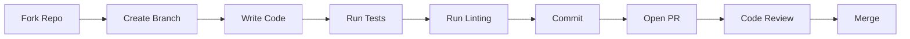

# Contributing

Thank you for your interest in contributing to Redshift Spectra! This guide will help you get started.

## Getting Started

### Prerequisites

- Python 3.11+
- [uv](https://github.com/astral-sh/uv) package manager
- AWS CLI configured (for integration tests)
- Git

### Development Setup

```bash
# Clone the repository
git clone https://github.com/zhiweio/redshift-spectra.git
cd redshift-spectra

# Install dependencies (including dev tools)
make install-dev

# Run tests to verify setup
make test

# Run linting
make lint
```

## Development Workflow



### 1. Fork and Clone

```bash
# Fork via GitHub UI, then:
git clone https://github.com/YOUR_USERNAME/redshift-spectra.git
cd redshift-spectra
git remote add upstream https://github.com/zhiweio/redshift-spectra.git
```

### 2. Create a Branch

```bash
# Create feature branch
git checkout -b feature/my-awesome-feature

# Or bugfix branch
git checkout -b fix/issue-123
```

### 3. Make Your Changes

Write your code following our style guidelines (see below).

### 4. Run Quality Checks

```bash
# Format code
make format

# Run linting
make lint

# Run type checking
make type-check

# Run tests
make test
```

### 5. Commit Your Changes

```bash
git add .
git commit -m "feat: add awesome feature"
```

Follow [Conventional Commits](https://www.conventionalcommits.org/):

| Prefix | Description |
|--------|-------------|
| `feat:` | New feature |
| `fix:` | Bug fix |
| `docs:` | Documentation only |
| `style:` | Formatting, no code change |
| `refactor:` | Code change, no new feature |
| `test:` | Adding tests |
| `chore:` | Maintenance tasks |

### 6. Push and Open PR

```bash
git push origin feature/my-awesome-feature
```

Then open a Pull Request on GitHub.

## Code Style

### Python Style

We use [Ruff](https://github.com/astral-sh/ruff) for linting and formatting:

```bash
# Format code
make format

# Check style
make lint
```

Key style points:

- Line length: 100 characters
- Use type hints for all function signatures
- Use docstrings for public functions and classes
- Follow PEP 8 conventions

### Example Code Style

```python
"""Module docstring explaining the purpose."""

from typing import Any

from pydantic import BaseModel


class QueryRequest(BaseModel):
    """Request model for query submission.
    
    Attributes:
        sql: The SQL query to execute.
        parameters: Optional query parameters.
        async_mode: Whether to execute asynchronously.
    """
    
    sql: str
    parameters: list[dict[str, Any]] | None = None
    async_mode: bool = True
    
    def validate_sql(self) -> None:
        """Validate the SQL query.
        
        Raises:
            ValueError: If SQL is invalid.
        """
        if not self.sql.strip():
            raise ValueError("SQL query cannot be empty")
```

### Documentation Style

- Use Markdown for all documentation
- Include code examples where helpful
- Use admonitions for tips, warnings, and notes
- Add Mermaid diagrams for complex flows

## Testing

### Write Tests for New Code

All new features should include tests:

```python
class TestNewFeature:
    def test_happy_path(self):
        """Test the normal use case."""
        ...
    
    def test_edge_case(self):
        """Test edge cases."""
        ...
    
    def test_error_handling(self):
        """Test error conditions."""
        ...
```

### Test Coverage

Maintain at least 80% code coverage:

```bash
make test-cov
```

## Pull Request Guidelines

### PR Checklist

- [ ] Code follows style guidelines
- [ ] Tests pass locally
- [ ] New code has tests
- [ ] Documentation updated if needed
- [ ] Commit messages follow convention
- [ ] No merge conflicts

### PR Description Template

```markdown
## Description
Brief description of changes.

## Type of Change
- [ ] Bug fix
- [ ] New feature
- [ ] Breaking change
- [ ] Documentation update

## Testing
Describe how you tested these changes.

## Related Issues
Fixes #123
```

## Project Structure

```
redshift-spectra/
├── src/spectra/           # Main source code
│   ├── handlers/          # Lambda handlers
│   ├── services/          # Business logic
│   ├── models/            # Pydantic models
│   ├── middleware/        # Request middleware
│   └── utils/             # Utilities
├── tests/                 # Test files
├── docs/                  # Documentation
├── terraform/             # Infrastructure modules
├── terragrunt/            # Environment configs
└── scripts/               # Build scripts
```

## Getting Help

- **Questions**: Open a [Discussion](https://github.com/zhiweio/redshift-spectra/discussions)
- **Bugs**: Open an [Issue](https://github.com/zhiweio/redshift-spectra/issues)
- **Security**: Email security@example.com (do not open public issues)

## Recognition

Contributors are recognized in:

- CONTRIBUTORS.md file
- Release notes
- Project documentation

Thank you for contributing! 🎉
