# LocalStack Local Development

This guide explains how to set up and use LocalStack for local development and testing of Redshift Spectra.

## Overview

[LocalStack](https://localstack.cloud/) provides a fully functional local AWS cloud stack that allows you to develop and test cloud applications offline. This project uses Terragrunt to manage infrastructure in both LocalStack (local) and AWS (dev/prod) environments, ensuring consistency across all deployments.

## Prerequisites

- **Docker**: LocalStack runs as a Docker container
- **Terraform**: >= 1.11.0
- **Terragrunt**: >= 0.99.0
- **AWS CLI** (optional): For testing with awslocal or direct commands

## Quick Start

### 1. Start LocalStack

```bash
# Using Make
make localstack-start

# Or using Docker Compose directly
docker compose up -d localstack

# Or using the helper script (Bash)
./scripts/localstack-deploy.sh start
```

### 2. Deploy Infrastructure

```bash
# Deploy all modules to LocalStack
make deploy-local

# Or step by step
make tg-init-local
make tg-plan-local
make tg-apply-local
```

### 3. Verify Deployment

```bash
# Check LocalStack status
make localstack-status

# List created resources
aws --endpoint-url=http://localhost:4566 s3 ls
aws --endpoint-url=http://localhost:4566 dynamodb list-tables
aws --endpoint-url=http://localhost:4566 secretsmanager list-secrets
```

## Architecture

The following diagram illustrates how LocalStack integrates with the development workflow, using the same Terraform modules across all environments:

```mermaid
flowchart TB
    subgraph Environments["🌍 Deployment Environments"]
        direction LR
        LOCAL["🏠 LocalStack<br/><code>localhost:4566</code><br/><i>Account: 000000000000</i>"]
        DEV["🔧 AWS Dev<br/><code>dev.aws.amazon.com</code><br/><i>Account: 123456789012</i>"]
        PROD["🚀 AWS Prod<br/><code>prod.aws.amazon.com</code><br/><i>Account: 987654321098</i>"]
    end

    subgraph TerragruntConfig["📁 Terragrunt Configuration"]
        direction TB
        ROOT_AWS["terragrunt.hcl<br/><i>AWS Root Config</i>"]
        ROOT_LOCAL["terragrunt-local.hcl<br/><i>LocalStack Root Config</i>"]
        COMMON["common.hcl<br/><i>Shared Variables</i>"]

        subgraph EnvConfigs["environments/"]
            ENV_LOCAL["local/<br/>• account.hcl<br/>• us-east-1/env.hcl"]
            ENV_DEV["dev/<br/>• account.hcl<br/>• us-east-1/env.hcl"]
            ENV_PROD["prod/<br/>• account.hcl<br/>• us-east-1/env.hcl"]
        end
    end

    subgraph TerraformModules["🧱 Terraform Modules<br/><i>Shared across all environments</i>"]
        direction LR
        MOD_DDB[("💾 dynamodb")]
        MOD_S3[("📦 s3")]
        MOD_IAM[("🔐 iam")]
        MOD_LAMBDA[("⚡ lambda")]
        MOD_APIGW[("🌐 api-gateway")]
        MOD_MON[("📊 monitoring")]
    end

    subgraph LocalStackServices["🐳 LocalStack Container"]
        direction LR
        LS_S3["S3"]
        LS_DDB["DynamoDB"]
        LS_IAM["IAM"]
        LS_SM["Secrets<br/>Manager"]
        LS_LAMBDA["Lambda"]
        LS_APIGW["API<br/>Gateway"]
        LS_CW["CloudWatch"]
    end

    %% Connections
    ROOT_LOCAL --> ENV_LOCAL
    ROOT_AWS --> ENV_DEV
    ROOT_AWS --> ENV_PROD
    COMMON --> ROOT_LOCAL
    COMMON --> ROOT_AWS

    ENV_LOCAL --> TerraformModules
    ENV_DEV --> TerraformModules
    ENV_PROD --> TerraformModules

    TerraformModules --> LOCAL
    TerraformModules --> DEV
    TerraformModules --> PROD

    LOCAL --> LocalStackServices

    %% Styling
    classDef localEnv fill:#e1f5fe,stroke:#0288d1,stroke-width:2px
    classDef devEnv fill:#fff3e0,stroke:#f57c00,stroke-width:2px
    classDef prodEnv fill:#e8f5e9,stroke:#388e3c,stroke-width:2px
    classDef config fill:#f3e5f5,stroke:#7b1fa2,stroke-width:2px
    classDef modules fill:#fce4ec,stroke:#c2185b,stroke-width:2px
    classDef services fill:#e0f2f1,stroke:#00796b,stroke-width:2px

    class LOCAL localEnv
    class DEV devEnv
    class PROD prodEnv
    class ROOT_AWS,ROOT_LOCAL,COMMON,ENV_LOCAL,ENV_DEV,ENV_PROD config
    class MOD_DDB,MOD_S3,MOD_IAM,MOD_LAMBDA,MOD_APIGW,MOD_MON modules
    class LS_S3,LS_DDB,LS_IAM,LS_SM,LS_LAMBDA,LS_APIGW,LS_CW services
```



### Development Workflow

```mermaid
sequenceDiagram
    autonumber
    participant Dev as 👨‍💻 Developer
    participant Docker as 🐳 Docker
    participant LS as 📦 LocalStack
    participant TG as 🔧 Terragrunt
    participant TF as 📐 Terraform
    participant AWS as ☁️ AWS Services

    Note over Dev,AWS: Local Development Phase

    Dev->>Docker: make localstack-start
    Docker->>LS: Start container (port 4566)
    LS-->>Docker: Ready ✓
    Docker-->>Dev: LocalStack running

    Dev->>TG: make tg-apply-local
    TG->>TG: Load terragrunt-local.hcl
    TG->>TF: Generate provider.tf<br/>(LocalStack endpoints)
    TF->>LS: Create resources<br/>(S3, DynamoDB, IAM...)
    LS-->>TF: Resources created ✓
    TF-->>TG: Apply complete
    TG-->>Dev: Infrastructure deployed locally

    Note over Dev,AWS: Testing & Iteration

    Dev->>LS: Run integration tests
    LS-->>Dev: Test results
    Dev->>Dev: Fix issues, iterate

    Note over Dev,AWS: Cloud Deployment Phase

    Dev->>TG: make tg-apply-dev
    TG->>TG: Load terragrunt.hcl
    TG->>TF: Generate provider.tf<br/>(AWS endpoints)
    TF->>AWS: Create resources
    AWS-->>TF: Resources created ✓
    TF-->>TG: Apply complete
    TG-->>Dev: Deployed to AWS Dev ✓
```



### Environment Comparison

```mermaid
graph LR
    subgraph Local["🏠 LocalStack Environment"]
        L_CMD["make deploy-local"]
        L_CONFIG["terragrunt-local.hcl"]
        L_BACKEND["Local State<br/><code>terraform.tfstate</code>"]
        L_ENDPOINT["http://localhost:4566"]
        L_CREDS["AWS_ACCESS_KEY_ID=test<br/>AWS_SECRET_ACCESS_KEY=test"]
    end

    subgraph Cloud["☁️ AWS Environment"]
        C_CMD["make deploy-dev"]
        C_CONFIG["terragrunt.hcl"]
        C_BACKEND["S3 Remote State<br/><code>s3://...-terraform-state</code>"]
        C_ENDPOINT["AWS Regional Endpoints"]
        C_CREDS["IAM Credentials<br/><code>aws configure</code>"]
    end

    L_CMD --> L_CONFIG --> L_BACKEND
    L_CONFIG --> L_ENDPOINT
    L_CONFIG --> L_CREDS

    C_CMD --> C_CONFIG --> C_BACKEND
    C_CONFIG --> C_ENDPOINT
    C_CONFIG --> C_CREDS

    style Local fill:#e3f2fd,stroke:#1976d2
    style Cloud fill:#fff8e1,stroke:#ffa000
```



## Available Commands

### Makefile Targets

| Command | Description |
|---------|-------------|
| `make localstack-start` | Start LocalStack container |
| `make localstack-stop` | Stop LocalStack container |
| `make localstack-status` | Check LocalStack health status |
| `make localstack-logs` | Stream LocalStack container logs |
| `make localstack-reset` | Reset LocalStack (destroy volumes and restart) |
| `make deploy-local` | Full local deployment (start + apply) |
| `make tg-init-local` | Initialize Terragrunt for LocalStack |
| `make tg-plan-local` | Plan all changes for LocalStack |
| `make tg-apply-local` | Apply all changes to LocalStack |
| `make tg-destroy-local` | Destroy all LocalStack resources |
| `make tg-output-local` | Show Terragrunt outputs |
| `make tg-graph-local` | Show dependency graph for LocalStack |

### Module-Specific Commands

| Command | Description |
|---------|-------------|
| `make tg-plan-dynamodb-local` | Plan DynamoDB changes |
| `make tg-apply-dynamodb-local` | Apply DynamoDB changes |
| `make tg-plan-s3-local` | Plan S3 changes |
| `make tg-apply-s3-local` | Apply S3 changes |
| `make tg-plan-iam-local` | Plan IAM changes |
| `make tg-apply-iam-local` | Apply IAM changes |

### Formatting Commands

| Command | Description |
|---------|-------------|
| `make tf-fmt` | Format all Terraform files |
| `make tf-fmt-check` | Check Terraform formatting (no changes) |
| `make tg-fmt` | Format all Terragrunt HCL files |
| `make tg-fmt-check` | Check Terragrunt formatting (no changes) |
| `make iac-fmt` | Format all Terraform and Terragrunt files |
| `make iac-fmt-check` | Check all IaC formatting |

## Environment Switching

The project supports seamless switching between local and AWS environments:

### Local Development (LocalStack)

```bash
# Uses terragrunt-local.hcl configuration
cd terragrunt/environments/local/us-east-1

# Set LocalStack credentials
export AWS_ACCESS_KEY_ID=test
export AWS_SECRET_ACCESS_KEY=test
export AWS_DEFAULT_REGION=us-east-1

# Run with LocalStack config
terragrunt run-all apply --terragrunt-config ../../terragrunt-local.hcl
```

### AWS Development

```bash
# Uses standard terragrunt.hcl configuration
cd terragrunt/environments/dev/us-east-1

# Use your AWS credentials
aws configure

# Run with AWS config (default)
terragrunt run-all apply
```

### AWS Production

```bash
cd terragrunt/environments/prod/us-east-1
terragrunt run-all apply
```

## LocalStack Services

This project uses the following AWS services emulated by LocalStack:

| Service | LocalStack Support | Notes |
|---------|-------------------|-------|
| S3 | ✅ Full | Object storage for query results |
| DynamoDB | ✅ Full | Job state and session management |
| IAM | ✅ Full | Roles and policies (permissive mode) |
| Secrets Manager | ✅ Full | JWT secrets storage |
| Lambda | ✅ Full | Function execution (requires Docker) |
| API Gateway | ✅ Full | REST API endpoints |
| CloudWatch Logs | ✅ Full | Logging |
| STS | ✅ Full | Identity |

## Testing with LocalStack

### Using AWS CLI with LocalStack

```bash
# Configure alias for awslocal
alias awslocal='aws --endpoint-url=http://localhost:4566'

# Or use environment variable
export AWS_ENDPOINT_URL=http://localhost:4566

# Examples
awslocal s3 ls
awslocal dynamodb list-tables
awslocal secretsmanager list-secrets
```

### Using Python SDK (boto3)

```python
import boto3

# Create client pointing to LocalStack
dynamodb = boto3.client(
    'dynamodb',
    endpoint_url='http://localhost:4566',
    region_name='us-east-1',
    aws_access_key_id='test',
    aws_secret_access_key='test'
)

# Use normally
response = dynamodb.list_tables()
print(response['TableNames'])
```

### Running Integration Tests

```bash
# Start LocalStack first
make localstack-start

# Deploy infrastructure
make deploy-local

# Run integration tests against LocalStack
LOCALSTACK_ENDPOINT=http://localhost:4566 pytest tests/integration/
```

## Configuration

### Environment Variables

The project uses a unified `.env.example` file that works for both LocalStack and AWS environments:

```bash
# For LocalStack (defaults work out of the box)
cp .env.example .env

# For AWS (update with your actual values)
cp .env.example .env
# Edit .env and update:
# - ENVIRONMENT=dev
# - SPECTRA_REDSHIFT_CLUSTER_ID=your-cluster
# - SPECTRA_REDSHIFT_SECRET_ARN=arn:aws:...
# - etc.
```

Key environment variables for LocalStack:

| Variable | Default | Description |
|----------|---------|-------------|
| `ENVIRONMENT` | `local` | Environment name (local/dev/prod) |
| `LOCALSTACK_ENDPOINT` | `http://localhost:4566` | LocalStack endpoint URL |
| `AWS_ACCESS_KEY_ID` | `test` | AWS credentials (any value works for LocalStack) |
| `AWS_SECRET_ACCESS_KEY` | `test` | AWS credentials (any value works for LocalStack) |
| `LAMBDA_EXECUTOR` | `docker` | Lambda execution mode |
| `LOCALSTACK_PERSISTENCE` | `0` | Persist data across restarts |

### Docker Compose Configuration

The `docker-compose.yml` file configures LocalStack:

```yaml
services:
  localstack:
    image: localstack/localstack:latest
    ports:
      - "127.0.0.1:4566:4566"
    environment:
      - SERVICES=s3,dynamodb,lambda,iam,apigateway,secretsmanager,cloudwatch,logs,sts
      - LAMBDA_EXECUTOR=docker
      - LAMBDA_DOCKER_NETWORK=redshift-spectra-network
    volumes:
      - /var/run/docker.sock:/var/run/docker.sock
      - localstack-data:/var/lib/localstack
```

### Terragrunt Configuration

LocalStack environment configuration is located at:

- `terragrunt/environments/local/account.hcl` - Account settings
- `terragrunt/environments/local/us-east-1/env.hcl` - Environment settings
- `terragrunt/environments/local/us-east-1/region.hcl` - Region and endpoint settings

### Persistence

By default, LocalStack data is persisted in a Docker volume (`localstack-data`). To reset:

```bash
make localstack-reset
# or
docker compose down -v && docker compose up -d localstack
```

## Troubleshooting

### LocalStack Not Starting

```bash
# Check Docker is running
docker info

# Check port availability
netstat -an | grep 4566

# View container logs
docker compose logs localstack
```

### Terraform State Issues

The local environment uses local state files (not S3) to avoid chicken-and-egg problems:

```bash
# State files are stored at:
# terragrunt/environments/local/us-east-1/<module>/terraform.tfstate

# To reset state, remove these files:
find terragrunt/environments/local -name "terraform.tfstate*" -delete
```

### Lambda Execution Issues

LocalStack Lambda requires Docker access:

```bash
# Ensure Docker socket is mounted
docker inspect redshift-spectra-localstack | grep -A5 "Binds"

# Check Lambda executor setting
docker exec redshift-spectra-localstack env | grep LAMBDA
```

## Best Practices

1. **Always start with local**: Develop and test locally before deploying to AWS
2. **Use consistent configuration**: Same Terraform modules across all environments
3. **Reset regularly**: Clear LocalStack data when switching feature branches
4. **Test infrastructure changes locally**: Run `make tg-plan-local` before `make tg-plan-dev`
5. **Use LocalStack for integration tests**: Faster and cheaper than real AWS

## Related Documentation

- [LocalStack Documentation](https://docs.localstack.cloud/)
- [LocalStack AWS Services](https://docs.localstack.cloud/user-guide/aws/)
- [Terragrunt with LocalStack](https://docs.localstack.cloud/user-guide/integrations/terraform/#terragrunt)
- [Project Installation Guide](../getting-started/installation.md)
