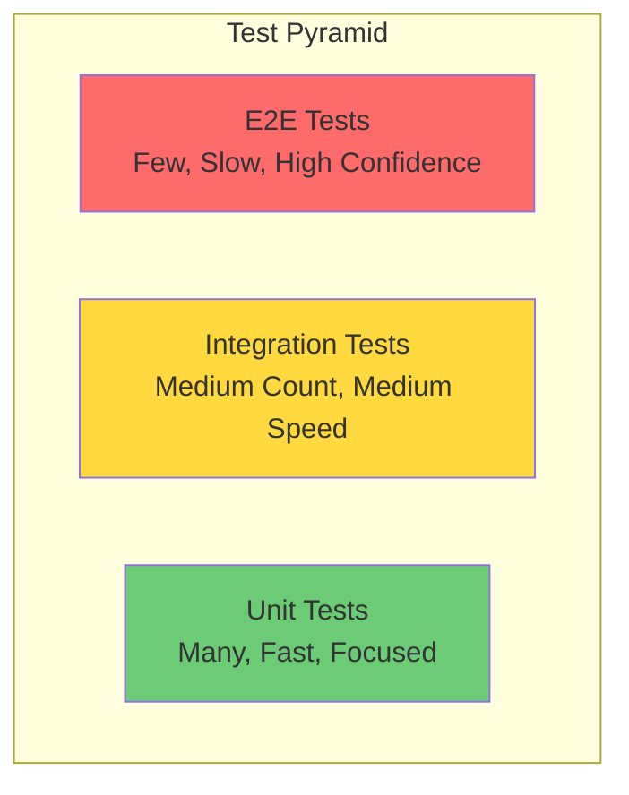

# Testing Strategy

Redshift Spectra uses a comprehensive testing strategy with unit, integration, and end-to-end tests.

## Test Pyramid



## Running Tests

### All Tests

```bash
make test
```

### Unit Tests Only

```bash
make test-unit
```

### Integration Tests Only

```bash
make test-integration
```

### With Coverage

```bash
make test-cov
```

## Test Structure

```
tests/
├── conftest.py              # Shared fixtures
├── unit/
│   ├── test_services/
│   │   ├── test_redshift.py
│   │   ├── test_job.py
│   │   ├── test_session.py
│   │   └── test_bulk.py
│   ├── test_models/
│   │   ├── test_query.py
│   │   └── test_job.py
│   └── test_utils/
│       ├── test_config.py
│       └── test_auth.py
├── integration/
│   ├── test_api_handler.py
│   ├── test_worker.py
│   └── test_dynamodb.py
└── e2e/
    └── test_full_workflow.py
```

## Unit Tests

### Example: Testing RedshiftService

```python
import pytest
from unittest.mock import Mock, patch
from spectra.services.redshift import RedshiftService

class TestRedshiftService:
    @pytest.fixture
    def mock_client(self):
        return Mock()
    
    @pytest.fixture
    def service(self, mock_client):
        with patch('boto3.client', return_value=mock_client):
            return RedshiftService()
    
    def test_execute_statement_success(self, service, mock_client):
        """Test successful query execution."""
        mock_client.execute_statement.return_value = {
            'Id': 'stmt-123'
        }
        
        result = service.execute_statement(
            sql="SELECT 1",
            db_user="test_user",
            tenant_id="tenant-123"
        )
        
        assert result == 'stmt-123'
        mock_client.execute_statement.assert_called_once()
    
    def test_execute_statement_with_session_reuse(self, service, mock_client):
        """Test query execution with session reuse."""
        mock_client.execute_statement.return_value = {
            'Id': 'stmt-123',
            'SessionId': 'session-abc'
        }
        
        result = service.execute_statement(
            sql="SELECT 1",
            db_user="test_user",
            tenant_id="tenant-123",
            use_session=True
        )
        
        # Verify SessionKeepAliveSeconds was passed
        call_args = mock_client.execute_statement.call_args
        assert 'SessionKeepAliveSeconds' in call_args.kwargs
```

### Example: Testing SessionService

```python
class TestSessionService:
    @pytest.fixture
    def mock_table(self):
        return Mock()
    
    @pytest.fixture
    def service(self, mock_table):
        with patch.object(SessionService, '_get_table', return_value=mock_table):
            return SessionService()
    
    def test_get_active_session_found(self, service, mock_table):
        """Test retrieving an active session."""
        mock_table.get_item.return_value = {
            'Item': {
                'session_id': 'session-123',
                'tenant_id': 'tenant-abc',
                'expires_at': (datetime.now(UTC) + timedelta(hours=1)).isoformat()
            }
        }
        
        session = service.get_active_session('tenant-abc', 'db_user')
        
        assert session is not None
        assert session.session_id == 'session-123'
    
    def test_get_active_session_expired(self, service, mock_table):
        """Test that expired sessions return None."""
        mock_table.get_item.return_value = {
            'Item': {
                'session_id': 'session-123',
                'expires_at': (datetime.now(UTC) - timedelta(hours=1)).isoformat()
            }
        }
        
        session = service.get_active_session('tenant-abc', 'db_user')
        
        assert session is None
```

## Integration Tests

### Example: Testing with Moto

```python
import pytest
import boto3
from moto import mock_dynamodb

@pytest.fixture
def dynamodb_table():
    with mock_dynamodb():
        client = boto3.client('dynamodb', region_name='us-east-1')
        client.create_table(
            TableName='spectra-jobs',
            KeySchema=[
                {'AttributeName': 'job_id', 'KeyType': 'HASH'}
            ],
            AttributeDefinitions=[
                {'AttributeName': 'job_id', 'AttributeType': 'S'}
            ],
            BillingMode='PAY_PER_REQUEST'
        )
        yield boto3.resource('dynamodb').Table('spectra-jobs')

class TestJobServiceIntegration:
    def test_create_and_get_job(self, dynamodb_table):
        """Test full job lifecycle with DynamoDB."""
        service = JobService()
        
        # Create job
        job = service.create_job(
            tenant_id='tenant-123',
            sql='SELECT 1'
        )
        
        # Retrieve job
        retrieved = service.get_job(job.job_id)
        
        assert retrieved.job_id == job.job_id
        assert retrieved.status == JobStatus.QUEUED
```

## E2E Tests

### Example: Full Query Workflow

```python
@pytest.mark.e2e
class TestQueryWorkflow:
    def test_submit_query_and_get_results(self, api_client, test_tenant):
        """Test complete query workflow."""
        # Submit query
        response = api_client.post(
            '/v1/queries',
            json={'sql': 'SELECT 1 as value'},
            headers={'X-Tenant-ID': test_tenant}
        )
        assert response.status_code == 202
        job_id = response.json()['job_id']
        
        # Poll for completion
        for _ in range(30):
            status_response = api_client.get(f'/v1/jobs/{job_id}')
            if status_response.json()['status'] == 'COMPLETED':
                break
            time.sleep(1)
        
        # Get results
        result_response = api_client.get(f'/v1/jobs/{job_id}/results')
        assert result_response.status_code == 200
        assert result_response.json()['data'][0]['value'] == 1
```

## Fixtures

### Shared Fixtures (conftest.py)

```python
import pytest
from spectra.utils.config import Settings

@pytest.fixture
def settings():
    """Provide test settings."""
    return Settings(
        aws_region='us-east-1',
        redshift_cluster_id='test-cluster',
        redshift_database='test_db',
        redshift_secret_arn='arn:aws:secretsmanager:us-east-1:123:secret:test',
        s3_bucket_name='test-bucket',
        dynamodb_table_name='test-jobs'
    )

@pytest.fixture
def tenant_context():
    """Provide test tenant context."""
    return TenantContext(
        tenant_id='test-tenant',
        db_user='tenant_test',
        db_group='tenant_group_test',
        permissions=['query', 'export']
    )
```

## Mocking AWS Services

### Using pytest-mock

```python
def test_with_mock(mocker):
    mock_client = mocker.patch('boto3.client')
    mock_client.return_value.execute_statement.return_value = {'Id': 'test'}
    
    # Test code here
```

### Using Moto

```python
from moto import mock_s3, mock_dynamodb, mock_secretsmanager

@mock_s3
@mock_dynamodb
def test_with_moto():
    # AWS services are mocked
    s3 = boto3.client('s3')
    s3.create_bucket(Bucket='test-bucket')
    # ...
```

## Coverage Requirements

Maintain minimum coverage thresholds:

```toml
# pyproject.toml
[tool.coverage.run]
source = ["src/spectra"]
branch = true

[tool.coverage.report]
fail_under = 80
exclude_lines = [
    "pragma: no cover",
    "if TYPE_CHECKING:",
    "raise NotImplementedError"
]
```

## CI Integration

```yaml
# .github/workflows/test.yml
name: Tests

on: [push, pull_request]

jobs:
  test:
    runs-on: ubuntu-latest
    steps:
      - uses: actions/checkout@v4
      
      - name: Set up Python
        uses: actions/setup-python@v5
        with:
          python-version: '3.11'
      
      - name: Install uv
        run: pip install uv
      
      - name: Install dependencies
        run: uv sync
      
      - name: Run tests
        run: make ci-test
      
      - name: Upload coverage
        uses: codecov/codecov-action@v4
        with:
          file: coverage.xml
```

## Best Practices

!!! tip "Test Behavior, Not Implementation"
    
    Focus on what the code does, not how it does it. This makes refactoring easier.

!!! tip "Use Descriptive Test Names"
    
    `test_execute_statement_with_invalid_sql_raises_error` is better than `test_error`.

!!! warning "Avoid Test Interdependence"
    
    Each test should be independent. Use fixtures for setup, not shared state.
