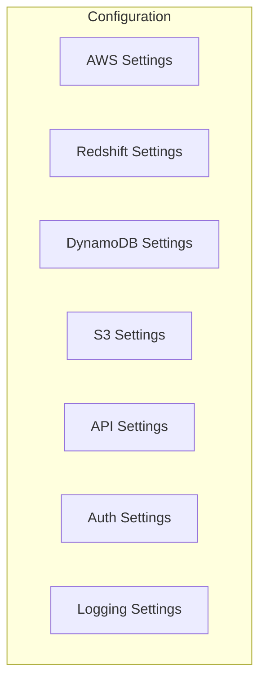
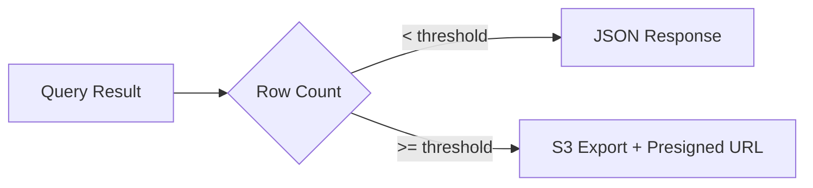

# Configuration Reference

Complete reference for all Redshift Spectra configuration options.

## Overview

Redshift Spectra uses environment variables for configuration, with the `SPECTRA_` prefix. You can set these in:

- `.env` file (development)
- Lambda environment variables (production)
- Terragrunt configuration (infrastructure)

## Configuration Categories



## AWS Configuration

| Variable | Type | Default | Description |
|----------|------|---------|-------------|
| `SPECTRA_AWS_REGION` | string | `us-east-1` | AWS region for all services |

## Redshift Configuration

| Variable | Type | Default | Description |
|----------|------|---------|-------------|
| `SPECTRA_REDSHIFT_CLUSTER_ID` | string | **Required** | Redshift cluster identifier |
| `SPECTRA_REDSHIFT_DATABASE` | string | **Required** | Target database name |
| `SPECTRA_REDSHIFT_SECRET_ARN` | string | **Required** | Secrets Manager ARN for credentials |
| `SPECTRA_REDSHIFT_WORKGROUP_NAME` | string | `null` | Serverless workgroup (if using Serverless) |
| `SPECTRA_REDSHIFT_SESSION_KEEP_ALIVE_SECONDS` | int | `3600` | Session keep-alive duration (max 86400) |
| `SPECTRA_REDSHIFT_SESSION_IDLE_TIMEOUT_SECONDS` | int | `300` | Session idle timeout before cleanup |

### Session Configuration

Session reuse significantly improves query performance by maintaining persistent database connections:

```bash
# Keep sessions alive for 1 hour
SPECTRA_REDSHIFT_SESSION_KEEP_ALIVE_SECONDS=3600

# Cleanup idle sessions after 5 minutes
SPECTRA_REDSHIFT_SESSION_IDLE_TIMEOUT_SECONDS=300
```

!!! tip "Performance Impact"
    Session reuse can reduce query latency by up to 80% for subsequent queries. See [Session Reuse](../performance/session-reuse.md) for details.

## DynamoDB Configuration

| Variable | Type | Default | Description |
|----------|------|---------|-------------|
| `SPECTRA_DYNAMODB_TABLE_NAME` | string | `spectra-jobs` | Table for job state tracking |
| `SPECTRA_DYNAMODB_SESSIONS_TABLE_NAME` | string | `spectra-sessions` | Table for session caching |
| `SPECTRA_DYNAMODB_TTL_DAYS` | int | `7` | TTL for job records |

## S3 Configuration

| Variable | Type | Default | Description |
|----------|------|---------|-------------|
| `SPECTRA_S3_BUCKET_NAME` | string | **Required** | Bucket for large result exports |
| `SPECTRA_S3_PREFIX` | string | `exports/` | Prefix for export files |
| `SPECTRA_PRESIGNED_URL_EXPIRY` | int | `3600` | Presigned URL expiration (seconds) |

## Query Configuration

| Variable | Type | Default | Description |
|----------|------|---------|-------------|
| `SPECTRA_RESULT_SIZE_THRESHOLD` | int | `10000` | Row count before S3 offload |
| `SPECTRA_QUERY_TIMEOUT_SECONDS` | int | `900` | Query execution timeout |
| `SPECTRA_MAX_CONCURRENT_QUERIES` | int | `10` | Max concurrent queries per tenant |

### Data Delivery Modes



## API Configuration

| Variable | Type | Default | Description |
|----------|------|---------|-------------|
| `SPECTRA_API_VERSION` | string | `v1` | API version prefix |
| `SPECTRA_CORS_ORIGINS` | list | `["*"]` | Allowed CORS origins |
| `SPECTRA_RATE_LIMIT_PER_MINUTE` | int | `100` | Rate limit per tenant |

## Authentication Configuration

| Variable | Type | Default | Description |
|----------|------|---------|-------------|
| `SPECTRA_AUTH_MODE` | string | `api_key` | Auth mode: `api_key`, `jwt`, `iam` |
| `SPECTRA_JWT_SECRET_ARN` | string | `null` | Secrets Manager ARN for JWT secret |
| `SPECTRA_JWT_ISSUER` | string | `null` | Expected JWT issuer |
| `SPECTRA_JWT_AUDIENCE` | string | `null` | Expected JWT audience |

### Authentication Modes

=== "API Key"

    ```bash
    SPECTRA_AUTH_MODE=api_key
    ```

    Simple API key authentication. Keys are passed in the `Authorization` header.

=== "JWT"

    ```bash
    SPECTRA_AUTH_MODE=jwt
    SPECTRA_JWT_SECRET_ARN=arn:aws:secretsmanager:...
    SPECTRA_JWT_ISSUER=https://auth.example.com
    SPECTRA_JWT_AUDIENCE=spectra-api
    ```

    JWT-based authentication with token validation.

=== "IAM"

    ```bash
    SPECTRA_AUTH_MODE=iam
    ```

    AWS IAM-based authentication using Signature Version 4.

## Logging Configuration

| Variable | Type | Default | Description |
|----------|------|---------|-------------|
| `SPECTRA_LOG_LEVEL` | string | `INFO` | Log level: `DEBUG`, `INFO`, `WARNING`, `ERROR` |
| `SPECTRA_ENABLE_XRAY` | bool | `true` | Enable AWS X-Ray tracing |

## Example Configuration

### Development

```bash
# .env for local development
SPECTRA_AWS_REGION=us-east-1
SPECTRA_REDSHIFT_CLUSTER_ID=dev-cluster
SPECTRA_REDSHIFT_DATABASE=analytics
SPECTRA_REDSHIFT_SECRET_ARN=arn:aws:secretsmanager:us-east-1:123456789012:secret:dev/redshift
SPECTRA_S3_BUCKET_NAME=spectra-dev-exports
SPECTRA_LOG_LEVEL=DEBUG
SPECTRA_ENABLE_XRAY=false
```

### Production

```bash
# Production configuration
SPECTRA_AWS_REGION=us-east-1
SPECTRA_REDSHIFT_CLUSTER_ID=prod-cluster
SPECTRA_REDSHIFT_DATABASE=analytics
SPECTRA_REDSHIFT_SECRET_ARN=arn:aws:secretsmanager:us-east-1:123456789012:secret:prod/redshift
SPECTRA_REDSHIFT_WORKGROUP_NAME=prod-workgroup
SPECTRA_S3_BUCKET_NAME=spectra-prod-exports
SPECTRA_RESULT_SIZE_THRESHOLD=50000
SPECTRA_LOG_LEVEL=INFO
SPECTRA_ENABLE_XRAY=true
SPECTRA_AUTH_MODE=jwt
SPECTRA_JWT_SECRET_ARN=arn:aws:secretsmanager:us-east-1:123456789012:secret:prod/jwt
```

## Terragrunt Configuration

Environment variables are configured in Terragrunt:

```hcl
# terragrunt/environments/dev/us-east-1/lambda/terragrunt.hcl
inputs = {
  environment_variables = {
    SPECTRA_REDSHIFT_CLUSTER_ID    = "dev-cluster"
    SPECTRA_REDSHIFT_DATABASE      = "analytics"
    SPECTRA_S3_BUCKET_NAME         = dependency.s3.outputs.bucket_name
    # ... other variables
  }
}
```

See [Infrastructure](../deployment/infrastructure.md) for complete Terragrunt configuration.
