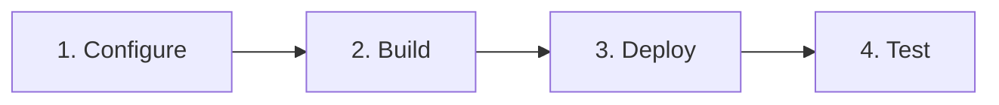
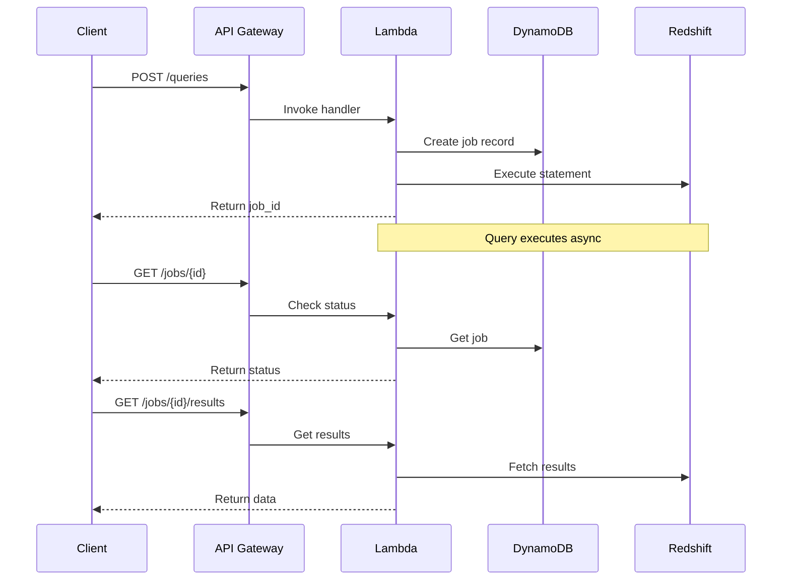

# Quick Start

Deploy Redshift Spectra and make your first API call in under 10 minutes.

## Overview



## Step 1: Configure Environment

Create your environment configuration:

```bash
# Copy the template
cp .env.template .env

# Edit with your settings
vim .env
```

**Minimum required settings:**

```bash
# Redshift Configuration
SPECTRA_REDSHIFT_CLUSTER_ID=my-redshift-cluster
SPECTRA_REDSHIFT_DATABASE=analytics
SPECTRA_REDSHIFT_SECRET_ARN=arn:aws:secretsmanager:us-east-1:123456789012:secret:redshift/credentials

# S3 Configuration
SPECTRA_S3_BUCKET_NAME=my-spectra-exports
```

## Step 2: Build Lambda Packages

Build the Lambda layer and function packages:

```bash
# Build everything
make package-all
```

This creates:

```
dist/lambda/
├── layer.zip          # Shared dependencies (~50MB)
├── api-handler.zip    # API handler code
├── worker.zip         # Async worker code
└── authorizer.zip     # Auth handler code
```

## Step 3: Deploy Infrastructure

Deploy to your AWS account using Terragrunt:

```bash
# Initialize Terragrunt
make tg-init-dev

# Preview changes
make tg-plan-dev

# Apply changes
make tg-apply-dev
```

After deployment, get your API endpoint:

```bash
make tg-output-dev
```

Example output:

```
api_endpoint = "https://abc123.execute-api.us-east-1.amazonaws.com/v1"
api_key = "spectra_demo_abc123xyz"
```

## Step 4: Make Your First API Call

### Submit a Query

```bash
# Set your API endpoint
export API_URL="https://abc123.execute-api.us-east-1.amazonaws.com/v1"
export API_KEY="spectra_demo_abc123xyz"

# Submit a query
curl -X POST "$API_URL/queries" \
  -H "Authorization: Bearer $API_KEY" \
  -H "X-Tenant-ID: demo-tenant" \
  -H "Content-Type: application/json" \
  -d '{
    "sql": "SELECT table_name FROM information_schema.tables LIMIT 10"
  }'
```

**Response:**

```json
{
  "job_id": "job-550e8400-e29b-41d4-a716-446655440000",
  "status": "QUEUED",
  "submitted_at": "2026-01-29T10:00:00Z"
}
```

### Check Job Status

```bash
curl "$API_URL/jobs/job-550e8400-e29b-41d4-a716-446655440000" \
  -H "Authorization: Bearer $API_KEY"
```

**Response:**

```json
{
  "job_id": "job-550e8400-e29b-41d4-a716-446655440000",
  "status": "COMPLETED",
  "row_count": 10,
  "completed_at": "2026-01-29T10:00:05Z"
}
```

### Get Results

```bash
curl "$API_URL/jobs/job-550e8400-e29b-41d4-a716-446655440000/results" \
  -H "Authorization: Bearer $API_KEY"
```

**Response:**

```json
{
  "data": [
    {"table_name": "users"},
    {"table_name": "orders"},
    {"table_name": "products"}
  ],
  "metadata": {
    "columns": ["table_name"],
    "row_count": 10,
    "format": "json"
  }
}
```

## Understanding the Flow



## Next Steps

Now that you have a working API:

- [Configuration](configuration.md) - Customize your deployment
- [Query API](../user-guide/query-api.md) - Learn the full API
- [Multi-Tenancy](../concepts/multi-tenancy.md) - Set up tenant isolation
- [Security](../security/overview.md) - Configure authentication

## Troubleshooting

### Common Issues

??? question "Query fails with 'Access Denied'"
    Ensure your Redshift credentials in Secrets Manager have permission to execute queries. Check the db_user has appropriate grants.

??? question "Lambda timeout errors"
    Increase the Lambda timeout in Terragrunt configuration. For analytical queries, consider using async mode.

??? question "S3 bucket access denied"
    Verify the Lambda execution role has `s3:PutObject` and `s3:GetObject` permissions on your bucket.

See [Development Guide](../development/testing.md) for debugging tips.
