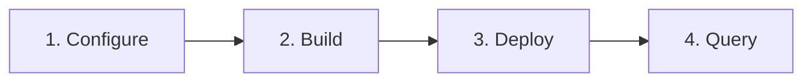
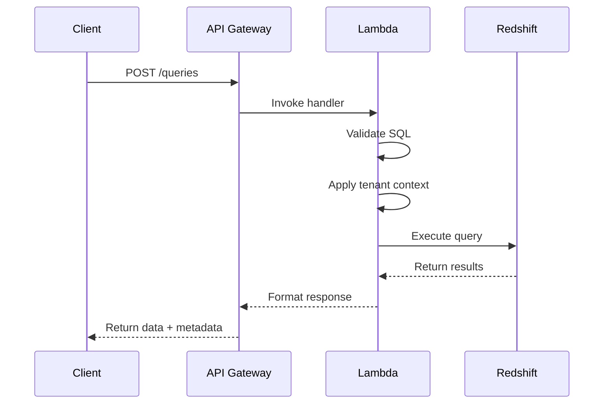

# Quick Start

Deploy Redshift Spectra and make your first API call in under 10 minutes.

## Overview



This guide walks you through the fastest path from zero to a working Redshift Spectra deployment. By the end, you'll have a fully functional API that executes queries against your Amazon Redshift cluster.

---

## Prerequisites

Before starting, ensure you have:

- **AWS Account** with administrative access
- **Amazon Redshift cluster** (Serverless or Provisioned)
- **AWS CLI** configured with appropriate credentials
- **Terraform** 1.11+ and **Terragrunt** 0.99+ installed
- **Python 3.11+** for building Lambda packages
- **Make** for running build commands

---

## Step 1: Configure Environment

Clone the repository and set up your configuration:

```bash
# Clone the repository
git clone https://github.com/your-org/redshift-spectra.git
cd redshift-spectra

# Copy the environment template
cp .env.template .env
```

Edit `.env` with your AWS and Redshift settings:

```bash
# AWS Configuration
AWS_REGION=us-east-1

# Redshift Configuration
SPECTRA_REDSHIFT_CLUSTER_ID=my-redshift-cluster
SPECTRA_REDSHIFT_DATABASE=analytics
SPECTRA_REDSHIFT_SECRET_ARN=arn:aws:secretsmanager:us-east-1:123456789012:secret:redshift/credentials

# S3 Configuration (for Bulk API exports)
SPECTRA_S3_BUCKET_NAME=my-spectra-exports

# Multi-tenant Configuration
SPECTRA_TENANT_ISOLATION=database  # Options: none, schema, database
```

!!! tip "Secrets Manager Setup"
    Your Redshift credentials should be stored in AWS Secrets Manager with the following structure:
    ```json
    {
      "username": "spectra_user",
      "password": "your-password",
      "host": "cluster.xxxxx.region.redshift.amazonaws.com",
      "port": 5439,
      "database": "analytics"
    }
    ```

---

## Step 2: Build Lambda Packages

Build the Lambda layer and function packages:

```bash
# Install development dependencies
make install-dev

# Build all Lambda packages
make package-all
```

This creates the following artifacts:

```
dist/lambda/
├── layer.zip          # Shared dependencies (~50MB)
├── api-handler.zip    # API handler code
└── authorizer.zip     # Custom authorizer code
```

---

## Step 3: Deploy Infrastructure

Deploy the infrastructure to your AWS account:

```bash
# Initialize Terragrunt
make tg-init-dev

# Preview changes
make tg-plan-dev

# Deploy infrastructure
make tg-apply-dev
```

After deployment, retrieve your API endpoint:

```bash
make tg-output-dev
```

Example output:

```
api_endpoint = "https://abc123.execute-api.us-east-1.amazonaws.com/v1"
api_key = "spectra_demo_abc123xyz"
```

!!! note "Deployment Time"
    Initial deployment typically takes 5-10 minutes to provision all AWS resources.

---

## Step 4: Make Your First Query

Now let's execute a query against your Redshift cluster!

### Set Environment Variables

```bash
export API_URL="https://abc123.execute-api.us-east-1.amazonaws.com/v1"
export API_KEY="spectra_demo_abc123xyz"
export TENANT_ID="demo-tenant"
```

### Execute a Query

The Query API is **synchronous** — you submit a query and receive results immediately in the response:

```bash
curl -X POST "$API_URL/queries" \
  -H "Authorization: Bearer $API_KEY" \
  -H "X-Tenant-ID: $TENANT_ID" \
  -H "Content-Type: application/json" \
  -d '{
    "sql": "SELECT table_name, table_type FROM information_schema.tables LIMIT 5"
  }'
```

**Response:**

```json
{
  "data": [
    {"table_name": "users", "table_type": "BASE TABLE"},
    {"table_name": "orders", "table_type": "BASE TABLE"},
    {"table_name": "products", "table_type": "BASE TABLE"},
    {"table_name": "inventory", "table_type": "BASE TABLE"},
    {"table_name": "sales_view", "table_type": "VIEW"}
  ],
  "metadata": {
    "columns": ["table_name", "table_type"],
    "column_types": ["VARCHAR", "VARCHAR"],
    "row_count": 5,
    "total_rows": 5,
    "truncated": false,
    "execution_time_ms": 156,
    "query_id": "abc123-def456"
  }
}
```

That's it! Your query executed on Redshift and returned results directly in the response.

---

## Understanding the Flow



The synchronous design provides:

- **Simplicity**: Single request-response, no polling required
- **Low latency**: Results returned immediately
- **Predictability**: Automatic LIMIT enforcement prevents runaway queries

---

## Query Examples

### Aggregate Query

```bash
curl -X POST "$API_URL/queries" \
  -H "Authorization: Bearer $API_KEY" \
  -H "X-Tenant-ID: $TENANT_ID" \
  -H "Content-Type: application/json" \
  -d '{
    "sql": "SELECT region, COUNT(*) as order_count, SUM(amount) as total FROM orders GROUP BY region"
  }'
```

### With Custom Limit

```bash
curl -X POST "$API_URL/queries" \
  -H "Authorization: Bearer $API_KEY" \
  -H "X-Tenant-ID: $TENANT_ID" \
  -H "Content-Type: application/json" \
  -d '{
    "sql": "SELECT * FROM large_table",
    "parameters": {
      "limit": 100
    }
  }'
```

### With Timeout

```bash
curl -X POST "$API_URL/queries" \
  -H "Authorization: Bearer $API_KEY" \
  -H "X-Tenant-ID: $TENANT_ID" \
  -H "Content-Type: application/json" \
  -d '{
    "sql": "SELECT * FROM complex_view WHERE date > CURRENT_DATE - 30",
    "parameters": {
      "timeout_seconds": 120
    }
  }'
```

---

## Handling Large Result Sets

When your query returns more rows than the configured limit, the response indicates truncation:

```json
{
  "data": [...],
  "metadata": {
    "row_count": 10000,
    "total_rows": 150000,
    "truncated": true
  }
}
```

For complete data export, use the **Bulk API**:

```bash
# Create a bulk export job
curl -X POST "$API_URL/bulk/jobs" \
  -H "Authorization: Bearer $API_KEY" \
  -H "X-Tenant-ID: $TENANT_ID" \
  -H "Content-Type: application/json" \
  -d '{
    "operation": "query",
    "object": "orders",
    "query": "SELECT * FROM orders WHERE year = 2024",
    "content_type": "CSV",
    "compression": "GZIP"
  }'
```

See the [Bulk API Guide](../user-guide/bulk-api.md) for complete documentation.

---

## Next Steps

Now that you have a working API, explore these topics:

<div class="grid cards" markdown>

-   :material-cog:{ .lg .middle } **Configuration**

    ---

    Customize settings for your deployment

    [:octicons-arrow-right-24: Configuration Guide](configuration.md)

-   :material-api:{ .lg .middle } **Query API**

    ---

    Learn the full Query API capabilities

    [:octicons-arrow-right-24: Query API Guide](../user-guide/query-api.md)

-   :material-account-group:{ .lg .middle } **Multi-Tenancy**

    ---

    Set up isolated tenant environments

    [:octicons-arrow-right-24: Multi-Tenancy](../concepts/multi-tenancy.md)

-   :material-shield-lock:{ .lg .middle } **Security**

    ---

    Configure authentication and authorization

    [:octicons-arrow-right-24: Security Overview](../security/overview.md)

</div>

---

## Troubleshooting

??? question "Query fails with 'Access Denied'"
    Ensure your Redshift credentials in Secrets Manager have permission to execute queries. The database user needs SELECT permission on the target tables.

    Also verify the Lambda execution role has permission to access Secrets Manager.

??? question "Query times out"
    The default timeout is 60 seconds. For longer-running queries:

    1. Increase `timeout_seconds` in the request (max: 300 seconds)
    2. For very long queries, use the Bulk API which supports 24-hour timeouts
    3. Optimize your query or add appropriate indexes

??? question "Results are truncated unexpectedly"
    The Query API has a maximum row limit of 10,000 rows. If you need more:

    1. Use the Bulk API for complete data export
    2. Add more specific WHERE clauses to reduce result size
    3. Use aggregation to summarize data

??? question "Authentication fails with 401"
    Verify your API key is correct and the `Authorization` header format:
    ```bash
    Authorization: Bearer your-api-key
    ```

    Also ensure the `X-Tenant-ID` header is present for multi-tenant deployments.

??? question "SQL validation error"
    The API blocks potentially dangerous SQL patterns. Ensure your query:

    - Uses only SELECT statements (no DDL/DML)
    - Doesn't contain comments that could hide injection attempts
    - Doesn't use system tables that are restricted

---

## Cleanup

To remove all deployed resources:

```bash
# Destroy infrastructure
make tg-destroy-dev

# Clean build artifacts
make clean
```

!!! warning "Data Loss"
    Destroying infrastructure will delete all DynamoDB tables and S3 data. Ensure you've exported any important data before cleanup.
