# Redshift Spectra

  <strong>Turn your Amazon Redshift into a secure, scalable Data-as-a-Service platform</strong>

  <em>Enterprise-grade serverless middleware for multi-tenant data access</em>

---

## The Enterprise Data Challenge

Modern enterprises face a critical challenge: **how to democratize data access while maintaining strict security and compliance**. Business units, partners, and customers all need access to analytical data, but traditional approaches create significant problems:

**Redshift Spectra** transforms your Amazon Redshift data warehouse into a managed, secure API—enabling you to build a **Data-as-a-Service platform** without exposing your database directly.

## Why Redshift Spectra?

### The Problem We Solve

When multiple teams, applications, or external partners need access to your data warehouse:

| Challenge | Traditional Solution | The Problem |
|-----------|---------------------|-------------|
| **Multi-tenant access** | Application-level filtering | Error-prone, security gaps |
| **Credential management** | Shared database passwords | Compliance nightmare |
| **Large result sets** | Direct connections with timeouts | Poor user experience |
| **Usage tracking** | Custom logging | Incomplete audit trail |
| **Scalability** | Connection poolers | Still limited by DB connections |

### Our Solution: Zero-Trust Data Access

Redshift Spectra implements security at the **database layer**, not the application layer. This means:

- **Tenant A cannot see Tenant B's data**—enforced by Redshift itself
- **No security logic in your application code**—zero chance of bugs leaking data  
- **Complete audit trail**—every query logged with tenant context
- **Serverless scaling**—from 1 to 10,000+ concurrent users

## Key Capabilities

-   :material-shield-lock:{ .lg .middle } **True Multi-Tenancy**

    ---

    Security enforcement at the database layer using Redshift RBAC and Row-Level Security. No tenant checks polluting your application code.

    [:octicons-arrow-right-24: Learn about multi-tenancy](concepts/multi-tenancy.md)

-   :material-lightning-bolt:{ .lg .middle } **Dual Execution Modes**

    ---

    Synchronous Query API for interactive workloads, Asynchronous Bulk API for large-scale data operations. Choose the right tool for each job.

    [:octicons-arrow-right-24: Explore the APIs](user-guide/query-api.md)

-   :material-database-sync:{ .lg .middle } **Session Reuse**

    ---

    Optimized connection management with Redshift Data API session pooling. Up to 80% latency reduction for repeated queries.

    [:octicons-arrow-right-24: Performance tuning](performance/session-reuse.md)

-   :material-file-export:{ .lg .middle } **Intelligent Data Delivery**

    ---

    Automatic format selection based on result size. JSON for small results, S3 presigned URLs for large datasets.

    [:octicons-arrow-right-24: Data delivery options](concepts/data-delivery.md)

-   :material-shield-check:{ .lg .middle } **SQL Security**

    ---

    Comprehensive SQL validation prevents injection attacks, blocks dangerous operations, and enforces query complexity limits.

    [:octicons-arrow-right-24: SQL security](security/sql-security.md)

-   :material-chart-timeline:{ .lg .middle } **Enterprise Observability**

    ---

    Built-in distributed tracing, structured logging, and custom metrics. Full visibility into every request.

    [:octicons-arrow-right-24: Monitoring](deployment/monitoring.md)

## Architecture at a Glance

```mermaid
flowchart TB
    subgraph Consumers["📱 Data Consumers"]
        APP[Internal Apps]
        BI[BI Tools]
        PARTNER[Partner Systems]
        ETL[ETL Pipelines]
    end

    subgraph Spectra["🔐 Redshift Spectra"]
        subgraph Edge["Edge Layer"]
            APIGW[API Gateway<br/>Rate Limiting · WAF]
        end
        
        subgraph Auth["Authentication"]
            AUTHZ[Authorizer<br/>JWT · API Key · IAM]
        end
        
        subgraph Compute["Compute Layer"]
            QUERY[Query Handler<br/>Sync Execution]
            BULK[Bulk Handler<br/>Async Operations]
        end
        
        subgraph State["State Layer"]
            DDB[(DynamoDB<br/>Jobs · Sessions)]
            S3[(S3<br/>Large Results)]
        end
    end

    subgraph Data["🏢 Enterprise Data"]
        RS[(Amazon Redshift<br/>RLS · RBAC)]
    end

    Consumers --> APIGW
    APIGW --> AUTHZ
    AUTHZ --> QUERY
    AUTHZ --> BULK
    QUERY --> DDB
    QUERY --> RS
    BULK --> DDB
    BULK --> S3
    BULK --> RS
```

## Enterprise Use Cases

### SaaS Analytics Platform

Provide each customer with isolated access to their analytics data through a unified API. Customers can integrate with their BI tools without sharing database credentials.

### Partner Data Sharing

Share specific datasets with business partners while ensuring they only see data they're authorized to access. Full audit trail for compliance requirements.

### Internal Data Democratization

Enable business teams to query data warehouses through a governed API, reducing shadow IT and ensuring consistent access patterns across the organization.

### ETL Pipeline Integration

Provide a standardized interface for ETL tools to extract large datasets with automatic handling of pagination, timeouts, and result delivery.

## Getting Started

Ready to build your enterprise Data-as-a-Service platform?

-   :material-rocket-launch:{ .lg .middle } **Quick Start**

    ---

    Deploy Redshift Spectra and make your first API call in under 10 minutes.

    [:octicons-arrow-right-24: Quick start guide](getting-started/quickstart.md)

-   :material-book-open-variant:{ .lg .middle } **Core Concepts**

    ---

    Understand the architecture and design decisions behind Redshift Spectra.

    [:octicons-arrow-right-24: Architecture overview](concepts/architecture.md)

-   :material-security:{ .lg .middle } **Security Model**

    ---

    Learn about our zero-trust security approach and compliance features.

    [:octicons-arrow-right-24: Security overview](security/overview.md)

## Enterprise Features

| Feature | Description | Compliance Benefit |
|---------|-------------|-------------------|
| **Row-Level Security** | Automatic data filtering at query time | SOC 2, GDPR data isolation |
| **Audit Logging** | Every query logged with full context | Compliance reporting & forensics |
| **Rate Limiting** | Per-tenant request throttling | Resource governance |
| **Idempotency** | Duplicate request handling | Data integrity |
| **Encryption** | TLS in-transit, KMS at-rest | Data protection standards |
| **Distributed Tracing** | Request correlation across services | Operational compliance |

---

  <em>Built for enterprises that take data security seriously.</em>

