# Redshift Spectra

<p align="center">
  <strong>Turn your Amazon Redshift into a secure, scalable Data-as-a-Service platform</strong>
</p>

<p align="center">
  <em>Enterprise-grade serverless middleware for multi-tenant data access</em>
</p>

---

**Redshift Spectra** transforms your Amazon Redshift data warehouse into a managed RESTful API, enabling secure multi-tenant data access without exposing your database directly.

## Why Redshift Spectra?

Building a data platform that serves multiple tenants is challenging:

- **Security**: How do you ensure Tenant A never sees Tenant B's data?
- **Performance**: How do you handle analytical queries without blocking your API?
- **Scale**: How do you serve thousands of concurrent requests efficiently?
- **Operations**: How do you manage credentials, monitor usage, and handle failures?

Redshift Spectra solves these challenges with a **zero-trust architecture** that leverages Redshift's native security features.

## Key Features

<div class="grid cards" markdown>

-   :material-shield-lock:{ .lg .middle } **True Multi-Tenancy**

    ---

    Security at the database layer using Redshift RBAC and Row-Level Security. Zero logic pollution in your application code.

-   :material-lightning-bolt:{ .lg .middle } **Serverless & Async**

    ---

    Built on AWS Lambda with async job patterns. Handle long-running analytical queries without timeout concerns.

-   :material-database:{ .lg .middle } **Session Reuse**

    ---

    Optimized connection pooling with Redshift Data API SessionKeepAliveSeconds. Up to 80% latency reduction.

-   :material-package-variant:{ .lg .middle } **Hybrid Delivery**

    ---

    JSON for small results, S3 presigned URLs for large datasets. Automatic format switching based on result size.

</div>

## Architecture Overview

```mermaid
flowchart TB
    subgraph Clients["🌐 Data Consumers"]
        APP[Applications]
        BI[BI Tools]
        ETL[ETL Pipelines]
    end

    subgraph AWS["☁️ AWS Cloud"]
        APIGW[API Gateway]
        LAMBDA[Lambda Functions]
        DDB[(DynamoDB)]
        S3[(S3)]
        RS[(Redshift)]
    end

    Clients --> APIGW
    APIGW --> LAMBDA
    LAMBDA --> DDB
    LAMBDA --> RS
    LAMBDA --> S3
```



## Quick Example

```bash
# Submit a query
curl -X POST https://api.example.com/v1/queries \
  -H "Authorization: Bearer $TOKEN" \
  -H "X-Tenant-ID: tenant-123" \
  -d '{"sql": "SELECT * FROM sales LIMIT 100"}'

# Response
{
  "job_id": "job-abc123",
  "status": "QUEUED"
}
```

## Getting Started

Ready to build your Data-as-a-Service platform?

<div class="grid cards" markdown>

-   [**Installation**](getting-started/installation.md)

    Set up your development environment

-   [**Quick Start**](getting-started/quickstart.md)

    Deploy your first API in 10 minutes

-   [**Configuration**](getting-started/configuration.md)

    Configure for your environment

</div>

## Learn More

- [Architecture](concepts/architecture.md) - Deep dive into system design
- [Security](security/overview.md) - Multi-tenancy and authentication
- [Performance](performance/overview.md) - Optimization techniques
- [API Reference](api-reference.md) - Complete endpoint documentation
