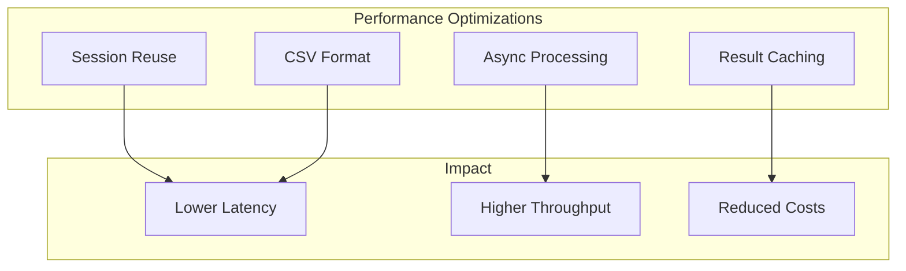
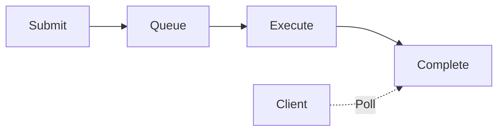

# Performance Overview

Redshift Spectra is optimized for high-performance data access with multiple strategies to minimize latency and maximize throughput.

## Performance Architecture



## Key Optimizations

### 1. Session Reuse

Eliminates connection overhead by reusing Redshift sessions:

| Metric | Without Session Reuse | With Session Reuse |
|--------|----------------------|-------------------|
| Connection Overhead | 200-500ms | 0ms |
| Subsequent Queries | 500ms | 50-100ms |
| Average Latency | 500ms | 150ms |

[Learn more →](session-reuse.md)

### 2. CSV Format Parsing

Uses `get_statement_result_v2` with CSV format for faster result parsing:

| Result Size | Typed Format | CSV Format | Improvement |
|-------------|--------------|------------|-------------|
| 10,000 rows | 120ms | 35ms | 71% |
| 100,000 rows | 1,200ms | 300ms | 75% |

[Learn more →](csv-format.md)

### 3. Async Job Processing

Long-running queries execute asynchronously:



Benefits:
- No API Gateway timeout (30s limit)
- Client can disconnect safely
- Better resource utilization

### 4. Hybrid Data Delivery

Automatic format selection based on result size:

| Result Size | Delivery Method | Format |
|-------------|-----------------|--------|
| < 10,000 rows | Inline JSON | JSON |
| ≥ 10,000 rows | S3 Export | Parquet |

## Benchmarks

### Query Latency (P50)

```
Small Query (100 rows):     ~150ms
Medium Query (10k rows):    ~500ms
Large Query (100k rows):    ~2s (async)
Export Query (1M+ rows):    ~30s (async, S3)
```

### Throughput

```
Concurrent Queries:         100/tenant
Requests per Second:        1000+ (API Gateway)
Max Result Size:            Unlimited (S3 export)
```

## Configuration

Key performance settings:

```bash
# Session Reuse
SPECTRA_REDSHIFT_SESSION_KEEP_ALIVE_SECONDS=3600
SPECTRA_REDSHIFT_SESSION_IDLE_TIMEOUT_SECONDS=300

# Result Handling
SPECTRA_RESULT_SIZE_THRESHOLD=10000

# Concurrency
SPECTRA_MAX_CONCURRENT_QUERIES=10
```

## Monitoring Performance

### Key Metrics

| Metric | Target | Alert Threshold |
|--------|--------|-----------------|
| Query Latency P50 | < 200ms | > 500ms |
| Query Latency P99 | < 2s | > 5s |
| Session Hit Rate | > 90% | < 80% |
| Error Rate | < 0.1% | > 1% |

### CloudWatch Dashboard

Monitor these metrics in real-time:

- API latency distribution
- Session cache hit/miss ratio
- Query execution times
- Concurrent execution count

## Optimization Checklist

=== "Quick Wins"

    - [x] Enable session reuse
    - [x] Use CSV format for results
    - [x] Configure appropriate timeouts
    - [x] Set result size threshold

=== "Advanced"

    - [ ] Tune Lambda memory size
    - [ ] Optimize Redshift workload management
    - [ ] Implement query result caching
    - [ ] Use Redshift Serverless for auto-scaling

## Next Steps

- [Session Reuse](session-reuse.md) - Deep dive into session management
- [CSV Format](csv-format.md) - Result parsing optimization
