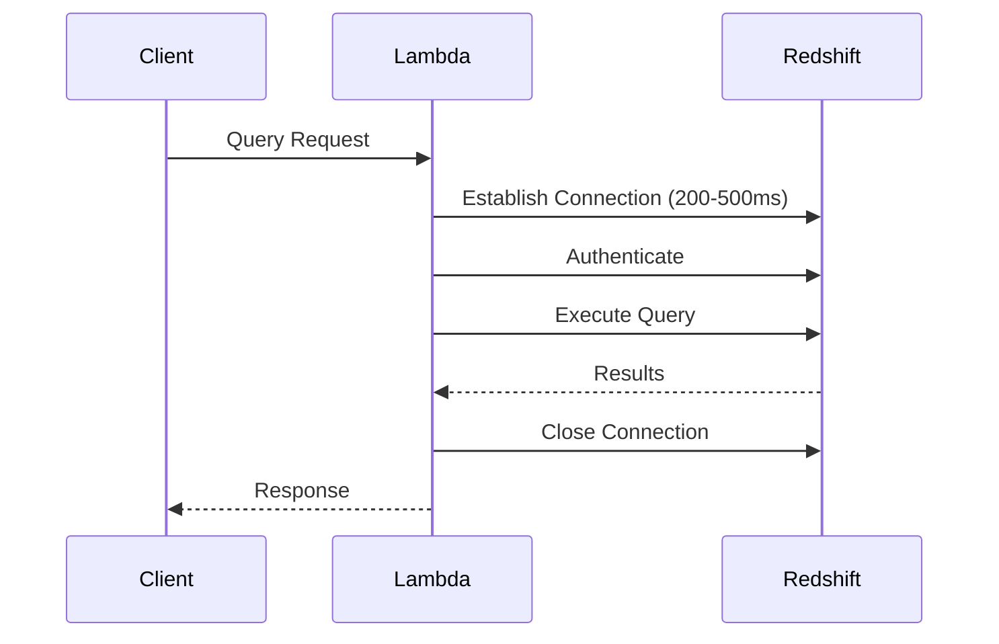
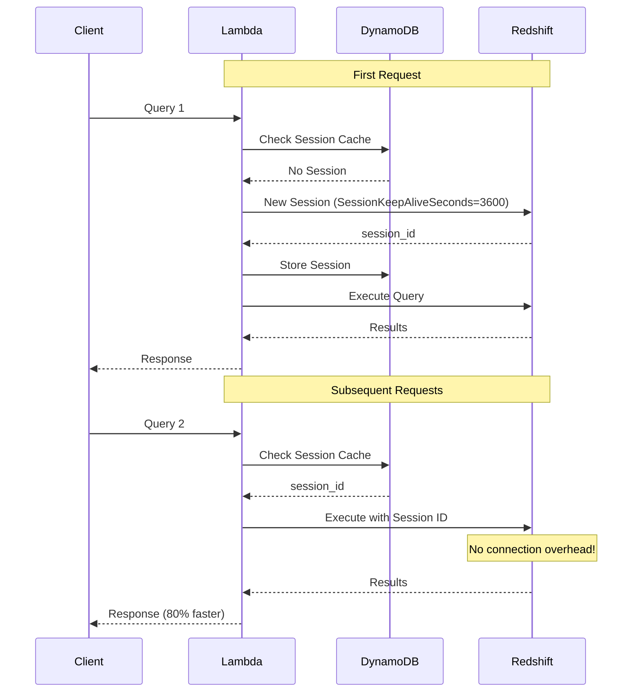
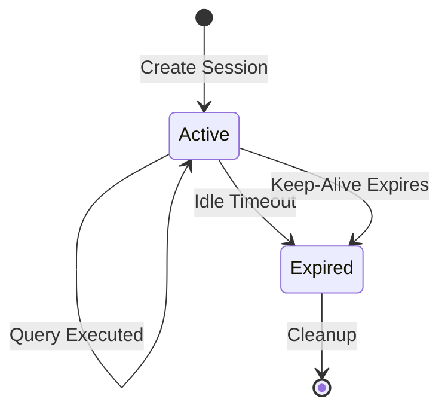

# Session Reuse

Redshift Spectra leverages the **Redshift Data API SessionKeepAliveSeconds** feature to eliminate connection overhead and dramatically reduce query latency.

## The Problem

Traditional database connections require:



**Connection overhead: 200-500ms per query**

## The Solution

With session reuse, connections persist across requests:



## How It Works

### Session Storage

Sessions are stored in DynamoDB with tenant association:

```json
{
  "session_id": "abc123-session-xyz",
  "tenant_id": "tenant-123",
  "db_user": "tenant_123",
  "created_at": "2026-01-29T10:00:00Z",
  "last_used_at": "2026-01-29T10:30:00Z",
  "expires_at": "2026-01-29T11:00:00Z",
  "ttl": 1738238400
}
```

### Session Lifecycle



## Implementation

### Configuration

```bash
# Session keep-alive duration (max 24 hours)
SPECTRA_REDSHIFT_SESSION_KEEP_ALIVE_SECONDS=3600

# Idle timeout before session is considered stale
SPECTRA_REDSHIFT_SESSION_IDLE_TIMEOUT_SECONDS=300

# DynamoDB table for session storage
SPECTRA_DYNAMODB_SESSIONS_TABLE_NAME=spectra-sessions
```

### Session Service

```python
# services/session.py

class SessionService:
    """Manages Redshift session caching per tenant."""

    def get_or_create_session_id(
        self,
        tenant_id: str,
        db_user: str,
    ) -> tuple[str | None, bool]:
        """Get existing session or signal that new one is needed."""

        # Try to get active session
        session = self.get_active_session(tenant_id, db_user)

        if session and not session.is_expired:
            self.update_last_used(session.session_id)
            return session.session_id, False  # Existing session

        return None, True  # Need new session
```

### RedshiftService Integration

```python
# services/redshift.py

def execute_statement(
    self,
    sql: str,
    db_user: str,
    tenant_id: str | None = None,
    use_session: bool = True,
) -> str:
    """Execute SQL with session reuse."""

    session_id = None
    if use_session and tenant_id:
        session_id, is_new = self.session_service.get_or_create_session_id(
            tenant_id=tenant_id,
            db_user=db_user,
        )

    params = {
        "Database": self.settings.redshift_database,
        "Sql": sql,
        "DbUser": db_user,
    }

    if session_id:
        # Reuse existing session
        params["SessionId"] = session_id
    else:
        # Create new session with keep-alive
        params["SessionKeepAliveSeconds"] = self.settings.redshift_session_keep_alive_seconds

    response = self.client.execute_statement(**params)

    # Store new session if created
    if not session_id and tenant_id:
        new_session_id = response.get("SessionId")
        if new_session_id:
            self.session_service.create_session(
                session_id=new_session_id,
                tenant_id=tenant_id,
                db_user=db_user,
            )

    return response["Id"]
```

## Performance Impact

| Metric | Without Session Reuse | With Session Reuse | Improvement |
|--------|----------------------|-------------------|-------------|
| **Connection Overhead** | 200-500ms | 0ms | 100% |
| **First Query** | 500ms | 500ms | - |
| **Subsequent Queries** | 500ms | 50-100ms | 80-90% |
| **Avg Latency (10 queries)** | 500ms | 150ms | 70% |

## Error Handling

Sessions can become invalid. Spectra handles this automatically:

```python
try:
    response = self.client.execute_statement(**params)
except ClientError as e:
    error_code = e.response["Error"]["Code"]

    if error_code in ("InvalidSessionException", "SessionNotFoundException"):
        # Invalidate cached session
        self.session_service.invalidate_session(session_id)

        # Retry without session (creates new one)
        return self.execute_statement(
            sql=sql,
            db_user=db_user,
            tenant_id=tenant_id,
            use_session=True,  # Will create new session
        )
    raise
```

## Session Cleanup

Expired sessions are automatically cleaned up:

```python
def cleanup_expired_sessions(self) -> int:
    """Remove expired sessions from cache."""
    now = datetime.now(UTC)

    # DynamoDB TTL handles automatic deletion
    # This method is for manual cleanup if needed

    response = self.table.scan(
        FilterExpression=Attr("expires_at").lt(now.isoformat())
    )

    deleted = 0
    for item in response.get("Items", []):
        self.table.delete_item(Key={"session_id": item["session_id"]})
        deleted += 1

    return deleted
```

## Best Practices

!!! tip "Tune Keep-Alive Duration"

    Set `SessionKeepAliveSeconds` based on your query patterns:
    - Frequent queries: 3600s (1 hour)
    - Infrequent queries: 300s (5 minutes)
    - Maximum allowed: 86400s (24 hours)

!!! tip "Monitor Session Hit Rate"

    Track session cache hits vs misses. Target > 90% hit rate for optimal performance.

!!! warning "Session Limits"

    Redshift has limits on concurrent sessions. Monitor and adjust based on your workload.

!!! warning "Tenant Isolation"

    Sessions are tenant-specific. Never share sessions across tenants.

## Monitoring

### Key Metrics

| Metric | Description | Target |
|--------|-------------|--------|
| `SessionHit` | Queries using cached session | > 90% |
| `SessionMiss` | Queries creating new session | < 10% |
| `SessionCreated` | New sessions created | Monitor trend |
| `SessionExpired` | Sessions that expired | Expected |

### CloudWatch Dashboard

```json
{
  "metrics": [
    ["Spectra", "SessionHit", "TenantId", "*"],
    ["Spectra", "SessionMiss", "TenantId", "*"]
  ],
  "title": "Session Cache Performance"
}
```
