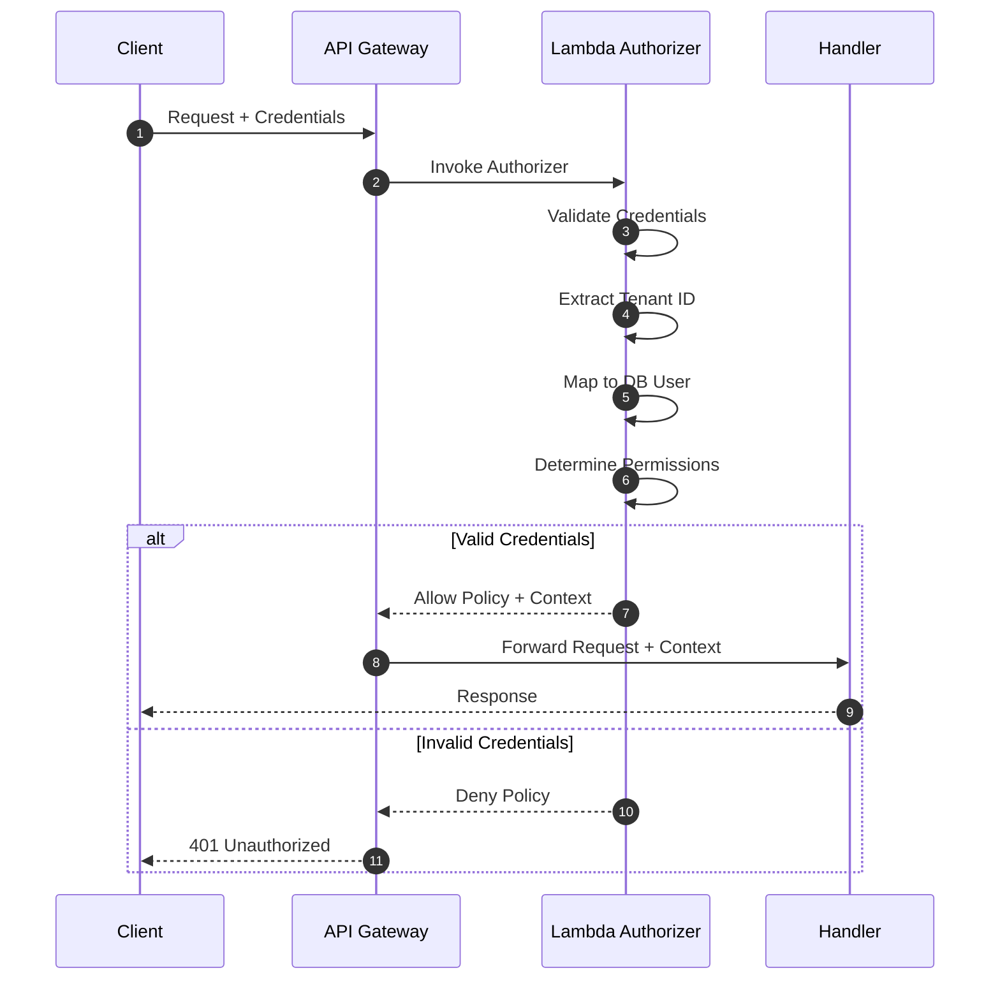
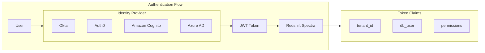
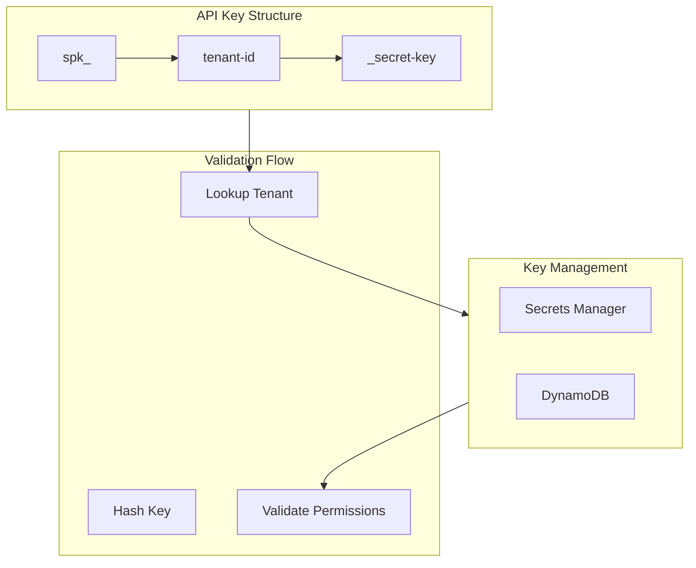
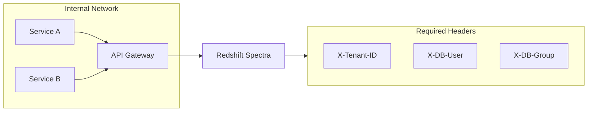
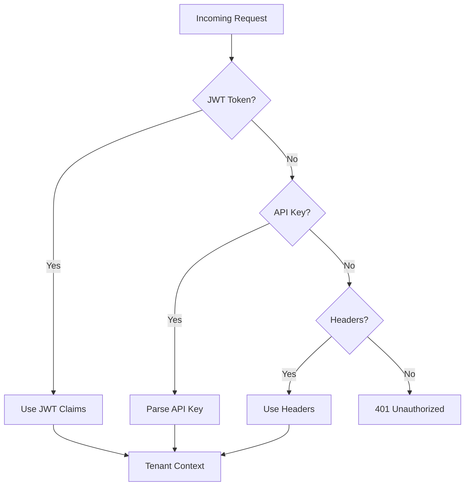
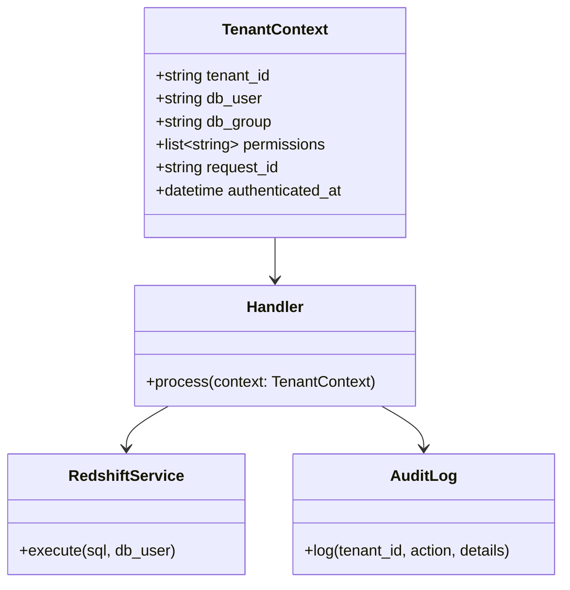
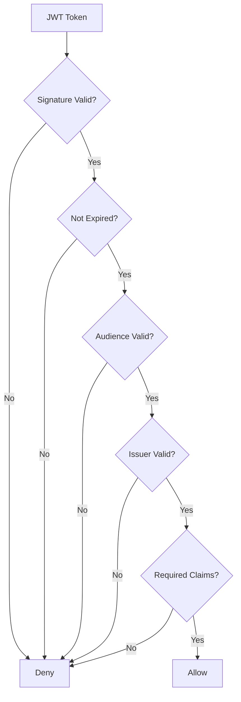

# Authentication

Authentication is the first line of defense in Redshift Spectra. This document explains the supported authentication methods and how they establish tenant identity.

## Authentication Flow

Every request to Redshift Spectra must be authenticated. The authentication process establishes two critical pieces of information:

1. **Identity** — Who is making the request
2. **Tenant Context** — Which tenant's data can be accessed

## Supported Authentication Methods

Redshift Spectra supports three authentication methods, each suited to different use cases:

### JWT Token Authentication

Best for: **User-facing applications** where users authenticate through an Identity Provider.

The authorizer extracts tenant information from JWT claims:

| Claim | Required | Description |
|-------|----------|-------------|
| `sub` | Yes | Subject identifier (user ID) |
| `tenant_id` | Yes | Tenant identifier |
| `db_user` | Yes | Database user for query execution |
| `db_group` | No | Database group for permissions |
| `permissions` | No | Array of allowed operations |

**How to configure:**

1. Configure your Identity Provider to include `tenant_id` and `db_user` claims
2. Set `SPECTRA_JWT_ISSUER` and `SPECTRA_JWT_AUDIENCE` environment variables
3. Send requests with `Authorization: Bearer <token>` header

### API Key Authentication

Best for: **Machine-to-machine** communication and **partner integrations**.

API keys encode tenant information directly in their structure:

- Format: `spk_{tenant_id}_{secret}`
- Example: `spk_acme-corp_a1b2c3d4e5f6`

The authorizer extracts `tenant_id` from the key prefix and validates the secret against stored hashes.

**How to configure:**

1. Generate API keys for each tenant
2. Store hashed keys in Secrets Manager or DynamoDB
3. Send requests with `Authorization: Bearer spk_...` header

### Request Header Authentication

Best for: **Internal microservices** where identity is established upstream.

Required headers:

| Header | Required | Description |
|--------|----------|-------------|
| `X-Tenant-ID` | Yes | Tenant identifier |
| `X-DB-User` | Yes | Database user for query execution |
| `X-DB-Group` | No | Database group for permissions |

!!! warning "Security Note"
    Header-based authentication should only be used for trusted internal services behind a VPC. Never expose this method to external clients.

## Authentication Priority

When multiple authentication methods are present, the authorizer applies this priority:

## Tenant Context

Successful authentication produces a **Tenant Context** that flows through the entire request:

The tenant context ensures:

- Queries execute as the tenant's database user
- All operations are logged with tenant identifier
- Permissions are checked before operations

## Token Validation

For JWT tokens, validation includes:

1. **Signature verification** — Using issuer's public keys
2. **Expiration check** — Token must not be expired
3. **Audience validation** — Token must be issued for this service
4. **Issuer validation** — Token must come from trusted issuer
5. **Required claims** — `tenant_id` and `db_user` must be present

## API Key Security

API keys are protected through:

- **Hashing** — Keys are stored as bcrypt hashes
- **Rotation** — Keys can be rotated without downtime
- **Scoping** — Keys can be limited to specific operations
- **Audit** — All key usage is logged
- **Revocation** — Keys can be immediately revoked

## Error Responses

| Error | HTTP Status | Description |
|-------|-------------|-------------|
| Missing credentials | 401 | No authentication method detected |
| Invalid token | 401 | JWT signature or format invalid |
| Expired token | 401 | JWT has expired |
| Invalid API key | 401 | API key not found or invalid |
| Missing tenant context | 401 | Required tenant claims not present |

## Best Practices

!!! tip "Use JWT for User Applications"
    JWT tokens from your Identity Provider provide the best user experience and centralized identity management.

!!! tip "Use API Keys for Integrations"
    API keys are simpler for machine-to-machine communication and can be easily rotated.

!!! warning "Protect API Keys"
    Treat API keys like passwords:

    - Never commit to version control
    - Rotate regularly (every 90 days)
    - Use different keys for different environments

!!! info "Header Authentication is Internal Only"
    Only use header-based authentication for trusted internal services. Never expose this method externally.
