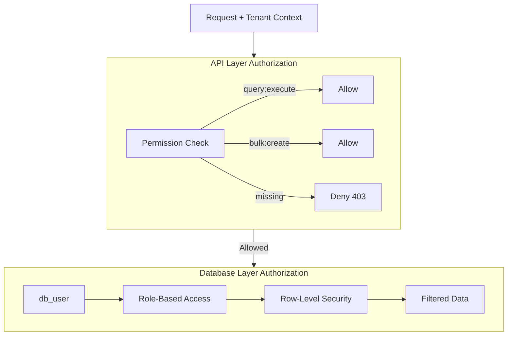
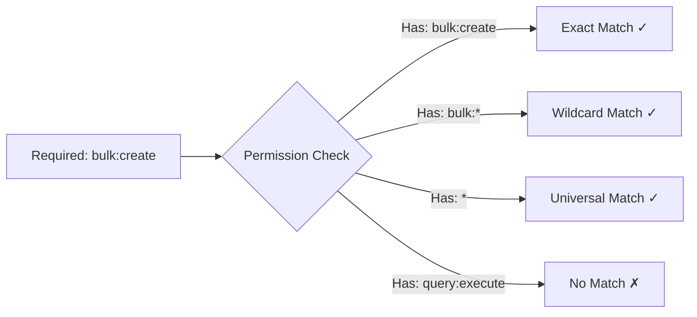
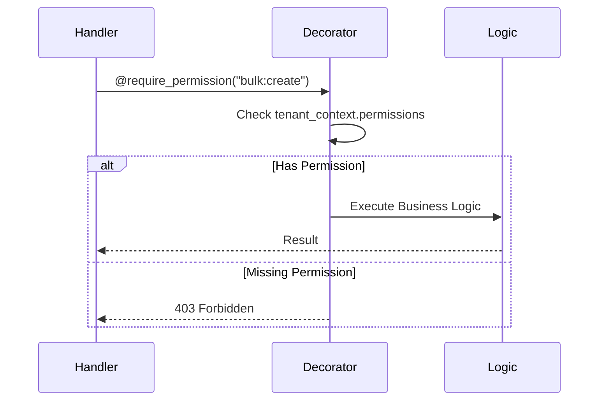
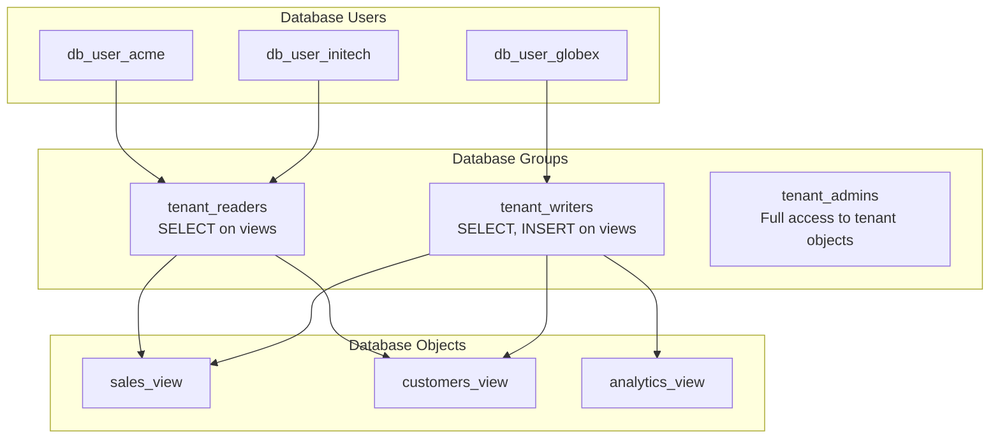
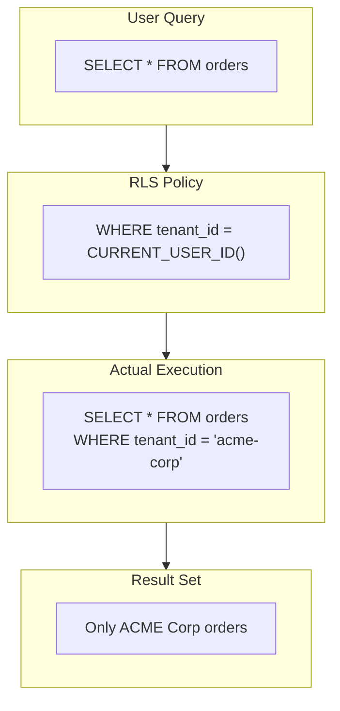
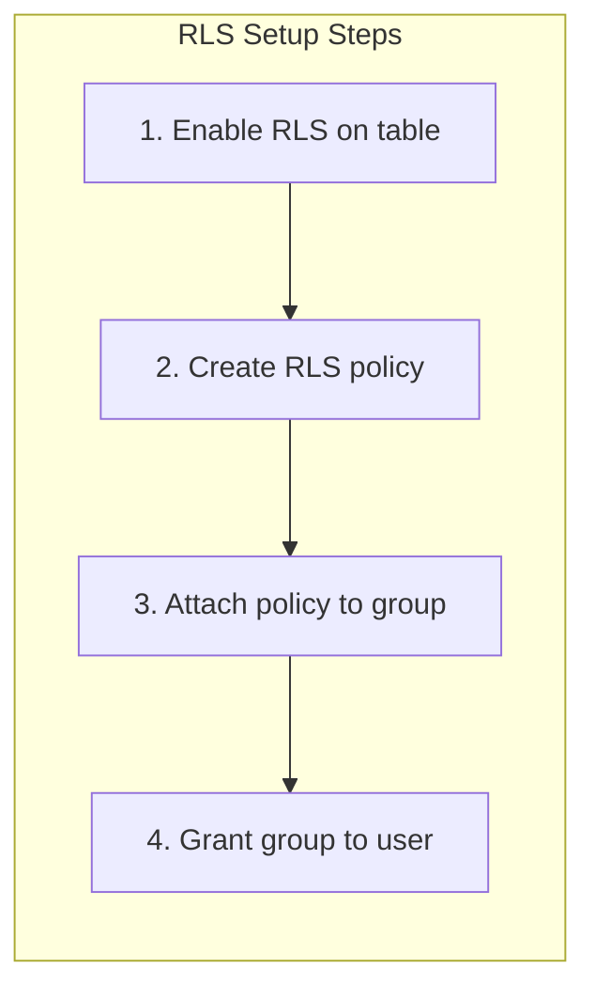
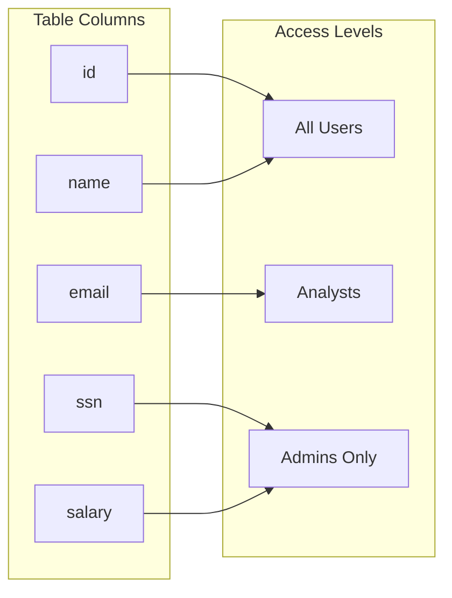
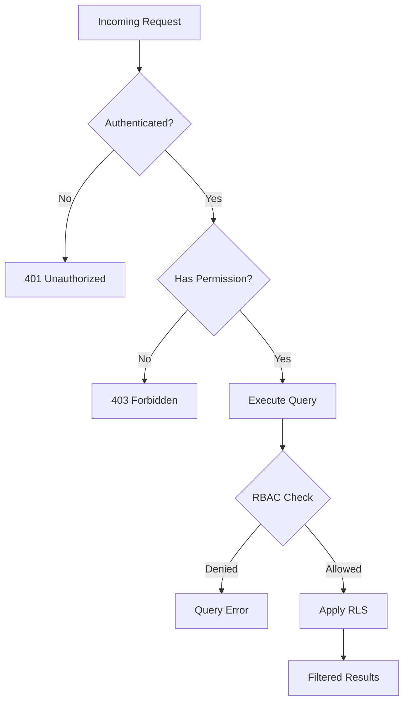

# Authorization

After authentication establishes identity, authorization determines what actions a user can perform and what data they can access. Redshift Spectra implements authorization at two levels: the **API layer** and the **database layer**.

## Authorization Architecture



## API Layer Authorization

The API layer checks whether the authenticated user has permission to perform the requested operation.

### Permission Model

Permissions are strings that describe allowed operations:

| Permission | Description | Scope |
|------------|-------------|-------|
| `query:execute` | Submit synchronous queries | Query API |
| `bulk:create` | Create bulk export/import jobs | Bulk API |
| `bulk:read` | Read job status and results | Bulk API |
| `bulk:cancel` | Cancel running jobs | Bulk API |
| `admin:*` | All administrative operations | Admin API |
| `*` | Wildcard (all permissions) | All APIs |

### Permission Sources

Permissions can come from multiple sources:

```mermaid
flowchart TB
    subgraph Sources["Permission Sources"]
        JWT[JWT Claims<br/>permissions: [...]]
        LOOKUP[API Key Lookup<br/>tenant_permissions table]
        DEFAULT[Default Permissions<br/>query:execute, bulk:read]
    end
    
    Sources --> MERGE[Merge Permissions]
    MERGE --> CHECK[Permission Check]
```

### Permission Hierarchy

Permissions support hierarchical matching:

- `bulk:*` matches `bulk:create`, `bulk:read`, `bulk:cancel`
- `*` matches all permissions
- Exact match is required otherwise



### Permission Enforcement

Permission checks happen after authentication but before business logic:



## Database Layer Authorization

The database layer controls what data the user can access. This is the **critical security boundary** that guarantees tenant isolation.

### Role-Based Access Control (RBAC)

Each database user belongs to groups that determine their base permissions:



### Row-Level Security (RLS)

RLS policies automatically filter data based on the executing user:



This means:

- The same SQL query works for all tenants
- No application code changes needed
- Impossible to accidentally access other tenant's data

### Setting Up RLS in Redshift

Row-Level Security requires creating policies in Redshift:



**Key concepts:**

1. **Tables must have a tenant identifier column** — Usually `tenant_id`
2. **Policies match column to user context** — `tenant_id = CURRENT_USER`
3. **Policies apply automatically** — No query modification needed
4. **Superusers bypass RLS** — Use dedicated users, not admin accounts

## Column-Level Security

Beyond row filtering, Redshift supports column-level access control:



This ensures sensitive columns like PII are only visible to authorized users.

## Authorization Decision Flow

The complete authorization flow:



## Tenant Isolation Verification

To verify tenant isolation is working correctly:

```mermaid
flowchart TB
    subgraph Test["Isolation Test"]
        T1[Connect as tenant_a user]
        T2[Query shared table]
        T3[Verify only tenant_a data]
        
        T1 --> T2 --> T3
    end
    
    subgraph Expected["Expected Behavior"]
        E1[Query: SELECT COUNT(*) FROM orders]
        E2[Result: 1000 rows<br/>All belong to tenant_a]
    end
    
    Test --> Expected
```

## Best Practices

!!! tip "Principle of Least Privilege"
    Grant the minimum permissions required:
    
    - Start with `query:execute` only
    - Add permissions as needed
    - Use specific permissions over wildcards

!!! tip "Use Database Groups"
    Don't grant permissions directly to users:
    
    - Create logical groups (readers, writers, admins)
    - Grant permissions to groups
    - Add users to groups

!!! warning "Test Tenant Isolation"
    Regularly verify that RLS is working:
    
    - Create test tenants with known data
    - Verify cross-tenant queries return no data
    - Include in CI/CD pipeline

!!! danger "Never Use Superuser Connections"
    Superusers bypass all RLS policies:
    
    - Create dedicated application users
    - Use Secrets Manager for credential rotation
    - Monitor for superuser access

## Error Responses

| Error | HTTP Status | Description |
|-------|-------------|-------------|
| Missing permission | 403 | User lacks required API permission |
| Invalid operation | 403 | Operation not allowed for this tenant |
| RLS violation | 500 | Query fails due to RLS restriction |

## Audit Trail

All authorization decisions are logged:

- **API permission checks** — Logged with outcome and required permission
- **Database access** — Logged in Redshift audit logs
- **RLS applications** — Visible in query explain plans
