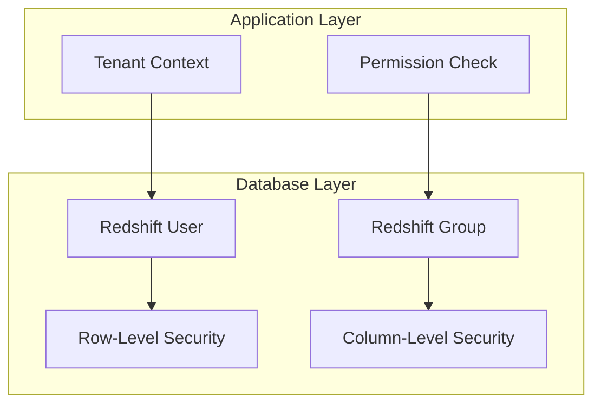
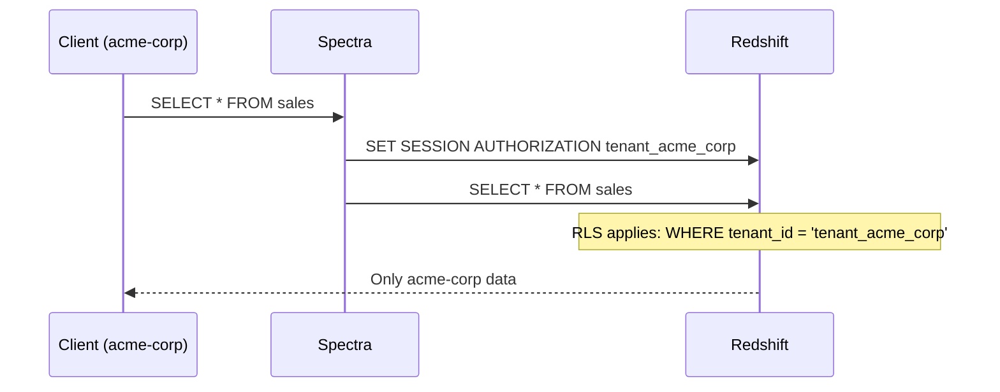

# Authorization

Redshift Spectra enforces authorization at the **database layer** using Redshift's native security features.

## Authorization Model



## Tenant-to-User Mapping

Each tenant maps to a dedicated Redshift database user:

| Tenant ID | Database User | Database Group |
|-----------|---------------|----------------|
| `acme-corp` | `tenant_acme_corp` | `tenant_group_acme_corp` |
| `globex` | `tenant_globex` | `tenant_group_globex` |
| `initech` | `tenant_initech` | `tenant_group_initech` |

### User Creation

```sql
-- Create tenant user
CREATE USER tenant_acme_corp PASSWORD DISABLE;

-- Create tenant group
CREATE GROUP tenant_group_acme_corp;

-- Add user to group
ALTER GROUP tenant_group_acme_corp ADD USER tenant_acme_corp;

-- Grant schema access
GRANT USAGE ON SCHEMA analytics TO GROUP tenant_group_acme_corp;

-- Grant table access
GRANT SELECT ON ALL TABLES IN SCHEMA analytics TO GROUP tenant_group_acme_corp;
```

## Row-Level Security (RLS)

RLS automatically filters data based on the executing user.

### Enable RLS

```sql
-- Enable RLS on the table
ALTER TABLE sales ROW LEVEL SECURITY ON;

-- Create policy
CREATE RLS POLICY tenant_isolation
ON sales
USING (tenant_id = current_user);

-- Attach policy to group
ATTACH RLS POLICY tenant_isolation
ON sales
TO GROUP tenant_group_acme_corp;
```

### How It Works



### Policy Examples

**Tenant Isolation:**

```sql
CREATE RLS POLICY tenant_data
ON orders
USING (tenant_id = current_user);
```

**Date-Based Access:**

```sql
CREATE RLS POLICY recent_data_only
ON transactions
USING (
  tenant_id = current_user
  AND transaction_date >= CURRENT_DATE - INTERVAL '90 days'
);
```

**Region-Based Access:**

```sql
CREATE RLS POLICY regional_access
ON customers
USING (
  tenant_id = current_user
  AND region = ANY(
    SELECT allowed_region
    FROM tenant_permissions
    WHERE tenant = current_user
  )
);
```

## Column-Level Security (CLS)

Restrict access to sensitive columns.

### Implementation

```sql
-- Revoke access to sensitive columns
REVOKE SELECT (ssn, credit_card_number, salary)
ON employees
FROM GROUP tenant_group_acme_corp;

-- Grant access to non-sensitive columns
GRANT SELECT (id, name, email, department, hire_date)
ON employees
TO GROUP tenant_group_acme_corp;
```

### Dynamic Column Masking

For partial access, create masking views:

```sql
CREATE VIEW employees_masked AS
SELECT
  id,
  name,
  email,
  department,
  CASE
    WHEN current_user = 'admin'
    THEN salary
    ELSE NULL
  END AS salary,
  CONCAT('XXX-XX-', RIGHT(ssn, 4)) AS ssn_masked
FROM employees;

GRANT SELECT ON employees_masked TO GROUP tenant_group_acme_corp;
```

## Permission Model

### Application-Level Permissions

Spectra checks permissions before executing queries:

```python
@dataclass
class TenantContext:
    tenant_id: str
    db_user: str
    db_group: str | None
    permissions: list[str]
    
    def has_permission(self, permission: str) -> bool:
        return permission in self.permissions
```

### Available Permissions

| Permission | Description |
|------------|-------------|
| `query` | Execute SELECT queries |
| `export` | Export results to S3 |
| `bulk_query` | Execute bulk query operations |
| `bulk_insert` | Execute bulk insert operations |
| `bulk_update` | Execute bulk update operations |
| `bulk_delete` | Execute bulk delete operations |

### Permission Enforcement

```python
from spectra.middleware.tenant import require_permission

@require_permission("export")
def export_handler(event, context):
    # Only executes if tenant has "export" permission
    ...
```

## Query Validation

### SQL Restrictions

Spectra validates queries before execution:

```python
def validate_query(sql: str) -> None:
    """Validate SQL query for security."""
    upper_sql = sql.upper().strip()
    
    # Only SELECT allowed
    if not upper_sql.startswith("SELECT"):
        raise ValueError("Only SELECT statements are allowed")
    
    # Block dangerous statements
    forbidden = ["DROP", "DELETE", "UPDATE", "INSERT", "ALTER", "CREATE"]
    for keyword in forbidden:
        if keyword in upper_sql:
            raise ValueError(f"{keyword} statements are not allowed")
```

### Object Access Validation

```sql
-- View accessible objects for a user
SELECT
  schemaname,
  tablename,
  has_table_privilege(current_user, schemaname || '.' || tablename, 'SELECT') as can_select
FROM pg_tables
WHERE schemaname = 'analytics';
```

## Audit Trail

All database access is logged:

```sql
-- Enable audit logging
ALTER USER tenant_acme_corp SET log_statement = 'all';

-- Query audit logs
SELECT
  username,
  query,
  starttime,
  endtime
FROM stl_query
WHERE username LIKE 'tenant_%'
ORDER BY starttime DESC;
```

## Best Practices

!!! tip "Principle of Least Privilege"
    
    Grant only the minimum permissions required. Start restrictive and add as needed.

!!! tip "Test RLS Policies"
    
    Always test RLS policies with multiple tenant users before production deployment.

!!! warning "Don't Rely on Application-Only Security"
    
    Application-level checks can be bypassed. Always implement database-level security.

!!! danger "Avoid Dynamic SQL"
    
    Never construct SQL from user input. Use parameterized queries to prevent injection.

## Troubleshooting

### Check User Permissions

```sql
-- List user's group memberships
SELECT
  usename,
  groname
FROM pg_user u
JOIN pg_group g ON u.usesysid = ANY(g.grolist)
WHERE usename = 'tenant_acme_corp';

-- Check table permissions
SELECT
  has_table_privilege('tenant_acme_corp', 'analytics.sales', 'SELECT') as can_select;
```

### Verify RLS Policies

```sql
-- List RLS policies
SELECT
  polname,
  polrelid::regclass as table_name,
  polcmd,
  polqual
FROM pg_policy;
```
