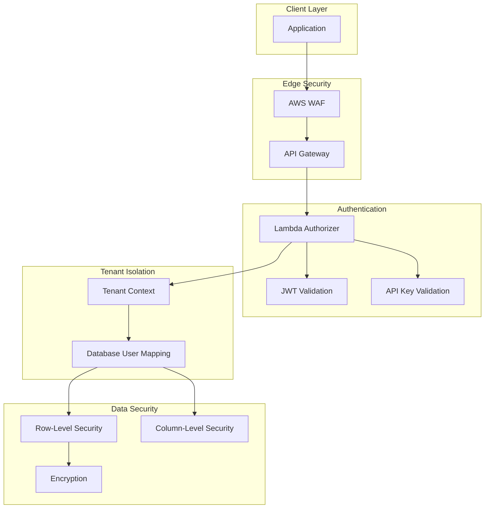
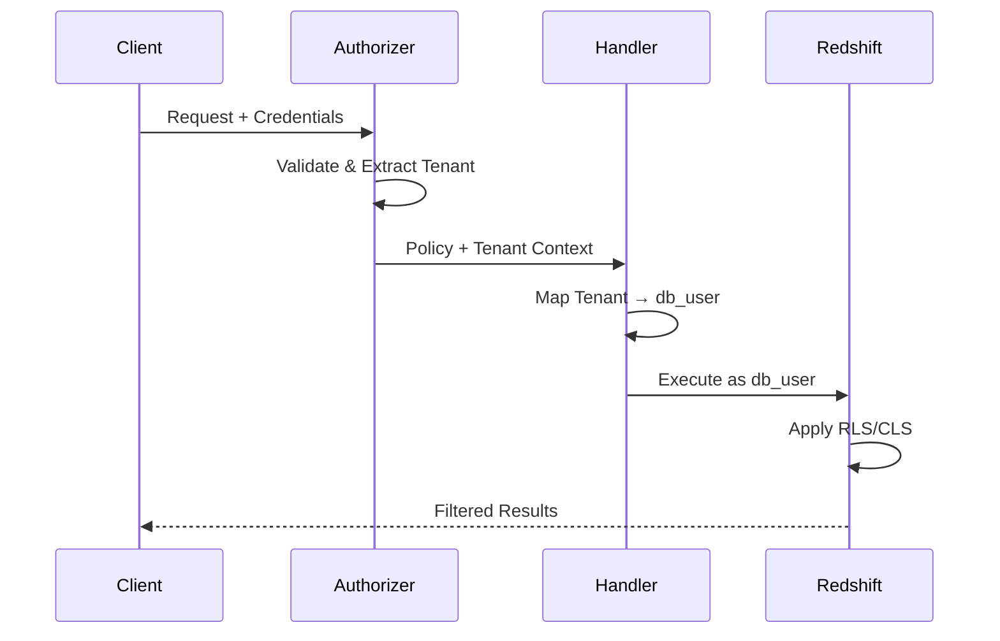

# Security Overview

Redshift Spectra implements a **zero-trust security model** with defense-in-depth across all layers.

## Security Architecture



## Security Layers

### 1. Edge Security

**AWS WAF** provides protection against:

- SQL injection attempts
- Cross-site scripting (XSS)
- Rate limiting
- Bot mitigation
- Geographic restrictions

**API Gateway** provides:

- TLS termination
- Request validation
- Throttling
- API key management

### 2. Authentication

Multiple authentication modes supported:

| Mode | Use Case | Token Lifetime |
|------|----------|----------------|
| API Key | Machine-to-machine | Long-lived |
| JWT | User authentication | Short-lived |
| IAM | AWS service calls | Temporary |

### 3. Tenant Isolation

Every request is associated with a tenant context:



### 4. Data Security

**Row-Level Security (RLS):**

Tenants only see their own data:

```sql
CREATE RLS POLICY tenant_isolation
ON sales
USING (tenant_id = current_user);
```

**Column-Level Security (CLS):**

Restrict sensitive columns:

```sql
REVOKE SELECT (ssn, credit_card)
ON customers
FROM tenant_group;
```

**Encryption:**

- Data at rest: AES-256
- Data in transit: TLS 1.2+
- S3 exports: Server-side encryption

## Compliance Considerations

| Standard | Relevant Features |
|----------|-------------------|
| **SOC 2** | Audit logging, access controls, encryption |
| **GDPR** | Data isolation, encryption, right to access |
| **HIPAA** | PHI protection, access controls, audit trails |
| **PCI DSS** | Encryption, access logging, network isolation |

## Security Checklist

=== "Development"

    - [ ] Use non-production credentials
    - [ ] Enable all logging
    - [ ] Test RLS policies work correctly
    - [ ] Validate input sanitization

=== "Production"

    - [ ] Enable AWS WAF
    - [ ] Configure VPC endpoints
    - [ ] Set up CloudTrail
    - [ ] Enable GuardDuty
    - [ ] Configure SNS alerts
    - [ ] Regular credential rotation

## Threat Model

| Threat | Mitigation |
|--------|------------|
| SQL Injection | Parameterized queries, input validation |
| Credential Theft | Short-lived tokens, Secrets Manager |
| Data Leakage | RLS, CLS, encryption |
| Privilege Escalation | Least-privilege IAM, database roles |
| DDoS | WAF, API throttling, rate limiting |
| Insider Threat | Audit logging, principle of least privilege |

## Next Steps

- [Authentication](authentication.md) - Deep dive into auth modes
- [Authorization](authorization.md) - RLS and CLS implementation
