# Security Overview

Security is the foundation of Redshift Spectra. As an enterprise data access platform, we implement a **defense-in-depth strategy** that protects your data at every layer, from the network edge to the database row.

## Zero-Trust Security Model

Redshift Spectra operates on a zero-trust principle: **never trust, always verify**. Every request is authenticated, authorized, and audited regardless of its origin.

```mermaid
flowchart TB
    subgraph ZeroTrust["🔐 Zero-Trust Security Layers"]
        direction TB
        
        subgraph Layer1["Layer 1: Network Security"]
            WAF[AWS WAF<br/>DDoS Protection]
            TLS[TLS 1.3<br/>Encryption in Transit]
        end
        
        subgraph Layer2["Layer 2: Identity & Access"]
            AUTHN[Authentication<br/>JWT · API Key · IAM]
            AUTHZ[Authorization<br/>Permission Checks]
        end
        
        subgraph Layer3["Layer 3: Request Validation"]
            SQL[SQL Security<br/>Injection Prevention]
            INPUT[Input Validation<br/>Schema Enforcement]
        end
        
        subgraph Layer4["Layer 4: Data Isolation"]
            RLS[Row-Level Security<br/>Tenant Filtering]
            RBAC[RBAC<br/>Column Access]
        end
        
        subgraph Layer5["Layer 5: Audit & Compliance"]
            AUDIT[Audit Logging<br/>Complete Trail]
            TRACE[Distributed Tracing<br/>Request Correlation]
        end
    end
    
    Layer1 --> Layer2 --> Layer3 --> Layer4 --> Layer5
```

## Security Design Principles

### Principle 1: Database-Level Enforcement

Unlike traditional applications that enforce security in application code, Redshift Spectra delegates security enforcement to Amazon Redshift itself.

| Traditional Approach | Redshift Spectra |
|---------------------|------------------|
| Security logic in application code | Security enforced by database engine |
| Developer must remember to add filters | Automatic filtering via RLS |
| Bugs can bypass security | Database guarantees isolation |
| Inconsistent enforcement | Uniform enforcement |

This architectural decision means that **even if there's a bug in the application layer, tenant isolation cannot be violated**.

### Principle 2: Least Privilege

Every component operates with the minimum permissions required:

- **Lambda functions** have scoped IAM roles for specific operations
- **Database users** have restricted access to only their tenant's data
- **API keys** can be scoped to specific operations and tenants
- **S3 access** is limited to specific prefixes per tenant

### Principle 3: Defense in Depth

Security is not a single control but multiple overlapping layers:

```mermaid
flowchart LR
    REQUEST["📥 Request"] --> WAF
    
    subgraph Layers["Defense in Depth"]
        WAF["🛡️ WAF<br/>Rate Limiting"] --> AUTH["🔑 Authentication"]
        AUTH --> PERM["✅ Authorization"]
        PERM --> SQL["🔍 SQL Validation"]
        SQL --> RLS["🔒 Row-Level Security"]
    end
    
    RLS --> DATA["📊 Data"]
    
    style Layers fill:#e8f5e9,stroke:#4caf50
```

If one layer fails, others continue to protect your data.

### Principle 4: Complete Auditability

Every operation is logged with sufficient detail for:

- **Incident investigation** — Trace who accessed what data and when
- **Compliance reporting** — Generate access reports for auditors
- **Anomaly detection** — Identify unusual access patterns
- **Forensics** — Reconstruct the full history of data access

## Security Features Summary

| Feature | Purpose | Compliance Impact |
|---------|---------|-------------------|
| **TLS Encryption** | Protect data in transit | SOC 2, PCI-DSS |
| **JWT/API Key Auth** | Identity verification | SOC 2, ISO 27001 |
| **Row-Level Security** | Tenant data isolation | GDPR, SOC 2 |
| **SQL Injection Prevention** | Query safety | OWASP Top 10 |
| **Audit Logging** | Complete access trail | All frameworks |
| **Rate Limiting** | Abuse prevention | Availability |
| **Secret Rotation** | Credential hygiene | SOC 2, PCI-DSS |

## Threat Model

Redshift Spectra is designed to protect against these threat categories:

### External Threats

- **DDoS attacks** — Mitigated by AWS WAF and API Gateway throttling
- **SQL injection** — Blocked by multi-layer SQL validation
- **Credential stuffing** — Prevented by rate limiting and token validation
- **Man-in-the-middle** — Prevented by TLS 1.3 encryption

### Insider Threats

- **Cross-tenant access** — Prevented by database-level RLS
- **Unauthorized queries** — Blocked by SQL whitelist validation
- **Data exfiltration** — Controlled by result size limits and audit logging

### Application Vulnerabilities

- **Code bugs** — Cannot bypass database-level security
- **Misconfiguration** — Default-secure settings
- **Dependency vulnerabilities** — Regular security updates

## Compliance Considerations

Redshift Spectra supports compliance with major frameworks:

!!! info "Shared Responsibility"
    Redshift Spectra provides security controls, but compliance is a shared responsibility. You must:
    
    - Configure tenant mappings correctly
    - Implement Row-Level Security policies in Redshift
    - Manage API key lifecycle
    - Monitor audit logs

## Next Steps

Dive deeper into specific security topics:

- [Authentication](authentication.md) — How identity is verified
- [Authorization](authorization.md) — How permissions are enforced
- [SQL Security](sql-security.md) — How queries are validated
