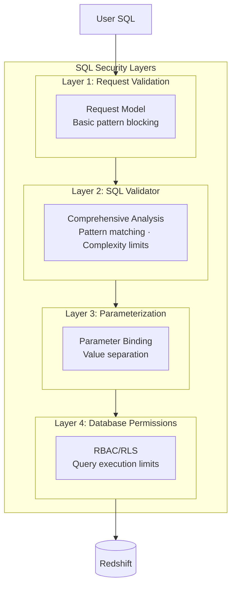
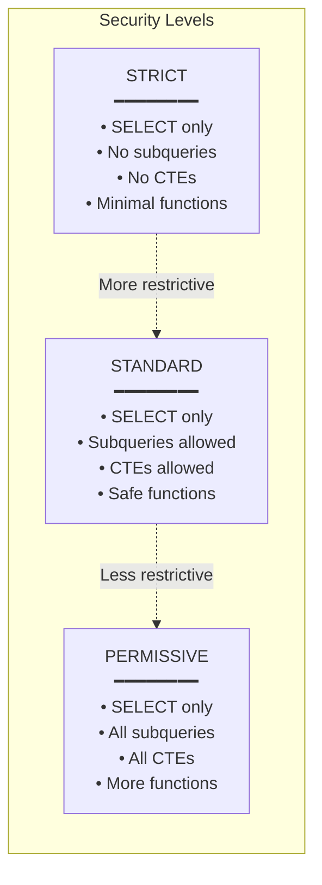
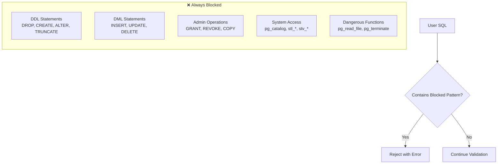
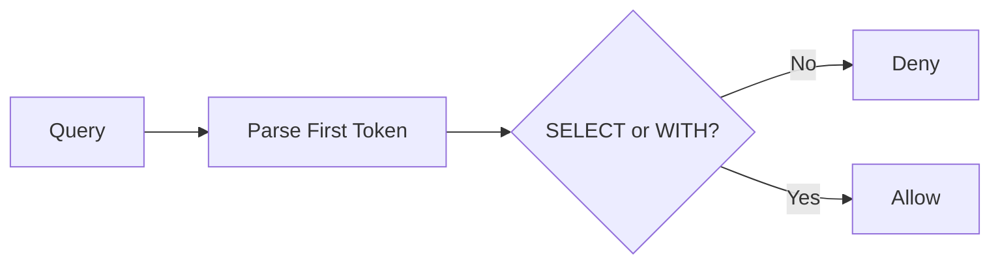
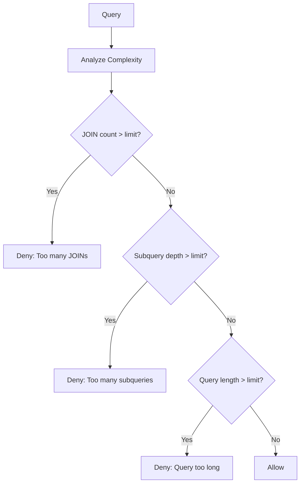
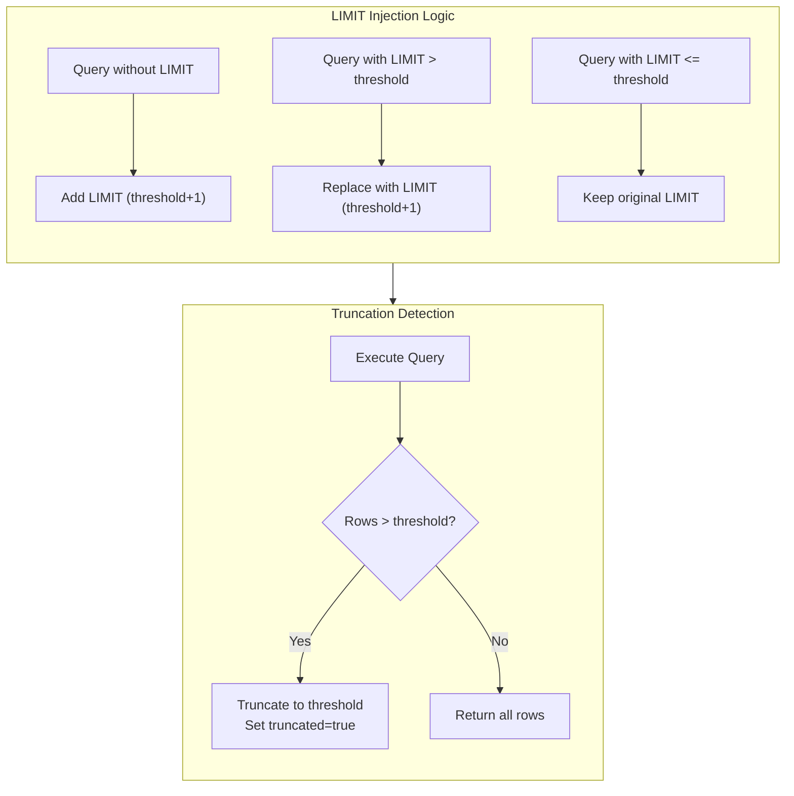
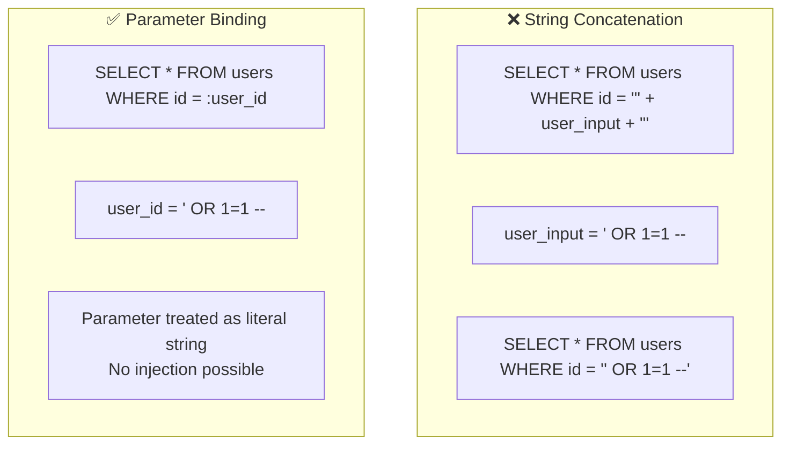
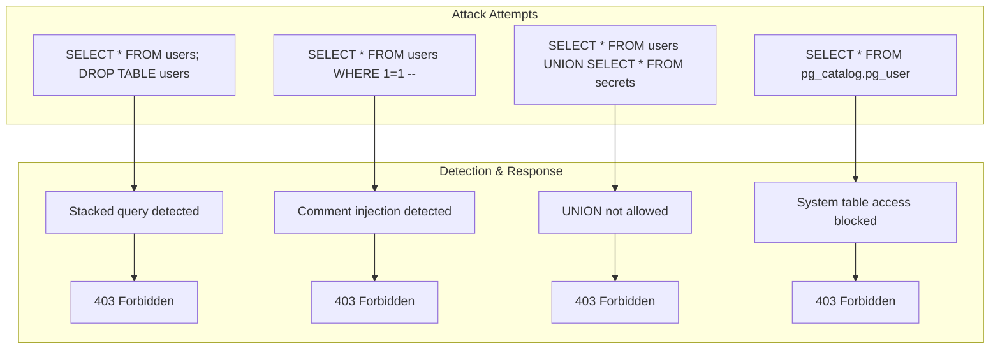
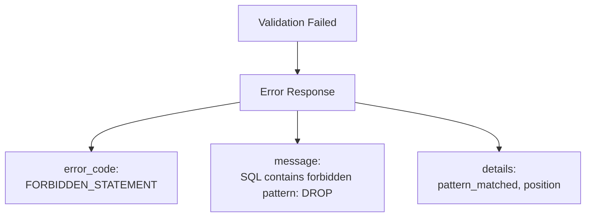

# SQL Security

SQL injection is one of the most dangerous attack vectors against database systems. Redshift Spectra implements comprehensive SQL validation to prevent malicious queries from reaching your data warehouse.

## Defense in Depth

SQL security in Redshift Spectra is implemented at multiple layers:

Even if an attacker bypasses one layer, others continue to protect your data.

## SQL Validator

The SQL Validator is the primary defense against SQL injection and query abuse. It analyzes queries before execution using multiple techniques.

### Security Levels

Three security levels are available, each with different trade-offs:

| Level | Use Case | Query Complexity |
|-------|----------|------------------|
| **STRICT** | Untrusted external users | Simple queries only |
| **STANDARD** | Internal applications | Most analytical queries |
| **PERMISSIVE** | Trusted data engineers | Complex analytical queries |

### Blocked Patterns

The validator blocks dangerous SQL patterns regardless of security level:

### Pattern Detection

The validator uses multiple detection techniques:

**1. Statement Type Detection**

Only SELECT statements (and WITH...SELECT for CTEs) are allowed:

**2. Dangerous Pattern Matching**

Regular expressions detect dangerous patterns:

| Category | Patterns Blocked |
|----------|-----------------|
| DDL | `DROP TABLE`, `CREATE TABLE`, `ALTER TABLE` |
| DML | `INSERT INTO`, `UPDATE SET`, `DELETE FROM` |
| Stacked queries | `; DROP`, `; DELETE`, `; INSERT` |
| Comment injection | `/*...*/DROP`, `--...DELETE` |
| System tables | `pg_catalog.`, `information_schema.` |
| Hex encoding | `0x44524f50` (encoded DROP) |

**3. Complexity Analysis**

Queries are analyzed for complexity to prevent resource abuse:

### Complexity Limits

| Limit | Default | Purpose |
|-------|---------|---------|
| Max JOINs | 10 | Prevent expensive cross-joins |
| Max Subqueries | 5 | Limit query complexity |
| Max Query Length | 100KB | Prevent buffer overflow |
| Max UNION clauses | 0 (blocked) | Prevent result set manipulation |

## LIMIT Enforcement

The Query API automatically enforces result limits to prevent memory exhaustion:

The LIMIT+1 strategy allows detection of truncation without executing the query twice.

## Parameter Binding

Parameterized queries separate SQL structure from data values:

Use parameters for any user-provided values:

| Parameter Type | Supported |
|---------------|-----------|
| String | ✓ |
| Integer | ✓ |
| Float | ✓ |
| Boolean | ✓ |
| Null | ✓ |
| Date/Time | ✓ (as string) |

## Attack Prevention Examples

### SQL Injection Attempts

### Real-World Attack Patterns

| Attack | Detection Method | Response |
|--------|-----------------|----------|
| `'; DROP TABLE --` | Stacked query pattern | Blocked |
| `UNION SELECT password FROM users` | UNION pattern | Blocked |
| `' OR '1'='1` | Parameterization prevents | No effect |
| `0x44524f50205441424c45` | Hex encoding detection | Blocked |
| `SELECT * FROM stl_query` | System table pattern | Blocked |

## Validation Response

When validation fails, detailed error information is returned:

Error codes:

| Code | Description |
|------|-------------|
| `FORBIDDEN_STATEMENT` | Blocked statement type detected |
| `FORBIDDEN_PATTERN` | Dangerous pattern detected |
| `COMPLEXITY_EXCEEDED` | Query too complex |
| `EMPTY_QUERY` | No SQL provided |
| `SYSTEM_TABLE_ACCESS` | Attempt to access system tables |

## Best Practices

!!! tip "Always Use Parameters"
    Never concatenate user input into SQL strings:
    
    - Use named parameters (`:param_name`)
    - Let the validator handle escaping
    - Audit parameter usage in logs

!!! tip "Start with STRICT Mode"
    For external-facing APIs:
    
    - Begin with STRICT security level
    - Relax only if specific queries require it
    - Document why relaxation is needed

!!! warning "Monitor Validation Failures"
    High validation failure rates may indicate:
    
    - Attack attempts in progress
    - Misconfigured client applications
    - Need for user education

!!! info "Validation is Not a Replacement"
    SQL validation complements, but doesn't replace:
    
    - Row-Level Security (data isolation)
    - RBAC (permission control)
    - Parameter binding (injection prevention)

## Configuration

| Setting | Default | Description |
|---------|---------|-------------|
| `SPECTRA_SQL_SECURITY_LEVEL` | `standard` | Security level: strict, standard, permissive |
| `SPECTRA_SQL_MAX_QUERY_LENGTH` | `100000` | Maximum query length in characters |
| `SPECTRA_SQL_MAX_JOINS` | `10` | Maximum JOIN clauses |
| `SPECTRA_SQL_MAX_SUBQUERIES` | `5` | Maximum subquery depth |
| `SPECTRA_SQL_ALLOW_CTE` | `true` | Allow WITH clauses (CTEs) |
| `SPECTRA_SQL_ALLOW_UNION` | `false` | Allow UNION (disabled by default) |

## Audit Trail

All SQL validation events are logged:

- **Passed validations** — With normalized SQL and warnings
- **Failed validations** — With error code and matched pattern
- **Complexity metrics** — JOIN count, subquery depth, query length
