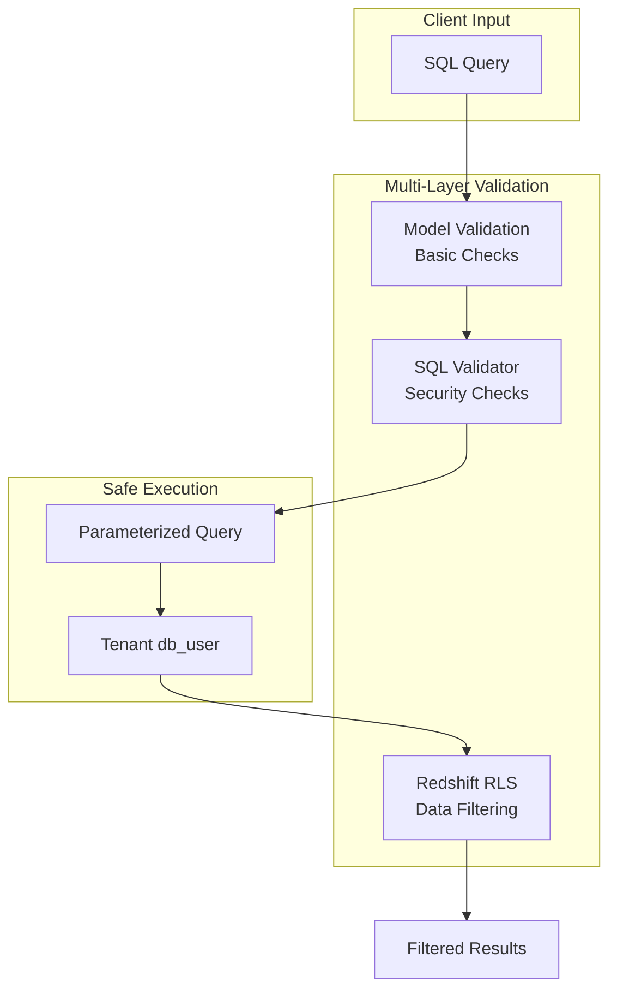

# SQL Security

Redshift Spectra implements comprehensive SQL security measures to prevent injection attacks and unauthorized operations.

## Overview



## Security Layers

### Layer 1: Model Validation

Basic validation at the request parsing level:

```python
@field_validator("sql")
def validate_sql(cls, v: str) -> str:
    # Must be SELECT or WITH (CTE)
    if not (upper_sql.startswith("SELECT") or upper_sql.startswith("WITH")):
        raise ValueError("Only SELECT statements are allowed")
    
    # Block obviously dangerous patterns
    dangerous = ["DROP", "DELETE", "INSERT", "UPDATE", "CREATE", "ALTER"]
    for pattern in dangerous:
        if pattern in upper_sql:
            raise ValueError(f"Dangerous operation not allowed: {pattern}")
```

### Layer 2: SQL Validator

Comprehensive security analysis:

| Check | Description | Error Code |
|-------|-------------|------------|
| Statement Type | Only SELECT allowed | `FORBIDDEN_STATEMENT` |
| Injection Patterns | Detect common attack vectors | `INJECTION_DETECTED` |
| System Objects | Block pg_catalog, stl_, etc. | `FORBIDDEN_OBJECT` |
| Dangerous Functions | Block pg_read_file, etc. | `FORBIDDEN_FUNCTION` |
| Query Complexity | Limit JOINs, subqueries | `TOO_MANY_JOINS` |

### Layer 3: Database Security

Redshift Row-Level Security filters all results:

```sql
-- User only sees their own data
SELECT * FROM sales 
-- RLS applies: WHERE tenant_id = current_user
```

## SQL Injection Prevention

### Detected Patterns

The validator detects these attack patterns:

```python
INJECTION_PATTERNS = [
    # Comment injection
    (r"--\s*$", "SQL comment at end of statement"),
    (r"/\*.*?\*/", "Block comment detected"),
    
    # Union-based injection
    (r"\bUNION\s+(ALL\s+)?SELECT\b", "UNION SELECT pattern"),
    
    # Stacked queries
    (r";\s*(SELECT|INSERT|DELETE)", "Stacked query detected"),
    
    # Time-based attacks
    (r"\b(SLEEP|WAITFOR|PG_SLEEP)\s*\(", "Time-based attack"),
]
```

### Example Attacks Blocked

**Comment Injection:**
```sql
-- BLOCKED: Comment used to bypass filters
SELECT * FROM users WHERE id = 1 --
```

**Union-Based Injection:**
```sql
-- BLOCKED: UNION SELECT for data exfiltration
SELECT name FROM products UNION SELECT password FROM users
```

**Stacked Queries:**
```sql
-- BLOCKED: Multiple statements
SELECT * FROM sales; DROP TABLE users
```

**System Table Access:**
```sql
-- BLOCKED: Access to system catalogs
SELECT * FROM pg_catalog.pg_user
```

## Forbidden Objects

Access to these objects is blocked:

| Pattern | Description |
|---------|-------------|
| `pg_catalog.*` | PostgreSQL system catalog |
| `information_schema.*` | Schema metadata |
| `stl_*` | Redshift system logs |
| `stv_*` | Redshift system views |
| `svl_*` | Redshift SVL views |
| `svv_*` | Redshift SVV views |
| `pg_*` | PostgreSQL internals |

## Forbidden Functions

These functions are blocked to prevent system access:

```python
FORBIDDEN_FUNCTIONS = {
    # File operations
    "pg_read_file",
    "pg_read_binary_file",
    "pg_ls_dir",
    
    # Process control
    "pg_terminate_backend",
    "pg_cancel_backend",
    
    # Configuration
    "current_setting",
    "set_config",
}
```

## Security Levels

Configure the security level in your environment:

=== "Strict"

    ```bash
    SPECTRA_SQL_SECURITY_LEVEL=strict
    ```
    
    - Only SELECT statements
    - Limited function whitelist
    - No subqueries beyond limit
    - Best for: High-security environments

=== "Standard (Default)"

    ```bash
    SPECTRA_SQL_SECURITY_LEVEL=standard
    ```
    
    - SELECT with common functions
    - Subqueries allowed
    - CTEs allowed
    - Best for: Most use cases

=== "Permissive"

    ```bash
    SPECTRA_SQL_SECURITY_LEVEL=permissive
    ```
    
    - Most functions allowed
    - Higher complexity limits
    - Still blocks injection patterns
    - Best for: Power users with trusted access

## Configuration

```bash
# Security level
SPECTRA_SQL_SECURITY_LEVEL=standard

# Query length limit (characters)
SPECTRA_SQL_MAX_QUERY_LENGTH=100000

# Complexity limits
SPECTRA_SQL_MAX_JOINS=10
SPECTRA_SQL_MAX_SUBQUERIES=5

# Feature toggles
SPECTRA_SQL_ALLOW_CTE=true
SPECTRA_SQL_ALLOW_UNION=false
```

## Parameterized Queries

Always use parameters for user-provided values:

```bash
# SAFE: Use parameters
curl -X POST "$API_URL/queries" \
  -d '{
    "sql": "SELECT * FROM orders WHERE customer_id = :customer_id",
    "parameters": [
      {"name": "customer_id", "value": "cust-123"}
    ]
  }'

# UNSAFE: Don't concatenate values
# sql = f"SELECT * FROM orders WHERE customer_id = '{user_input}'"
```

### Parameter Validation

Parameters are also validated:

```python
class QueryParameter(BaseModel):
    name: str = Field(..., min_length=1, max_length=128)
    value: str | int | float | bool | None
    
    @field_validator("name")
    def validate_name(cls, v: str) -> str:
        if not v.isidentifier():
            raise ValueError("Parameter name must be a valid identifier")
        return v
```

## Error Responses

Security violations return clear error messages:

```json
{
  "error": {
    "code": "SQL_VALIDATION_FAILED",
    "message": "SQL validation failed: Only SELECT statements are allowed. Detected: DROP",
    "details": {
      "error_code": "FORBIDDEN_STATEMENT",
      "detected_type": "DROP"
    }
  }
}
```

## Audit Logging

All SQL validation failures are logged:

```json
{
  "level": "WARNING",
  "message": "SQL validation failed",
  "error_code": "INJECTION_DETECTED",
  "pattern": "UNION SELECT pattern detected",
  "tenant_id": "tenant-123",
  "source_ip": "192.168.1.100",
  "timestamp": "2026-01-29T10:00:00Z"
}
```

## Best Practices

!!! tip "Always Use Parameters"
    
    Never concatenate user input into SQL strings. Use the `parameters` field.

!!! tip "Start Strict, Relax as Needed"
    
    Begin with `strict` security level and only relax if required.

!!! warning "Monitor Validation Failures"
    
    Set up alerts for repeated validation failures - they may indicate attack attempts.

!!! danger "Never Disable Security"
    
    The security validator should never be bypassed, even for "trusted" users.
