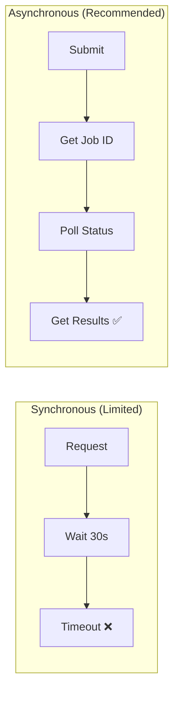
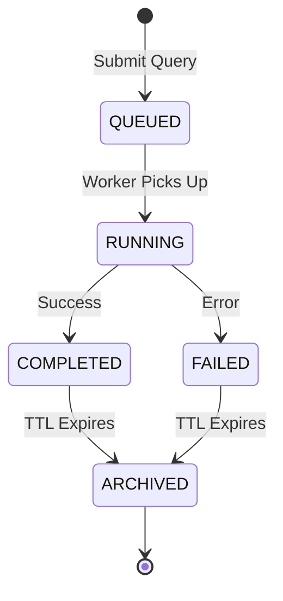
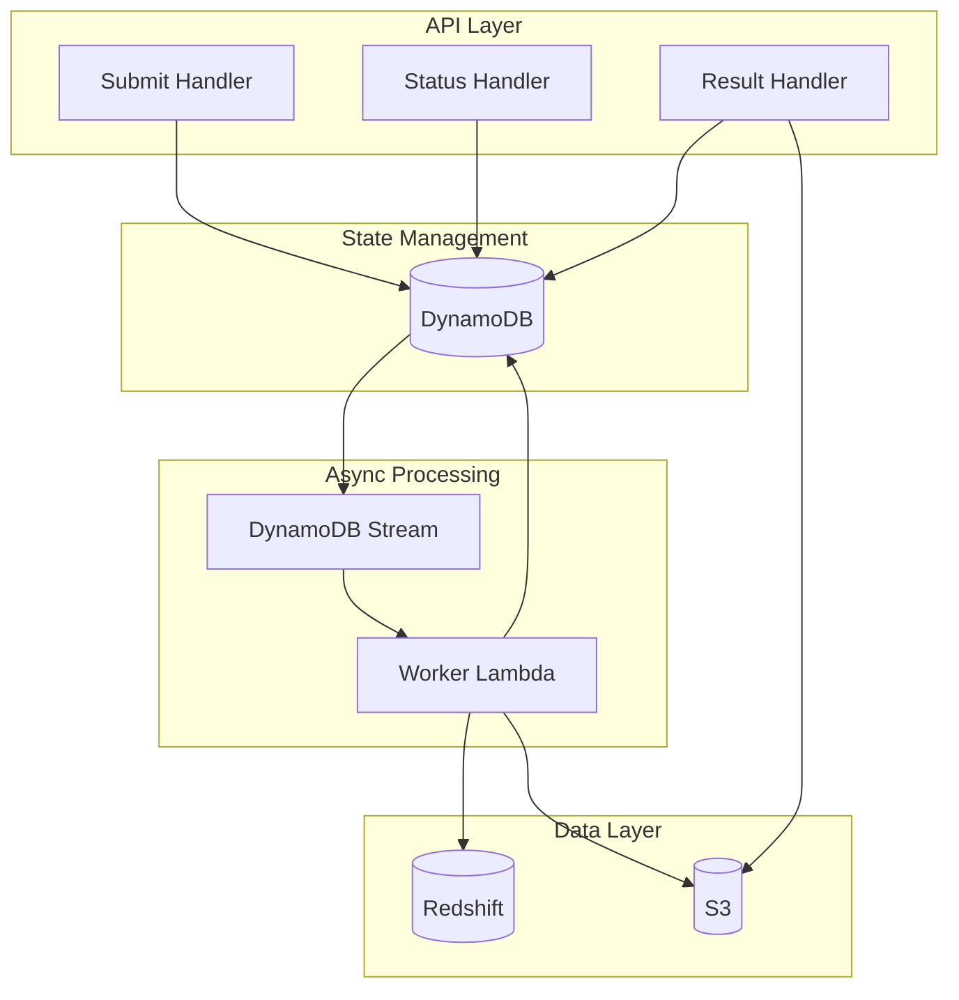

# Async Job Processing

Redshift Spectra uses an asynchronous job pattern to handle long-running analytical queries efficiently.

## Why Async?



**Challenges with synchronous APIs:**

- API Gateway timeout: 30 seconds
- Lambda timeout: 15 minutes (configurable)
- Analytical queries often take minutes to hours

**Async benefits:**

- No timeout constraints
- Better resource utilization
- Client can disconnect and reconnect

## Job Lifecycle



### State Descriptions

| State | Description | Duration |
|-------|-------------|----------|
| `QUEUED` | Submitted, awaiting execution | Seconds |
| `RUNNING` | Query executing on Redshift | Minutes to hours |
| `COMPLETED` | Results ready for retrieval | Until TTL |
| `FAILED` | Error occurred | Until TTL |
| `ARCHIVED` | Job data deleted | - |

## Implementation Architecture



## Job Tracking

Jobs are stored in DynamoDB with the following schema:

```json
{
  "job_id": "job-abc123",
  "tenant_id": "tenant-123",
  "status": "RUNNING",
  "statement_id": "rs-stmt-xyz",
  "sql": "SELECT ...",
  "submitted_at": "2026-01-29T10:00:00Z",
  "started_at": "2026-01-29T10:00:05Z",
  "completed_at": null,
  "row_count": null,
  "result_location": null,
  "error": null,
  "ttl": 1738234800
}
```

## Polling Strategies

### Simple Polling

```python
import time
import requests

def wait_for_job(job_id, timeout=300, interval=5):
    """Poll until job completes or times out."""
    start = time.time()
    
    while time.time() - start < timeout:
        response = requests.get(f"{API_URL}/jobs/{job_id}")
        status = response.json()["status"]
        
        if status == "COMPLETED":
            return get_results(job_id)
        elif status == "FAILED":
            raise Exception(response.json()["error"])
        
        time.sleep(interval)
    
    raise TimeoutError(f"Job {job_id} did not complete in {timeout}s")
```

### Exponential Backoff

```python
def wait_with_backoff(job_id, max_retries=10):
    """Poll with exponential backoff."""
    delay = 1  # Start with 1 second
    
    for attempt in range(max_retries):
        response = requests.get(f"{API_URL}/jobs/{job_id}")
        status = response.json()["status"]
        
        if status in ("COMPLETED", "FAILED"):
            return response.json()
        
        time.sleep(min(delay, 30))  # Cap at 30 seconds
        delay *= 2
    
    raise TimeoutError("Max retries exceeded")
```

## Webhooks (Coming Soon)

Future versions will support webhook notifications:

```json
{
  "sql": "SELECT * FROM large_table",
  "webhook_url": "https://myapp.com/callbacks/query-complete",
  "webhook_secret": "my-secret-key"
}
```

## Cancellation

Cancel a running job:

```bash
curl -X DELETE "$API_URL/jobs/job-abc123" \
  -H "Authorization: Bearer $TOKEN"
```

**Response:**

```json
{
  "job_id": "job-abc123",
  "status": "CANCELLED",
  "message": "Job cancelled by user"
}
```

## Job TTL

Jobs are automatically cleaned up after the configured TTL:

```bash
# Configure in environment
SPECTRA_DYNAMODB_TTL_DAYS=7
```

!!! note "Result Availability"
    
    Results are available until the job TTL expires. Download large 
    results promptly or use the presigned URL before it expires.

## Best Practices

!!! tip "Reasonable Polling Intervals"
    
    - Start with 5-second intervals for quick queries
    - Use exponential backoff for longer queries
    - Never poll more than once per second

!!! tip "Handle All States"
    
    Your client should handle `QUEUED`, `RUNNING`, `COMPLETED`, 
    and `FAILED` states gracefully.

!!! warning "Job Timeouts"
    
    Configure `SPECTRA_QUERY_TIMEOUT_SECONDS` based on your 
    longest expected query duration. Default is 900 seconds.
