# Asynchronous Job Processing

This guide explains asynchronous job processing in Redshift Spectra, which is used by the Bulk API for large-scale data operations.

## Overview

Redshift Spectra uses two execution models:

| API | Execution Model | Best For |
|-----|-----------------|----------|
| **Query API** | Synchronous | Interactive queries, small results (≤10K rows) |
| **Bulk API** | Asynchronous | Large exports, ETL operations, unlimited rows |


---

## Why Asynchronous?

The asynchronous pattern solves fundamental challenges with large-scale data operations:

### Timeout Constraints


- **API Gateway timeout**: 30 seconds maximum
- **Lambda timeout**: 15 minutes configurable
- **Large queries**: May take hours to complete

The asynchronous pattern decouples request handling from query execution, allowing operations to run for up to 24 hours.

### Benefits of Asynchronous Processing

| Benefit | Description |
|---------|-------------|
| **No timeouts** | Jobs run independently of HTTP connection limits |
| **Resilience** | Client disconnects don't affect running jobs |
| **Progress tracking** | Monitor job status and progress |
| **Retry capability** | Failed jobs can be retried without re-uploading data |
| **Resource efficiency** | Better utilization of compute resources |

---

## Job Lifecycle

Understanding the job lifecycle is essential for building robust integrations.


### State Descriptions

| State | Description | Typical Duration |
|-------|-------------|------------------|
| `Open` | Job created, awaiting data upload | Until client uploads |
| `UploadComplete` | Data received, queued for processing | Seconds to minutes |
| `InProgress` | Operation executing on Redshift | Minutes to hours |
| `JobComplete` | Success, results available for download | Until TTL expires |
| `Failed` | Error occurred, see error details | Until TTL expires |
| `Aborted` | Cancelled by user | Final state |

---

## Implementation Architecture

The asynchronous processing system uses a combination of AWS services:


### Component Responsibilities

| Component | Responsibility |
|-----------|----------------|
| **API Handler** | Validates requests, creates job records, generates presigned URLs |
| **DynamoDB** | Stores job state, enables change tracking via streams |
| **DynamoDB Streams** | Triggers worker Lambda when jobs are ready |
| **Worker Lambda** | Executes operations against Redshift, manages results |
| **S3** | Stores uploaded data and exported results |
| **Redshift** | Executes SQL queries and data operations |

---

## Job Tracking

Jobs are stored in DynamoDB with comprehensive metadata:

```json
{
  "job_id": "bulk-job-abc123",
  "tenant_id": "tenant-123",
  "state": "InProgress",
  "operation": "query",
  "object": "sales",
  "query": "SELECT * FROM sales WHERE year = 2024",
  "content_type": "CSV",
  "compression": "GZIP",
  "created_at": "2026-01-29T10:00:00Z",
  "updated_at": "2026-01-29T10:05:00Z",
  "started_at": "2026-01-29T10:01:00Z",
  "completed_at": null,
  "number_records_processed": 75000,
  "number_records_failed": 0,
  "result_location": null,
  "error": null,
  "ttl": 1738320000
}
```

---

## Polling Strategies

When working with asynchronous jobs, implement appropriate polling strategies.

### Simple Interval Polling

For predictable workloads, use fixed-interval polling:


**Recommendation**: Start with 5-second intervals for most workloads.

### Exponential Backoff

For longer-running jobs, use exponential backoff to reduce API calls:


This approach:

- Reduces unnecessary API calls
- Respects rate limits
- Provides timely completion notification

### Best Practices

| Practice | Recommendation |
|----------|----------------|
| **Initial delay** | Wait 2-5 seconds before first poll |
| **Maximum interval** | Cap at 30-60 seconds |
| **Jitter** | Add random variation to prevent thundering herd |
| **Timeout** | Set client-side timeout based on expected duration |

---

## Cancellation

Cancel a job at any point before completion:


**Important considerations**:

- Cancellation is best-effort for in-progress operations
- Redshift queries already submitted will complete
- Resources (S3, compute) are released promptly
- Cancelled jobs remain visible until TTL

---

## Job TTL and Cleanup

Jobs and their results are automatically cleaned up after the configured TTL:


### Configuration

| Setting | Default | Description |
|---------|---------|-------------|
| `SPECTRA_JOB_TTL_DAYS` | 7 | Days until job metadata is deleted |
| `SPECTRA_RESULT_TTL_DAYS` | 7 | Days until result files are deleted |
| `SPECTRA_PRESIGNED_URL_EXPIRY` | 3600 | Seconds until download URL expires |

### Implications

- Download results before TTL expiration
- Presigned URLs have shorter expiry than job TTL
- Re-request download URL if it expires while job exists
- Plan data pipelines to consume results promptly

---

## Error Handling

Failed jobs include detailed error information:

```json
{
  "job_id": "bulk-job-abc123",
  "state": "Failed",
  "error": {
    "code": "QUERY_ERROR",
    "message": "Column 'invalid_column' does not exist",
    "details": {
      "sql_state": "42703",
      "position": 45
    }
  }
}
```

### Error Categories

| Category | Description | Retry Strategy |
|----------|-------------|----------------|
| **Validation errors** | Invalid SQL, bad parameters | Fix request, retry |
| **Permission errors** | Access denied | Check credentials |
| **Resource errors** | Table not found | Verify object exists |
| **Transient errors** | Connection timeout | Retry with backoff |
| **Capacity errors** | Cluster overloaded | Retry later |

---

## Comparison: Query API vs Bulk API

Choose the right API based on your use case:

```mermaid
flowchart TD
    Q{Query Size?}
    Q -->|"< 10K rows"| QueryAPI[Query API]
    Q -->|"> 10K rows"| BulkAPI[Bulk API]

    QueryAPI --> Sync[Synchronous]
    BulkAPI --> Async[Asynchronous]

    Sync --> Inline[Inline JSON Response]
    Async --> S3[S3 Export]

    Inline --> Fast["⚡ Fast"]
    S3 --> Complete["📦 Complete Data"]
```



| Scenario | Recommended API |
|----------|----------------|
| Dashboard queries | Query API |
| Real-time lookups | Query API |
| Data exports | Bulk API |
| ETL pipelines | Bulk API |
| Report generation | Bulk API |
| Analytics queries (small) | Query API |
| Analytics queries (large) | Bulk API |

---

## Next Steps

- [Bulk API Guide](bulk-api.md) - Complete Bulk API documentation
- [Query API Guide](query-api.md) - Synchronous query execution
- [Monitoring](../deployment/monitoring.md) - Job metrics and alerting
