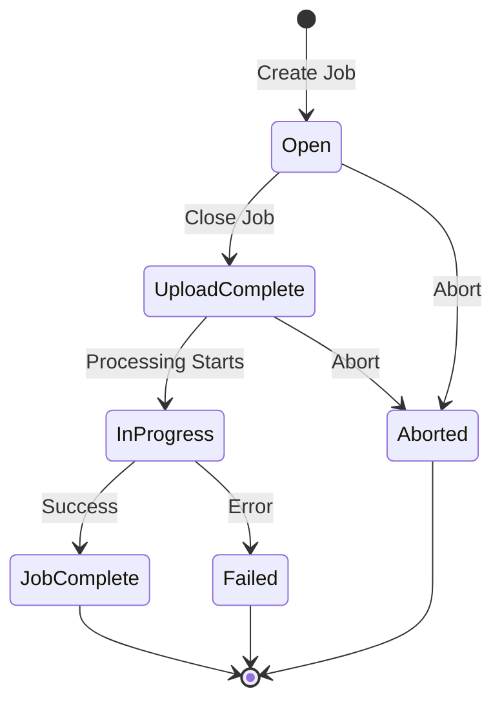
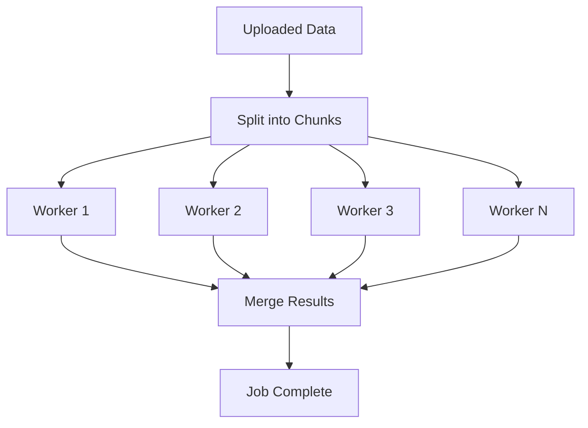

# Bulk Operations API

The Bulk API enables high-volume data operations with a workflow inspired by Salesforce Bulk API v2.

## Overview



## Workflow

### 1. Create a Bulk Job

```bash
curl -X POST "$API_URL/bulk/jobs" \
  -H "Authorization: Bearer $TOKEN" \
  -H "X-Tenant-ID: tenant-123" \
  -d '{
    "operation": "query",
    "object": "sales",
    "content_type": "CSV"
  }'
```

**Response:**

```json
{
  "job_id": "bulk-job-abc123",
  "state": "Open",
  "operation": "query",
  "object": "sales",
  "content_type": "CSV",
  "created_at": "2026-01-29T10:00:00Z"
}
```

### 2. Upload Data (for Insert/Update Operations)

For import operations, upload your data:

```bash
# Get upload URL
curl "$API_URL/bulk/jobs/bulk-job-abc123/upload-url" \
  -H "Authorization: Bearer $TOKEN"

# Upload data
curl -X PUT "$UPLOAD_URL" \
  -H "Content-Type: text/csv" \
  --data-binary @data.csv
```

### 3. Close the Job

Signal that upload is complete and start processing:

```bash
curl -X PATCH "$API_URL/bulk/jobs/bulk-job-abc123" \
  -H "Authorization: Bearer $TOKEN" \
  -d '{"state": "UploadComplete"}'
```

### 4. Monitor Progress

```bash
curl "$API_URL/bulk/jobs/bulk-job-abc123" \
  -H "Authorization: Bearer $TOKEN"
```

**Response:**

```json
{
  "job_id": "bulk-job-abc123",
  "state": "InProgress",
  "number_records_processed": 50000,
  "number_records_failed": 12,
  "progress_percentage": 75
}
```

### 5. Get Results

```bash
# Download job results
curl "$API_URL/bulk/jobs/bulk-job-abc123/results" \
  -H "Authorization: Bearer $TOKEN"
```

## Supported Operations

| Operation | Description | Data Flow |
|-----------|-------------|-----------|
| `query` | Export query results | Redshift → S3 → Client |
| `insert` | Insert new records | Client → S3 → Redshift |
| `update` | Update existing records | Client → S3 → Redshift |
| `upsert` | Insert or update | Client → S3 → Redshift |
| `delete` | Delete records | Client → S3 → Redshift |

## Data Formats

### CSV Format

```csv
id,name,email,created_at
1,John Doe,john@example.com,2026-01-01
2,Jane Smith,jane@example.com,2026-01-02
```

### JSON Format

```json
[
  {"id": 1, "name": "John Doe", "email": "john@example.com"},
  {"id": 2, "name": "Jane Smith", "email": "jane@example.com"}
]
```

## Compression

Reduce transfer time with compression:

```bash
curl -X POST "$API_URL/bulk/jobs" \
  -H "Authorization: Bearer $TOKEN" \
  -d '{
    "operation": "insert",
    "object": "customers",
    "content_type": "CSV",
    "compression": "GZIP"
  }'
```

Supported compression types:

- `NONE` (default)
- `GZIP`

## Parallel Processing

For large datasets, Spectra automatically parallelizes processing:



## API Reference

### Create Job

```
POST /v1/bulk/jobs
```

| Field | Type | Required | Description |
|-------|------|----------|-------------|
| `operation` | string | Yes | `query`, `insert`, `update`, `upsert`, `delete` |
| `object` | string | Yes | Target table/object name |
| `content_type` | string | No | `CSV` (default), `JSON` |
| `compression` | string | No | `NONE` (default), `GZIP` |
| `query` | string | For `query` | SQL for query operations |

### Update Job State

```
PATCH /v1/bulk/jobs/{job_id}
```

| Field | Type | Description |
|-------|------|-------------|
| `state` | string | `UploadComplete` or `Aborted` |

### List Jobs

```
GET /v1/bulk/jobs?state=InProgress&limit=25
```

| Parameter | Type | Description |
|-----------|------|-------------|
| `state` | string | Filter by state |
| `limit` | integer | Max results (default: 25) |
| `offset` | string | Pagination token |

## Error Handling

Errors are returned in the job results with details about which records failed.

## Best Practices

!!! tip "Batch Size"
    
    Keep individual uploads under 150MB for optimal performance.
    Split larger datasets into multiple jobs.

!!! tip "Monitor Progress"
    
    Poll job status every 5-10 seconds. Don't poll more frequently
    as it won't speed up processing.

!!! warning "Timeouts"
    
    Bulk jobs have a 24-hour maximum lifetime. Jobs not completed
    within this window will be marked as failed.
