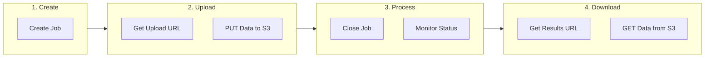
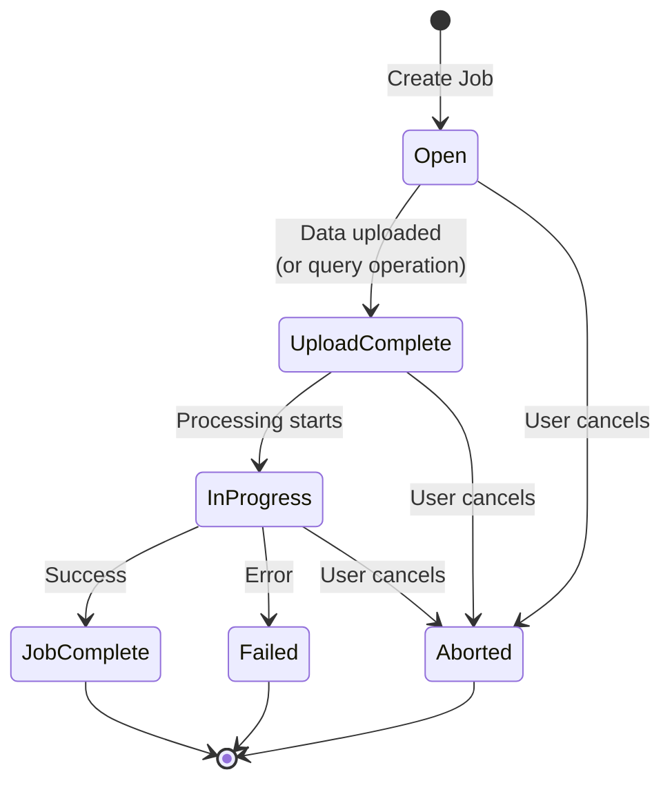
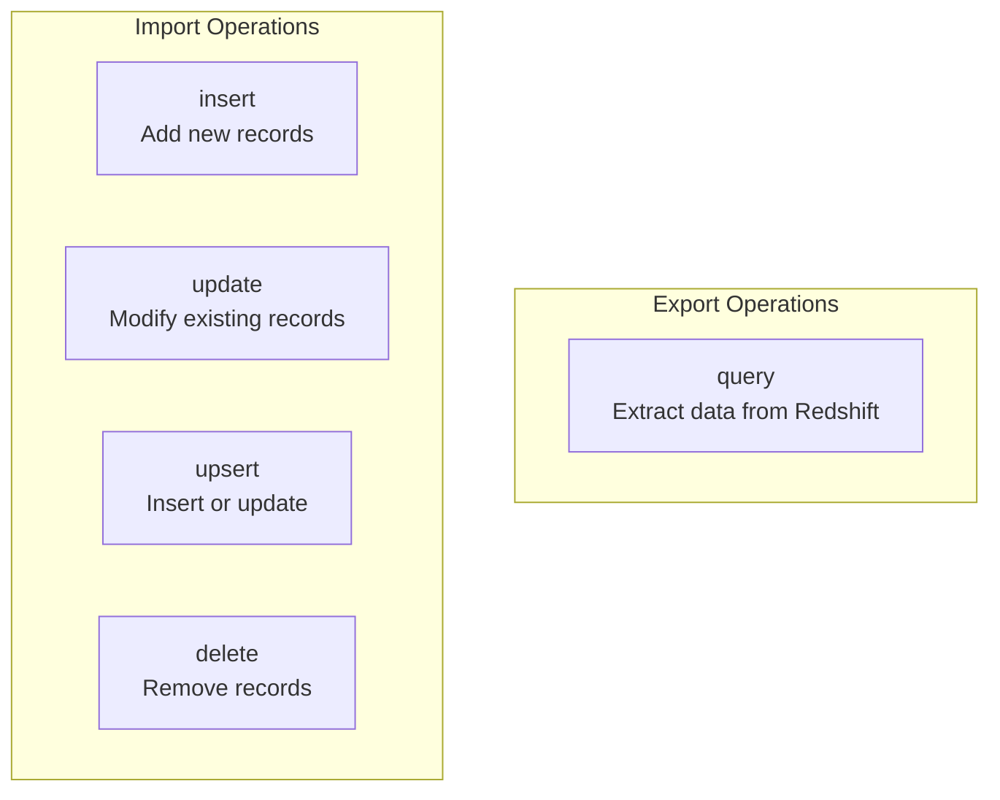
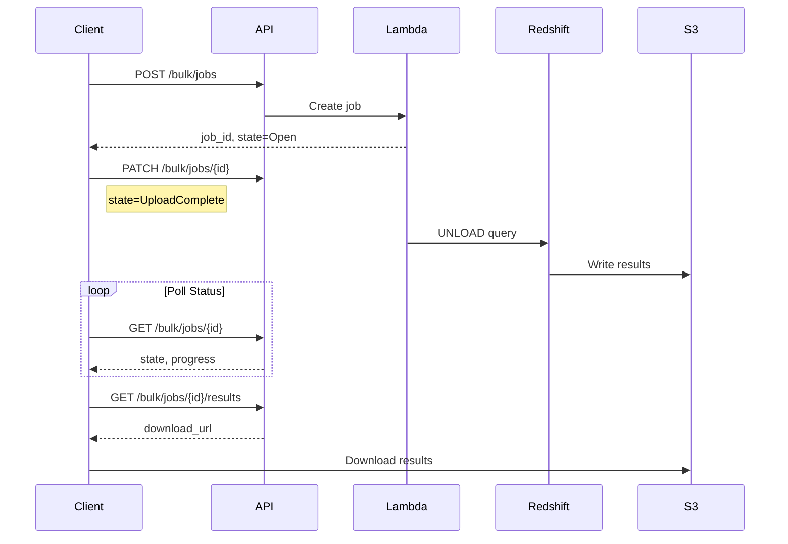
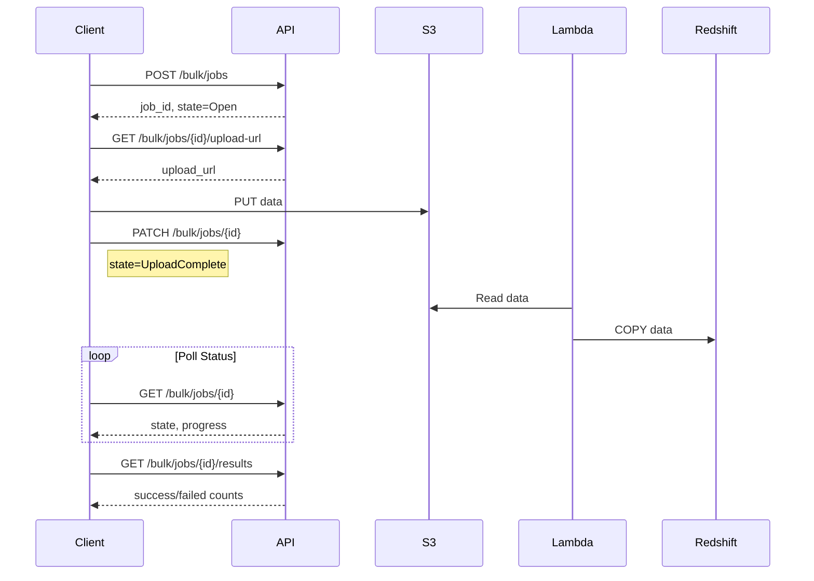
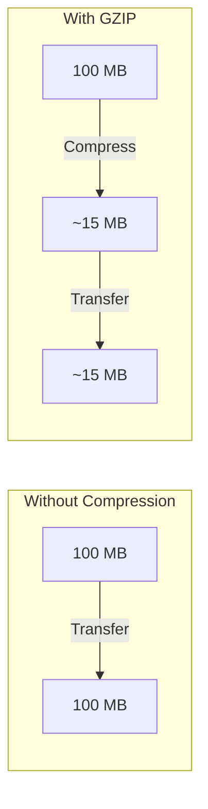
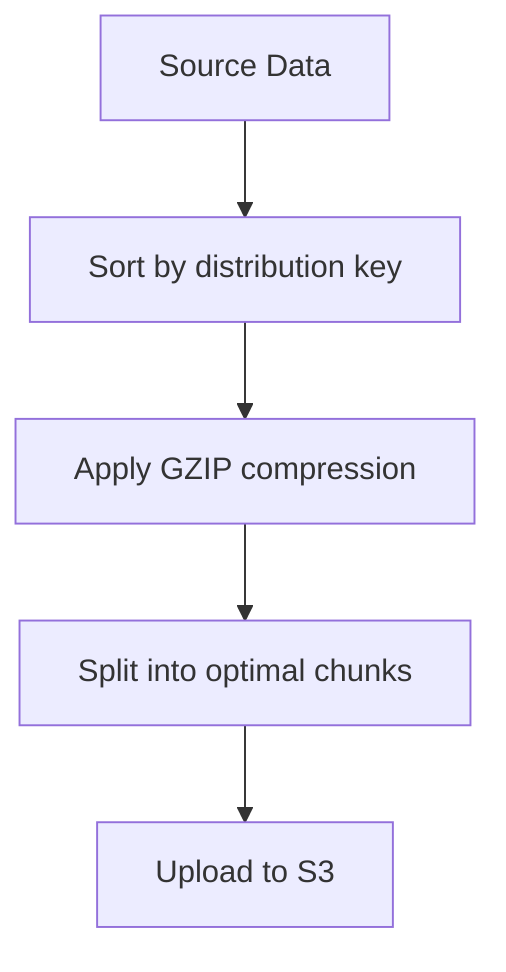

# Bulk API

The Bulk API enables high-volume data operations with asynchronous execution, S3-based data transfer, and support for multi-million row datasets. Designed for ETL pipelines, data exports, and batch processing operations.

## Overview

The Bulk API follows a job-based workflow inspired by enterprise integration patterns:



---

## Why Bulk API?

The Bulk API solves challenges that the synchronous Query API cannot address:

| Challenge | Query API | Bulk API |
|-----------|-----------|----------|
| Large result sets (>10K rows) | ❌ Truncated | ✅ Unlimited |
| Long-running queries (>5 min) | ❌ Timeout | ✅ Up to 24 hours |
| Data import operations | ❌ Not supported | ✅ Insert/Update/Upsert/Delete |
| S3 integration | ❌ Inline only | ✅ Direct S3 export |
| Progress tracking | ❌ None | ✅ Detailed progress |

---

## Job Lifecycle

Understanding the job lifecycle is essential for building robust integrations:



### State Descriptions

| State | Description | Next States |
|-------|-------------|-------------|
| `Open` | Job created, awaiting data upload (import) or close (query) | UploadComplete, Aborted |
| `UploadComplete` | Ready for processing | InProgress, Aborted |
| `InProgress` | Operation executing | JobComplete, Failed, Aborted |
| `JobComplete` | Success, results available | Terminal |
| `Failed` | Error occurred | Terminal |
| `Aborted` | Cancelled by user | Terminal |

---

## Supported Operations



| Operation | Description | Data Flow | Use Case |
|-----------|-------------|-----------|----------|
| `query` | Export query results | Redshift → S3 → Client | Data exports, reports |
| `insert` | Insert new records | Client → S3 → Redshift | Bulk data loading |
| `update` | Update existing records | Client → S3 → Redshift | Batch updates |
| `upsert` | Insert or update | Client → S3 → Redshift | Sync external data |
| `delete` | Delete matching records | Client → S3 → Redshift | Data cleanup |

---

## Query Export Workflow

Export large datasets from Redshift to S3:



### Step 1: Create the Job

```bash
curl -X POST "$API_URL/bulk/jobs" \
  -H "Authorization: Bearer $API_KEY" \
  -H "X-Tenant-ID: tenant-123" \
  -H "Content-Type: application/json" \
  -d '{
    "operation": "query",
    "object": "sales",
    "query": "SELECT * FROM sales WHERE year = 2024",
    "content_type": "CSV",
    "compression": "GZIP"
  }'
```

**Response:**

```json
{
  "job_id": "bulk-job-abc123",
  "state": "Open",
  "operation": "query",
  "object": "sales",
  "content_type": "CSV",
  "compression": "GZIP",
  "created_at": "2026-01-29T10:00:00Z"
}
```

### Step 2: Start Processing

For query operations, close the job immediately to begin processing:

```bash
curl -X PATCH "$API_URL/bulk/jobs/bulk-job-abc123" \
  -H "Authorization: Bearer $API_KEY" \
  -H "X-Tenant-ID: tenant-123" \
  -H "Content-Type: application/json" \
  -d '{"state": "UploadComplete"}'
```

### Step 3: Monitor Progress

```bash
curl "$API_URL/bulk/jobs/bulk-job-abc123" \
  -H "Authorization: Bearer $API_KEY" \
  -H "X-Tenant-ID: tenant-123"
```

**Response:**

```json
{
  "job_id": "bulk-job-abc123",
  "state": "InProgress",
  "operation": "query",
  "number_records_processed": 500000,
  "number_records_failed": 0,
  "created_at": "2026-01-29T10:00:00Z",
  "updated_at": "2026-01-29T10:05:00Z"
}
```

### Step 4: Download Results

Once `state` is `JobComplete`:

```bash
curl "$API_URL/bulk/jobs/bulk-job-abc123/results" \
  -H "Authorization: Bearer $API_KEY" \
  -H "X-Tenant-ID: tenant-123"
```

**Response:**

```json
{
  "download_url": "https://bucket.s3.amazonaws.com/exports/...",
  "expires_at": "2026-01-29T11:00:00Z",
  "format": "csv",
  "compression": "gzip",
  "size_bytes": 52428800
}
```

Download the file:

```bash
curl -o results.csv.gz "$DOWNLOAD_URL"
gunzip results.csv.gz
```

---

## Data Import Workflow

Import data into Redshift (insert, update, upsert, delete):



### Step 1: Create Import Job

```bash
curl -X POST "$API_URL/bulk/jobs" \
  -H "Authorization: Bearer $API_KEY" \
  -H "X-Tenant-ID: tenant-123" \
  -H "Content-Type: application/json" \
  -d '{
    "operation": "insert",
    "object": "customers",
    "content_type": "CSV",
    "compression": "GZIP"
  }'
```

### Step 2: Get Upload URL

```bash
curl "$API_URL/bulk/jobs/bulk-job-def456/upload-url" \
  -H "Authorization: Bearer $API_KEY" \
  -H "X-Tenant-ID: tenant-123"
```

**Response:**

```json
{
  "upload_url": "https://bucket.s3.amazonaws.com/uploads/...",
  "expires_at": "2026-01-29T11:00:00Z"
}
```

### Step 3: Upload Data

```bash
# Compress and upload
gzip -c data.csv | curl -X PUT "$UPLOAD_URL" \
  -H "Content-Type: text/csv" \
  -H "Content-Encoding: gzip" \
  --data-binary @-
```

### Step 4: Close Job

```bash
curl -X PATCH "$API_URL/bulk/jobs/bulk-job-def456" \
  -H "Authorization: Bearer $API_KEY" \
  -H "X-Tenant-ID: tenant-123" \
  -H "Content-Type: application/json" \
  -d '{"state": "UploadComplete"}'
```

### Step 5: Monitor and Get Results

Follow the same polling pattern as query exports.

---

## Data Formats

### CSV Format

The default and most efficient format for large datasets:

```csv
id,name,email,region,amount,created_at
1,John Doe,john@example.com,APAC,1500.00,2024-01-15
2,Jane Smith,jane@example.com,EMEA,2300.00,2024-01-16
```

**CSV Requirements:**

- First row must be header with column names
- Column names must match target table columns
- Date/timestamp format: ISO 8601 (`YYYY-MM-DD` or `YYYY-MM-DDTHH:MM:SS`)
- NULL values: empty field (not the string "NULL")
- Escape quotes with double quotes: `"She said ""hello"""`

### JSON Format

For complex data structures or when CSV escaping becomes problematic:

```json
[
  {"id": 1, "name": "John Doe", "email": "john@example.com", "metadata": {"source": "web"}},
  {"id": 2, "name": "Jane Smith", "email": "jane@example.com", "metadata": {"source": "api"}}
]
```

**JSON Requirements:**

- Must be an array of objects
- Each object represents one record
- Nested objects stored as JSON in SUPER columns
- Dates as ISO 8601 strings

### Format Comparison

| Aspect | CSV | JSON |
|--------|-----|------|
| File size | Smaller | Larger |
| Parse speed | Faster | Slower |
| Complex data | Difficult | Easy |
| Human readable | Good | Good |
| Redshift native | COPY | Requires transform |

---

## Compression

Compression reduces transfer time and storage costs:



| Compression | Extension | Typical Ratio | Recommendation |
|-------------|-----------|---------------|----------------|
| `NONE` | - | 1:1 | Small files (<10 MB) |
| `GZIP` | .gz | 5-10:1 | Large files, standard choice |

### Using Compression

```bash
# Upload compressed data
gzip data.csv
curl -X PUT "$UPLOAD_URL" \
  -H "Content-Type: text/csv" \
  -H "Content-Encoding: gzip" \
  --data-binary @data.csv.gz

# Download compressed results
curl -o results.csv.gz "$DOWNLOAD_URL"
gunzip results.csv.gz
```

---

## Error Handling

### Job-Level Errors

When the entire job fails:

```json
{
  "job_id": "bulk-job-abc123",
  "state": "Failed",
  "error": {
    "code": "QUERY_ERROR",
    "message": "Table 'invalid_table' does not exist"
  }
}
```

### Record-Level Errors

For import operations, individual record failures are tracked:

```json
{
  "job_id": "bulk-job-def456",
  "state": "JobComplete",
  "number_records_processed": 99988,
  "number_records_failed": 12
}
```

Failed records can be downloaded for review:

```bash
curl "$API_URL/bulk/jobs/bulk-job-def456/failed-results" \
  -H "Authorization: Bearer $API_KEY" \
  -H "X-Tenant-ID: tenant-123"
```

**Failed Records Format:**

```csv
id,name,error
5001,Invalid User,"Value too long for column 'name'"
5002,Test Record,"Duplicate key violation"
```

---

## Job Management

### List Jobs

```bash
curl "$API_URL/bulk/jobs?state=InProgress&limit=10" \
  -H "Authorization: Bearer $API_KEY" \
  -H "X-Tenant-ID: tenant-123"
```

**Response:**

```json
{
  "jobs": [
    {
      "job_id": "bulk-job-abc123",
      "state": "InProgress",
      "operation": "query",
      "object": "sales"
    }
  ],
  "next_offset": "eyJsYXN0X2tleSI6..."
}
```

### Cancel Job

```bash
curl -X PATCH "$API_URL/bulk/jobs/bulk-job-abc123" \
  -H "Authorization: Bearer $API_KEY" \
  -H "X-Tenant-ID: tenant-123" \
  -H "Content-Type: application/json" \
  -d '{"state": "Aborted"}'
```

---

## Performance Optimization

### Data Preparation



| Optimization | Benefit |
|--------------|---------|
| **Sort data** | Improves COPY performance |
| **Use compression** | Reduces transfer time 5-10x |
| **Match column order** | Avoids reordering overhead |
| **Remove unused columns** | Smaller files, faster processing |

### Chunking Large Files

For files over 150 MB, consider splitting into multiple jobs:

| File Size | Recommendation |
|-----------|----------------|
| < 150 MB | Single job |
| 150 MB - 1 GB | 2-5 jobs |
| > 1 GB | Multiple jobs, parallel processing |

---

## Best Practices

### Job Creation

- **Use appropriate operation**: Choose `upsert` only when needed (slower than `insert`)
- **Set compression**: Always use `GZIP` for files over 10 MB
- **Include metadata**: Add custom metadata for tracking and debugging

### Polling

- **Initial delay**: Wait 5 seconds before first status check
- **Poll interval**: 5-10 seconds is optimal
- **Exponential backoff**: For long-running jobs, increase interval
- **Timeout**: Set client-side timeout (e.g., 1 hour for large exports)

### Error Handling

- **Check job state**: Always verify `JobComplete` before downloading
- **Handle partial failures**: Process `failed-results` for import jobs
- **Retry strategy**: Use exponential backoff for transient errors

---

## Configuration Reference

| Environment Variable | Default | Description |
|---------------------|---------|-------------|
| `SPECTRA_BULK_MAX_FILE_SIZE_MB` | 150 | Maximum upload file size |
| `SPECTRA_BULK_JOB_TIMEOUT_HOURS` | 24 | Maximum job lifetime |
| `SPECTRA_PRESIGNED_URL_EXPIRY_SECONDS` | 3600 | Download URL validity |
| `SPECTRA_BULK_MAX_CONCURRENT_JOBS` | 5 | Per-tenant concurrent job limit |

---

## Next Steps

- [Async Jobs](async-jobs.md) - Deep dive on asynchronous processing
- [Query API](query-api.md) - Synchronous queries for small results
- [Data Delivery](../concepts/data-delivery.md) - Understanding delivery strategies
- [API Reference](../api-reference.md) - Complete endpoint documentation
