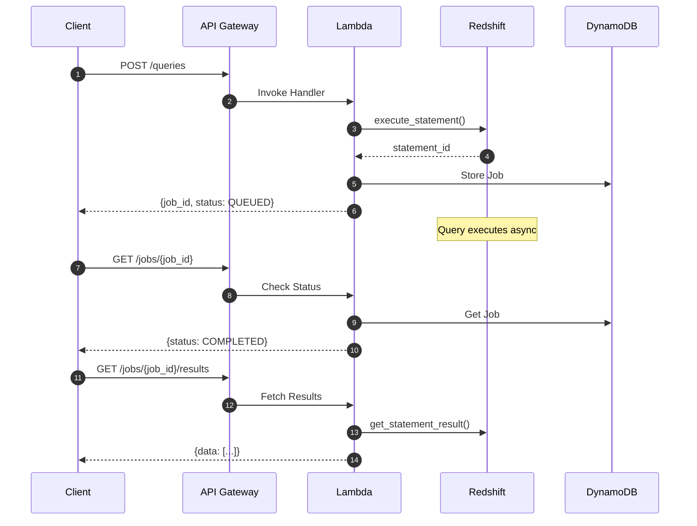
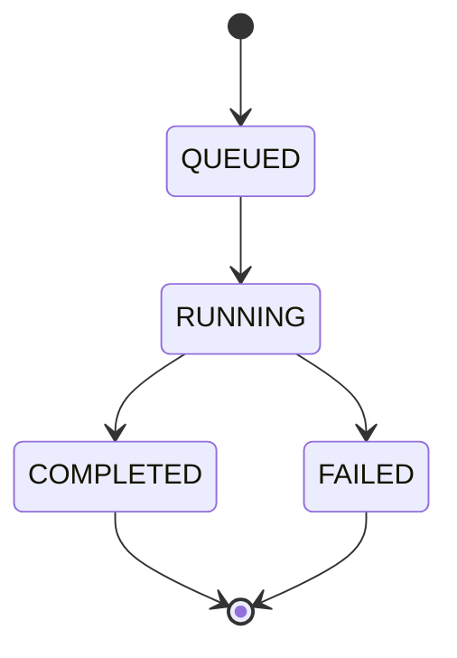

# Query API

The Query API is the primary interface for executing SQL queries against your Redshift data warehouse.

## Overview



## Submit a Query

### Endpoint

```
POST /v1/queries
```

### Request Headers

| Header | Required | Description |
|--------|----------|-------------|
| `Authorization` | Yes | Bearer token or API key |
| `X-Tenant-ID` | Yes | Tenant identifier |
| `Content-Type` | Yes | `application/json` |

### Request Body

```json
{
  "sql": "SELECT * FROM sales WHERE date >= '2026-01-01' LIMIT 1000",
  "parameters": [],
  "output_format": "json",
  "async": true
}
```

| Field | Type | Default | Description |
|-------|------|---------|-------------|
| `sql` | string | Required | SQL query to execute |
| `parameters` | array | `[]` | Query parameters for prepared statements |
| `output_format` | string | `json` | Output format: `json`, `csv`, `parquet` |
| `async` | boolean | `true` | Async execution (recommended) |

### Response

```json
{
  "job_id": "job-abc123def456",
  "status": "QUEUED",
  "submitted_at": "2026-01-29T10:00:00Z",
  "estimated_duration_seconds": 30
}
```

## Check Job Status

### Endpoint

```
GET /v1/jobs/{job_id}
```

### Response

```json
{
  "job_id": "job-abc123def456",
  "status": "COMPLETED",
  "submitted_at": "2026-01-29T10:00:00Z",
  "completed_at": "2026-01-29T10:00:25Z",
  "row_count": 1500,
  "result_location": "inline"
}
```

### Job Statuses



| Status | Description |
|--------|-------------|
| `QUEUED` | Job submitted, waiting to execute |
| `RUNNING` | Query executing on Redshift |
| `COMPLETED` | Query finished successfully |
| `FAILED` | Query failed with error |

## Get Results

### Endpoint

```
GET /v1/jobs/{job_id}/results
```

### Small Result Response (Inline)

```json
{
  "data": [
    {"id": 1, "product": "Widget", "revenue": 1000.00},
    {"id": 2, "product": "Gadget", "revenue": 2500.00}
  ],
  "metadata": {
    "columns": ["id", "product", "revenue"],
    "row_count": 2
  }
}
```

### Large Result Response (S3 Export)

```json
{
  "download_url": "https://s3.amazonaws.com/bucket/exports/job-abc123.parquet?...",
  "expires_at": "2026-01-29T11:00:00Z",
  "format": "parquet",
  "size_bytes": 52428800
}
```

## Parameterized Queries

Use parameters to prevent SQL injection:

```bash
curl -X POST "$API_URL/queries" \
  -H "Authorization: Bearer $TOKEN" \
  -H "X-Tenant-ID: tenant-123" \
  -d '{
    "sql": "SELECT * FROM sales WHERE region = :region AND date >= :start_date",
    "parameters": [
      {"name": "region", "value": "US"},
      {"name": "start_date", "value": "2026-01-01"}
    ]
  }'
```

## Error Handling

### Error Response Format

```json
{
  "error": {
    "code": "QUERY_EXECUTION_FAILED",
    "message": "Column 'invalid_column' does not exist",
    "details": {
      "sql_state": "42703",
      "statement_id": "abc123"
    }
  }
}
```

### Common Error Codes

| Code | HTTP Status | Description |
|------|-------------|-------------|
| `INVALID_SQL` | 400 | SQL syntax error |
| `UNAUTHORIZED` | 401 | Invalid or missing credentials |
| `FORBIDDEN` | 403 | Tenant lacks permission |
| `JOB_NOT_FOUND` | 404 | Job ID doesn't exist |
| `QUERY_TIMEOUT` | 408 | Query exceeded timeout |
| `RATE_LIMITED` | 429 | Too many requests |

## Best Practices

!!! tip "Use Async Mode"
    
    Always use `async: true` for analytical queries. Synchronous mode is 
    only suitable for queries that complete in < 30 seconds.

!!! tip "Limit Result Sets"
    
    Use `LIMIT` clauses to control result size. Large result sets will 
    automatically be exported to S3.

!!! warning "Query Timeout"
    
    Default timeout is 900 seconds (15 minutes). Configure 
    `SPECTRA_QUERY_TIMEOUT_SECONDS` for longer queries.
