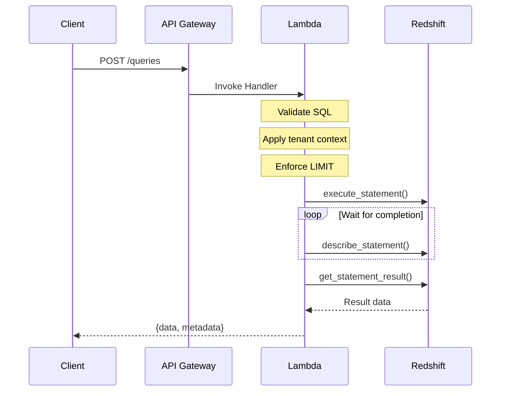
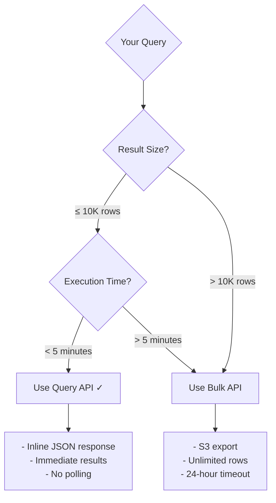
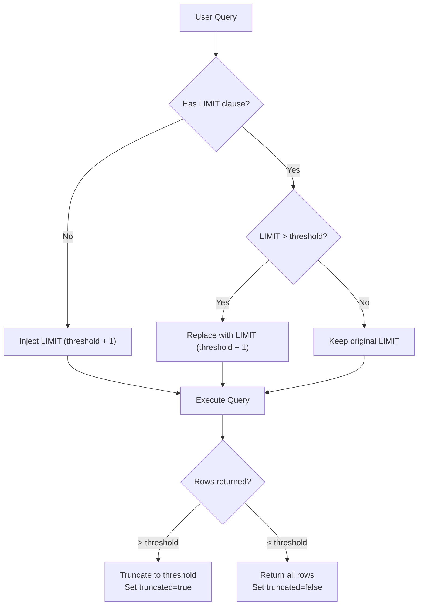
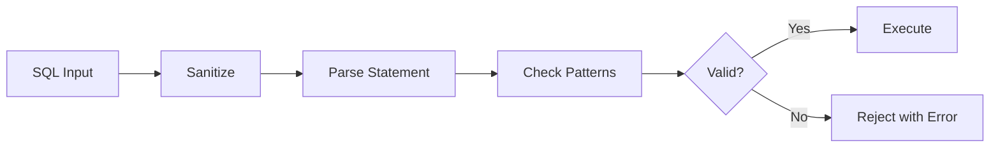
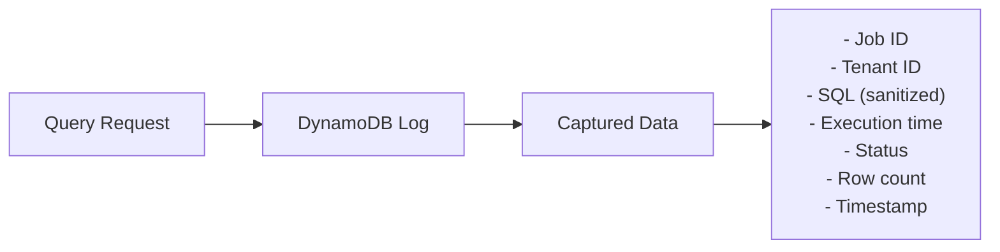

# Query API

The Query API provides **synchronous** SQL query execution with results returned directly in the HTTP response. Designed for interactive queries, dashboards, and real-time data access with result sets up to 10,000 rows.

## Overview

The Query API follows a simple request-response pattern. Submit your SQL query and receive results immediately—no polling required.



---

## Why Synchronous?

The synchronous design provides significant advantages for interactive use cases:

| Benefit | Description |
|---------|-------------|
| **Simplicity** | Single request-response, no polling or callbacks |
| **Low Latency** | Results returned immediately upon completion |
| **Predictability** | Automatic LIMIT enforcement prevents runaway queries |
| **Error Clarity** | Immediate feedback on validation or execution errors |

---

## When to Use Query API vs Bulk API



| Scenario | API | Reason |
|----------|-----|--------|
| Dashboard widgets | Query API | Small results, low latency |
| User search results | Query API | Interactive, immediate feedback |
| Aggregation reports | Query API | Summarized data, small output |
| Data exports | Bulk API | Large result sets |
| ETL pipelines | Bulk API | Complete data required |
| Batch processing | Bulk API | Long-running operations |

---

## Making a Query Request

### Endpoint

```
POST /v1/queries
```

### Required Headers

| Header | Required | Description |
|--------|----------|-------------|
| `Authorization` | Yes | `Bearer {api_key}` or `Bearer {jwt_token}` |
| `X-Tenant-ID` | Yes | Tenant identifier for multi-tenant deployments |
| `Content-Type` | Yes | `application/json` |

### Optional Headers

| Header | Description |
|--------|-------------|
| `X-Idempotency-Key` | Unique key to prevent duplicate query execution |
| `X-Request-ID` | Client-provided request ID for distributed tracing |

### Request Body

```json
{
  "sql": "SELECT region, COUNT(*) as orders, SUM(amount) as revenue FROM sales GROUP BY region",
  "parameters": {
    "limit": 1000,
    "timeout_seconds": 60
  }
}
```

### Request Fields

| Field | Type | Required | Default | Description |
|-------|------|----------|---------|-------------|
| `sql` | string | Yes | - | SQL query to execute (SELECT only) |
| `parameters.limit` | integer | No | 10000 | Maximum rows to return (max: 10000) |
| `parameters.timeout_seconds` | integer | No | 60 | Query timeout in seconds (max: 300) |

---

## Response Format

### Successful Query

```json
{
  "data": [
    {"region": "APAC", "orders": 15000, "revenue": 2500000.00},
    {"region": "EMEA", "orders": 12000, "revenue": 1800000.00},
    {"region": "AMER", "orders": 18000, "revenue": 3200000.00}
  ],
  "metadata": {
    "columns": ["region", "orders", "revenue"],
    "column_types": ["VARCHAR", "BIGINT", "DECIMAL"],
    "row_count": 3,
    "total_rows": 3,
    "truncated": false,
    "execution_time_ms": 1250,
    "query_id": "abc123-def456-789"
  }
}
```

### Response Fields

| Field | Type | Description |
|-------|------|-------------|
| `data` | array | Query results as array of JSON objects |
| `metadata.columns` | array | Column names in order |
| `metadata.column_types` | array | Redshift data types for each column |
| `metadata.row_count` | integer | Number of rows in this response |
| `metadata.total_rows` | integer | Total matching rows (before truncation) |
| `metadata.truncated` | boolean | Whether results were truncated |
| `metadata.execution_time_ms` | integer | Query execution time in milliseconds |
| `metadata.query_id` | string | Redshift query identifier for debugging |

---

## LIMIT Enforcement

The Query API automatically manages row limits to ensure predictable response sizes and prevent memory exhaustion.



### How It Works

1. **No LIMIT in query**: System adds `LIMIT (threshold + 1)` automatically
2. **LIMIT exceeds threshold**: Replaced with `LIMIT (threshold + 1)`  
3. **LIMIT within threshold**: Kept as-is

The extra row (threshold + 1) allows detection of truncation without fetching all data.

### Truncation Example

When your query matches more rows than the limit:

```json
{
  "data": [...],
  "metadata": {
    "row_count": 10000,
    "total_rows": 150000,
    "truncated": true,
    "message": "Results truncated. Use Bulk API for complete data export."
  }
}
```

---

## SQL Validation and Security

The Query API includes comprehensive SQL security to prevent injection attacks and unauthorized operations.

### Allowed Operations

Only `SELECT` statements are permitted. The following are blocked:

| Category | Blocked Patterns |
|----------|-----------------|
| **DDL** | CREATE, ALTER, DROP, TRUNCATE |
| **DML** | INSERT, UPDATE, DELETE, MERGE |
| **System** | GRANT, REVOKE, VACUUM, ANALYZE |
| **Dangerous** | COPY, UNLOAD, CALL |

### Validation Flow



### Error Example

```json
{
  "error": {
    "code": "SQL_BLOCKED",
    "message": "Query contains forbidden patterns",
    "details": {
      "pattern": "DROP TABLE",
      "reason": "DDL statements are not allowed"
    }
  }
}
```

See [SQL Security](../security/sql-security.md) for detailed documentation.

---

## Idempotency

Prevent duplicate query execution using idempotency keys:

```bash
curl -X POST "$API_URL/queries" \
  -H "Authorization: Bearer $API_KEY" \
  -H "X-Tenant-ID: tenant-123" \
  -H "X-Idempotency-Key: daily-sales-report-2024-01-29" \
  -H "Content-Type: application/json" \
  -d '{"sql": "SELECT SUM(amount) FROM sales WHERE date = CURRENT_DATE"}'
```

### Idempotency Behavior

| Scenario | Behavior |
|----------|----------|
| First request | Executes query, caches result |
| Duplicate (same key) | Returns cached result immediately |
| Different key | Executes as new query |
| Key expires (24h) | Executes as new query |

### Use Cases

- **Report generation**: Prevent duplicate expensive queries
- **Retry logic**: Safely retry failed requests
- **Distributed systems**: Coordinate across multiple clients

---

## Timeout Handling

Queries that exceed the timeout return an error:

```json
{
  "error": {
    "code": "QUERY_TIMEOUT",
    "message": "Query exceeded timeout of 60 seconds",
    "details": {
      "timeout_seconds": 60,
      "suggestion": "Use Bulk API for long-running queries"
    }
  }
}
```

### Timeout Configuration

| Setting | Range | Default |
|---------|-------|---------|
| Request timeout | 1-300 seconds | 60 seconds |
| System maximum | - | 300 seconds |

### Handling Timeouts

1. **Increase timeout**: Set `timeout_seconds` up to 300
2. **Optimize query**: Add indexes, reduce data scanned
3. **Use Bulk API**: For queries consistently exceeding 5 minutes

---

## Error Handling

### HTTP Status Codes

| Status | Description |
|--------|-------------|
| `200` | Query executed successfully |
| `400` | Invalid request (bad SQL, validation error) |
| `401` | Authentication failed |
| `403` | Permission denied |
| `408` | Query timeout |
| `429` | Rate limit exceeded |
| `500` | Internal server error |

### Error Codes

| Code | Description | Action |
|------|-------------|--------|
| `INVALID_SQL` | SQL syntax error | Fix query syntax |
| `SQL_BLOCKED` | Forbidden SQL pattern | Use only SELECT |
| `QUERY_TIMEOUT` | Exceeded timeout | Increase timeout or use Bulk API |
| `QUERY_FAILED` | Redshift execution error | Check error details |
| `UNAUTHORIZED` | Invalid credentials | Verify API key/token |
| `FORBIDDEN` | Access denied | Check permissions |

### Error Response Format

```json
{
  "error": {
    "code": "QUERY_FAILED",
    "message": "Column 'invalid_column' does not exist",
    "details": {
      "sql_state": "42703",
      "position": 25,
      "query_id": "abc123-def456"
    }
  }
}
```

---

## Audit Trail

All queries are automatically logged for security auditing and debugging:



### Captured Information

| Field | Description |
|-------|-------------|
| Job ID | Unique identifier for the query |
| Tenant ID | Tenant that executed the query |
| SQL query | Query text (may be sanitized for security) |
| Execution time | Query duration in milliseconds |
| Status | Success/failure outcome |
| Row count | Number of rows returned |
| Timestamp | When the query was executed |

---

## Performance Tips

### Query Optimization

| Tip | Benefit |
|-----|---------|
| **Add WHERE clauses** | Reduce data scanned |
| **Use specific columns** | Avoid `SELECT *` |
| **Leverage indexes** | Faster query execution |
| **Aggregate early** | Reduce result size |

### Request Optimization

| Tip | Benefit |
|-----|---------|
| **Set appropriate limits** | Reduce response size |
| **Use idempotency keys** | Avoid duplicate work |
| **Set realistic timeouts** | Fail fast on long queries |

---

## Configuration Reference

| Environment Variable | Default | Description |
|---------------------|---------|-------------|
| `SPECTRA_RESULT_SIZE_THRESHOLD` | 10000 | Maximum rows for inline results |
| `SPECTRA_DEFAULT_TIMEOUT_SECONDS` | 60 | Default query timeout |
| `SPECTRA_MAX_TIMEOUT_SECONDS` | 300 | Maximum allowed timeout |
| `SPECTRA_IDEMPOTENCY_TTL_HOURS` | 24 | Idempotency key cache duration |

---

## Next Steps

- [Bulk API](bulk-api.md) - Large-scale data export
- [SQL Security](../security/sql-security.md) - SQL validation details
- [Authentication](../security/authentication.md) - API authentication options
- [API Reference](../api-reference.md) - Complete endpoint documentation
