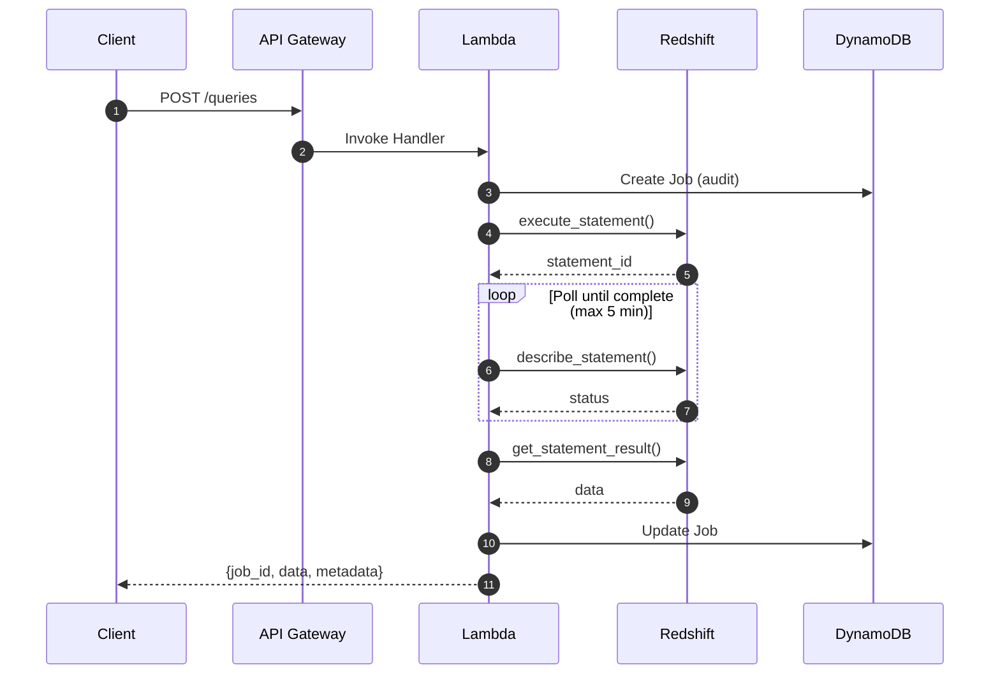

# Query API

The Query API provides **synchronous** SQL query execution for small-to-medium result sets. For large datasets or long-running queries, use the [Bulk API](bulk-api.md) instead.

## Overview



## Key Characteristics

| Feature | Query API | Bulk API |
|---------|-----------|----------|
| Execution Mode | Synchronous | Asynchronous |
| Max Timeout | 300 seconds (5 min) | 24 hours |
| Max Rows | Configurable threshold (default 10,000) | Unlimited |
| Result Delivery | Inline JSON | S3 download URL |
| Use Case | Interactive queries, dashboards | ETL, large exports |

## Submit a Query

### Endpoint

```
POST /v1/queries
```

### Request Headers

| Header | Required | Description |
|--------|----------|-------------|
| `Authorization` | Yes | Bearer token or API key |
| `X-Tenant-ID` | Yes | Tenant identifier |
| `X-DB-User` | Yes | Database user for RLS |
| `Content-Type` | Yes | `application/json` |

### Request Body

```json
{
  "sql": "SELECT * FROM sales WHERE date >= '2026-01-01'",
  "parameters": [],
  "timeout_seconds": 60,
  "metadata": {
    "source": "dashboard",
    "request_id": "req-123"
  }
}
```

| Field | Type | Default | Description |
|-------|------|---------|-------------|
| `sql` | string | Required | SQL query to execute (SELECT only) |
| `parameters` | array | `[]` | Query parameters for prepared statements |
| `timeout_seconds` | integer | `60` | Query timeout (1-300 seconds) |
| `idempotency_key` | string | `null` | Key to prevent duplicate submissions |
| `metadata` | object | `null` | Custom metadata for audit trail |

### Successful Response

```json
{
  "job_id": "job-abc123def456",
  "status": "COMPLETED",
  "data": [
    {"id": 1, "product": "Widget", "revenue": 1000.00},
    {"id": 2, "product": "Gadget", "revenue": 2500.00}
  ],
  "metadata": {
    "columns": [
      {"name": "id", "type": "int4"},
      {"name": "product", "type": "varchar"},
      {"name": "revenue", "type": "numeric"}
    ],
    "row_count": 2,
    "truncated": false,
    "execution_time_ms": 1234
  }
}
```

### Truncated Response

When results exceed the configured threshold, partial data is returned:

```json
{
  "job_id": "job-abc123def456",
  "status": "COMPLETED",
  "data": [...],
  "metadata": {
    "columns": [...],
    "row_count": 10000,
    "truncated": true,
    "execution_time_ms": 5678,
    "message": "Result exceeds limit of 10000 rows. Only first 10000 rows returned. For complete results, use POST /v1/bulk API."
  }
}
```

!!! warning "Truncated Results"
    When `truncated: true`, you're only receiving partial data. 
    Use the [Bulk API](bulk-api.md) to retrieve the complete dataset.

### Timeout Response

```json
{
  "job_id": "job-abc123def456",
  "status": "TIMEOUT",
  "error": {
    "code": "QUERY_TIMEOUT",
    "message": "Query exceeded timeout of 60 seconds. For long-running queries, use POST /v1/bulk API."
  }
}
```

### Error Response

```json
{
  "job_id": "job-abc123def456",
  "status": "FAILED",
  "error": {
    "code": "QUERY_FAILED",
    "message": "Column 'invalid_column' does not exist"
  }
}
```

## LIMIT Enforcement

The Query API automatically enforces row limits to prevent memory issues:

1. **No LIMIT in query**: A `LIMIT (threshold + 1)` is added automatically
2. **LIMIT > threshold**: Replaced with `LIMIT (threshold + 1)`
3. **LIMIT <= threshold**: Kept as-is

If `threshold + 1` rows are returned, results are truncated to `threshold` rows and `truncated: true` is set.

```python
# Example: threshold = 10000
# User query: SELECT * FROM large_table
# Executed:   SELECT * FROM large_table LIMIT 10001
# If 10001 rows returned → truncate to 10000, set truncated=true
```

## Parameterized Queries

Use parameters to prevent SQL injection:

```bash
curl -X POST "$API_URL/v1/queries" \
  -H "Authorization: Bearer $TOKEN" \
  -H "X-Tenant-ID: tenant-123" \
  -H "X-DB-User: analytics_user" \
  -H "Content-Type: application/json" \
  -d '{
    "sql": "SELECT * FROM sales WHERE region = :region AND date >= :start_date",
    "parameters": [
      {"name": "region", "value": "US"},
      {"name": "start_date", "value": "2026-01-01"}
    ],
    "timeout_seconds": 30
  }'
```

## Error Handling

### HTTP Status Codes

| Status | Description |
|--------|-------------|
| `200` | Query completed (check `status` field) |
| `400` | Invalid request (bad SQL, missing fields) |
| `401` | Unauthorized (missing/invalid credentials) |
| `408` | Query timeout |
| `500` | Query execution failed |

### Error Codes

| Code | Description |
|------|-------------|
| `INVALID_SQL` | SQL syntax error or forbidden operation |
| `QUERY_FAILED` | Redshift query execution error |
| `QUERY_TIMEOUT` | Query exceeded timeout limit |
| `QUERY_CANCELLED` | Query was cancelled |
| `INTERNAL_ERROR` | Unexpected server error |

## Best Practices

!!! tip "Use Query API for Interactive Queries"
    
    The Query API is ideal for:
    
    - Dashboard widgets and visualizations
    - Ad-hoc data exploration
    - Small aggregations and summaries
    - Queries expected to return < 10,000 rows

!!! tip "Set Appropriate Timeouts"
    
    Start with a reasonable timeout (30-60 seconds) for interactive queries.
    If queries consistently timeout, consider:
    
    - Optimizing the query (add indexes, reduce data scanned)
    - Using the Bulk API for long-running queries

!!! warning "Don't Use for Large Exports"
    
    For queries returning > 10,000 rows or running > 5 minutes,
    use the [Bulk API](bulk-api.md) which:
    
    - Supports unlimited result sizes
    - Exports directly to S3
    - Runs asynchronously (up to 24 hours)

## Configuration

| Environment Variable | Default | Description |
|---------------------|---------|-------------|
| `SPECTRA_RESULT_SIZE_THRESHOLD` | `10000` | Max rows for inline results |
| `SPECTRA_QUERY_TIMEOUT_SECONDS` | `900` | Default query timeout |

## Audit Trail

All queries are recorded in DynamoDB for audit purposes, including:

- Job ID and tenant ID
- Original SQL query
- Execution timestamp and duration
- Success/failure status
- User metadata

This enables:

- Security auditing
- Query analytics
- Debugging and troubleshooting
